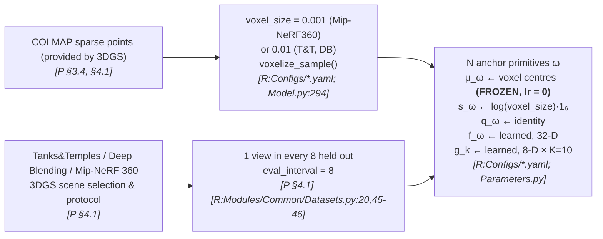
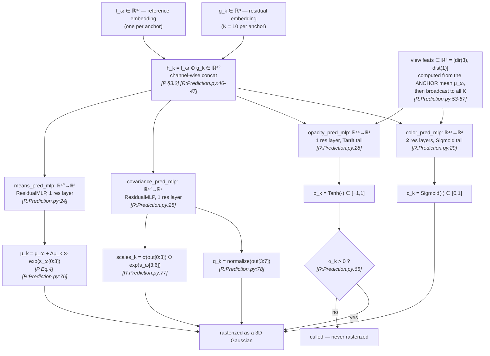
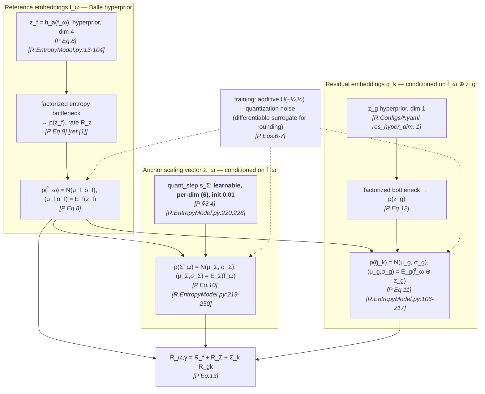
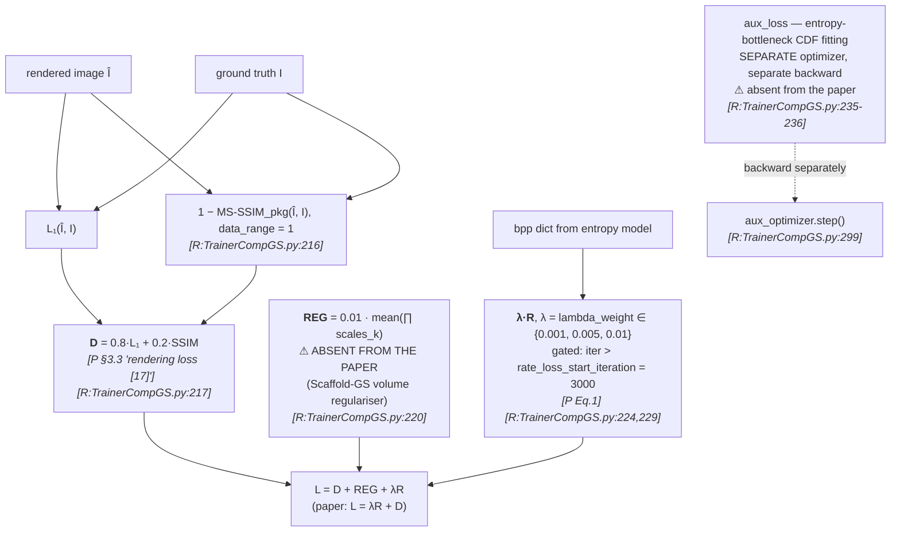
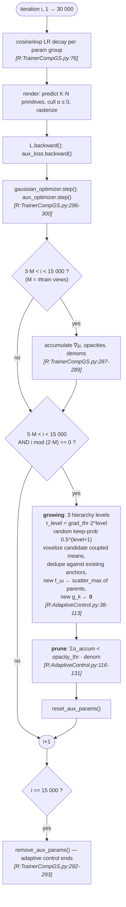
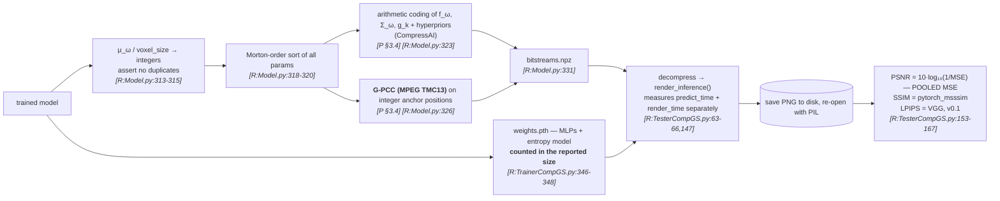

# §2 — Pipeline flowcharts

`[R:file:line]` = `[repo: file:line]`; `[P §x]` = `[paper §x]` (**arXiv:2404.09458v1** = `../../CompGS.pdf`).

---

## Stage A — Data → preprocessing → anchor initialisation

> **`means_lr_init = means_lr_final = means_lr_delay_mult = 0.0`** in all three configs
> `[R:Configs/MipNeRF360.yaml; TanksAndTemplates.yaml; DeepBlending.yaml]`. Anchor
> positions **never move**. This is what makes the lossless integer-grid G-PCC coding at
> `[R:Model.py:313-315]` sound — and it is not stated in the paper.

---

## Stage B — Inter-primitive prediction (one anchor → K = 10 coupled primitives)

> **This is Scaffold-GS offset prediction, not the affine transform of `[P Eqs. 2-4]`.**
> The paper describes **three** networks `{𝒯, 𝒮, ℛ}` producing a translation vector,
> a scaling matrix and a rotation matrix `[P Eq. 3]`. The repo has **two** geometry MLPs;
> scale and rotation come from a single 7-channel head (3 scales + 4 quaternion), and both
> the offset and the scale are modulated by the **anchor's own** 6-D scaling vector, which
> Eq. 4 does not mention. See D-1.
>
> Also note `[P Eq. 4]` writes `Σ_k = S_k R_k`, which is not a valid covariance
> factorisation (it should be `R S Sᵀ Rᵀ`); the repo stores scale and quaternion separately
> and lets the rasterizer build `Σ`. Treat Eq. 4 as loose notation.

---

## Stage C — Entropy estimation (the rate model)

> `f̃_ω` is used as the **context** for both `Σ_ω` and `g_k` — a one-level spatial context
> model, exactly the Ballé-2018 hyperprior pattern. Quantization steps: `s_f = s_g = 1`
> (fixed) and `s_Σ` **learnable, init 0.01** `[P §3.4]` — the repo matches, but makes
> `s_Σ` a **6-vector** (one per scale dimension) rather than a scalar
> `[R:EntropyModel.py:228]`.

---

## Stage D — Loss composition

> **Three deltas visible here at once:** the undocumented `REG` term (D-2), the
> undocumented `aux_loss` / second optimizer (D-3), and the undocumented 3 000-iteration
> warm-up before the rate term switches on (D-4).

---

## Stage E — Optimization + adaptive control (Scaffold-GS)

> **The control schedule is view-count-relative, not iteration-absolute.** Intervals are
> `base × num_training_views` `[R:TrainerCompGS.py:284-304; Configs/*.yaml comments]`, so a
> scene with 300 views densifies ~6× less often than one with 50 views at the same
> iteration count. Unusual, undocumented in the paper, and important for reproduction.

---

## Stage F — Compression, decompression, evaluation

> Two things worth carrying into the comparison:
> **(a)** the reported model size **includes `weights.pth`** — honest, and unusual;
> **(b)** PSNR is **pooled-MSE** on **8-bit PNGs round-tripped through disk**
> `[R:TesterCompGS.py:153-159]` — the same convention as `seathru_NeRF/`, and *different*
> from the per-channel-mean PSNR used by `seasplat/`, `mini-splatting/` and 3DGS itself.
> See [`10-reproducibility.md`](10-reproducibility.md).
