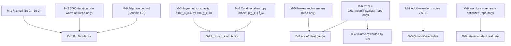

# §5 — Constraints and well-posedness

> ⚠️ `[paper …]` = **arXiv:2404.09458v1** = `../../CompGS.pdf`.

## 5.1 Why the naive objective is underdetermined

CompGS has a genuinely different well-posedness problem from every other method in the set,
because its objective contains a **rate** term. Two families of degeneracy result.

### D-1 — The rate term's own degenerate optimum: **`R → 0`, the constant scene**

`L = λR + D`. The rate term is minimized *exactly* when every embedding is constant: a
degenerate distribution has zero entropy, so `R = 0`. Nothing in `R` cares about the image.

This is not the usual "some other solution is equally good" — it is a **direct, explicit
pressure toward collapse**, present at every step, traded off against `D` only by the
scalar `λ`. It is the defining hazard of end-to-end learned compression, and it is why the
field's standard practice is a warm-up before the rate term engages.

### D-2 — Anchor/coupled attribution ambiguity

Every coupled attribute is decoded from `h_k = f_ω ⊕ g_k`. Information can live in `f_ω`
(paid once per anchor, ~128 bits) or in `g_k` (paid `K = 10` times, ~15 bits each). The
*rendered image is identical* either way; only the bitrate differs.

Left unconstrained, the MLPs could ignore `g_k` entirely and let `f_ω` carry everything —
which is **exactly the "w.o. Res. Embed." variant** the paper ablates, and it loses
**0.99 dB** `[paper Tab. 5]`. So the degenerate solution is not merely possible, it is
measurably attractive.

### D-3 — Scale/offset gauge between anchor and prediction

`μ_k = μ_ω + Δμ_k ⊙ exp(s_ω[0:3])` and `scales_k = σ(·) ⊙ exp(s_ω[3:6])`
`[repo: Prediction.py:76-77]`. Scaling `s_ω → s_ω + c` while the MLP outputs shrink by
`e^{-c}` leaves the geometry **exactly** invariant — but changes the entropy of both `s_ω`
and the MLP activations, hence the rate. A pure gauge freedom that the rate term will
exploit in whichever direction happens to be cheaper.

### D-4 — Unbounded Gaussian volume, made *profitable* by the rate term

`scales_k` is unbounded above through `exp(s_ω[3:6])`. In plain 3DGS a giant blob is
penalised only indirectly. **Here it is actively rewarded**: bigger Gaussians cover more
pixels, so fewer primitives are needed, so `R` falls. The rate term converts a mild
pathology into an incentive.

### D-5 — Quantization is not differentiable

`Q(·)` has zero gradient almost everywhere, so a literal implementation of `[paper Eq. 6]`
would sever the entire optimization chain — "the rounding operator within Q is not
differentiable and breaks the back-propagation chain of optimization" `[paper §3.3]`.

### D-6 — The rate *estimate* can be wrong

`R` is `−log p̂` under a *learned* density model. If `p̂` is a poor fit, the loss optimizes a
fiction and the actual coded size diverges from the reported one.

---

## 5.2 The resolving mechanisms



### M-1 / M-2 — Keeping `R → 0` at bay

**λ is small**: `{0.001, 0.005, 0.01}` `[paper §3.4]` against a distortion term of order 1.
Sweeping λ is how the R-D curve of `[paper Fig. 6]` is generated — this is the *intended*
knob, and it is the only method in your comparison set that exposes one.

**The warm-up is the real safeguard**, and it is repo-only:
`[repo: TrainerCompGS.py:229; Configs/*.yaml rate_loss_start_iteration: 3000]`
```python
loss = rendering_loss + reg_loss + (rate_loss if iteration > 3000 else 0.)
```
For the first 10% of training there is **no rate pressure at all**, so the representation
reaches a useful configuration before compression starts pulling on it. Starting `λR` at
iteration 0 — as `[paper Eq. 1]` implies — risks collapsing the embeddings before they
encode anything. **Not mentioned in the paper.**

### M-3 / M-4 — Forcing the anchor/coupled split (the paper's core design)

Two independent mechanisms push information into the right tier:

1. **Capacity asymmetry.** `dim(f_ω) = 32` vs `dim(g_k) = 8` `[paper §3.4]`. `g_k`
   physically cannot hold a full attribute description; it can only *correct*. The residual
   form is enforced by architecture, in the same way `seathru_NeRF/` enforces its medium
   constraint by withholding positional input from the medium MLP.
2. **Conditional coding.** `p(g̃_k) = N(μ_g, σ_g)` with `(μ_g, σ_g) = E_g(f̃_ω ⊕ z_g)`
   `[paper Eq. 11]` — the residual's *code cost* is computed **given** the reference
   embedding. Anything predictable from `f_ω` is therefore free to encode in `g_k`, so the
   rate term stops charging twice for shared information. This is textbook predictive
   coding, and it is what the paper means by importing the video-coding paradigm.

Fig. 8 confirms the mechanism works: coupled primitives cost **6.52–15.36 bits** each while
anchors cost **80.65–128.26** `[paper Fig. 8]`.

### M-5 — Frozen anchor means (repo-only, and load-bearing three times over)

`means_lr_init = means_lr_final = 0.0` in all three configs `[repo: Configs/*.yaml]`.
Anchors never leave their initial voxel grid. Three consequences:

- **Closes D-3 partially**: with `μ_ω` fixed, the offset gauge is anchored to a fixed grid.
- **Makes G-PCC valid**: positions stay exact integers on a known grid, so
  `torch.round(means / voxel_size)` is lossless and the assertion
  `torch.unique(means, dim=0).shape[0] == means.shape[0]` at `[repo: Model.py:315]` holds.
  A moving anchor could collide with another after voxelization and **trip that assert**.
- **Reduces the rate**: no position residual to code — G-PCC compresses a static occupancy
  grid.

The paper says only that anchors "are initialized from sparse point clouds produced by
voxel-downsampled SfM points" `[paper §3.4]`, which does not imply they stay there.

### M-6 — `REG`, and why the rate term makes it necessary

`REG = 0.01 · mean(s_x·s_y·s_z)` `[repo: TrainerCompGS.py:220]`. Inherited from Scaffold-GS,
absent from the paper.

In Scaffold-GS this is a mild anti-blob prior. **In CompGS it is doing more work**, because
D-4 means the rate term *rewards* large Gaussians. `REG` is the only thing making volume
expensive, and it is a hard-coded constant with no config knob. See
[`06-implementation-deltas.md`](06-implementation-deltas.md) D-2.

### M-7 — Differentiable quantization

Training: additive uniform noise `[paper Eqs. 6-7]` —
`f̃_ω = f_ω + Δ_f`, `Δ ~ U(−½, ½)` — Ballé's standard relaxation.
Evaluation/compression: **straight-through estimator**, `quantize_ste(y − μ) + μ`
`[repo: EntropyModel.py:246]`, which is a *different* relaxation from the noise used in
training. The train/test mismatch is standard in learned compression but is a real source
of rate/quality drift, and the paper describes only the noise branch.

### M-8 — `aux_loss`: keeping the rate estimate honest

`[repo: TrainerCompGS.py:235-236, 299-300]`. The factorized entropy bottleneck's CDF is
fitted by its own objective on its own optimizer. Without it, `p̂` drifts from the true
marginal, `R` becomes a bad estimate of the coded size, and the R-D trade-off the whole
method rests on is being optimized against the wrong quantity (D-6). **Absent from the
paper**; mandatory for reproduction.

### M-9 — Adaptive control bounds `N`

Scaffold-GS growing/pruning `[paper §3.4]` `[repo: AdaptiveControl.py]`, stopped at
iteration 15 000 `[repo: Configs/*.yaml stop_iteration]`. Pruning uses accumulated
opacity against `opacity_threshold · anchor_denorm`
`[repo: AdaptiveControl.py:119]`, so anchors whose coupled primitives are consistently
culled (`α ≤ 0`) are removed. This is a second, structural route to lower rate that does
not go through the entropy model — and it is the reason `R` alone is not asked to do all
the compression.

Note the growing rule includes **explicit stochasticity**:
`rand_mask = rand_like(...) > 0.5^(level+1)` `[repo: AdaptiveControl.py:57]` — deeper
hierarchy levels keep a smaller random fraction of candidates.

---

## 5.3 What is *not* resolved

- **The train/eval quantization mismatch (M-7)** is unquantified. `render_inference` passes
  `skip_quant=True` `[repo: Model.py:257]`, so inference-time rendering uses the
  *dequantized* values loaded from the bitstream, while training saw noise. The paper does
  not report the gap between estimated `R` and actual coded bytes. `[unverified]`
- **λ is a per-run constant, not a target rate.** You cannot request "8 MB"; you sweep λ and
  see what you get. Every reported operating point is post-hoc.
- **Network weights are an irreducible floor.** At λ = 0.01 they are **46%** of the
  bitstream `[paper Fig. 8]`, so the compression ratio saturates: pushing λ higher mostly
  shrinks the scene bits around a fixed MLP cost. The paper does not discuss this limit.
- **Per-dataset hyperparameters are hand-tuned and undocumented.** `voxel_size` differs by
  10× between Mip-NeRF 360 (0.001) and T&T (0.01); `grad_threshold` and
  `opacity_threshold` also differ `[repo: Configs/*.yaml]`. None appears in the paper.
  Applying CompGS to a new domain (e.g. underwater) requires re-tuning at least these
  three, with no stated procedure.
- **Adaptive-control intervals scale with `M`**, the number of training views
  `[repo: TrainerCompGS.py:287, 303-304]`. Two scenes with the same iteration budget but
  different view counts receive very different amounts of densification. Undocumented.
- **The opacity cull is view-dependent.** `α_k > 0` `[repo: Prediction.py:65]` is evaluated
  per view, so the rasterized primitive set changes from frame to frame. Nothing enforces
  temporal/multi-view consistency of that set — a plausible source of flicker in novel-view
  video that neither the paper nor the repo addresses. `[inferred]`
