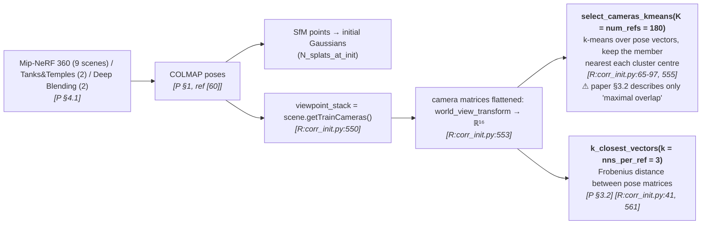
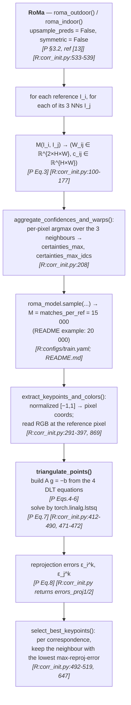
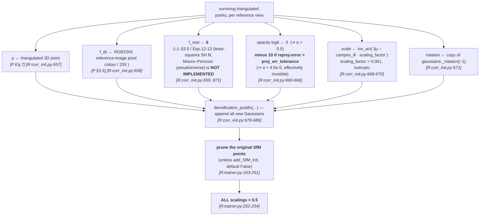
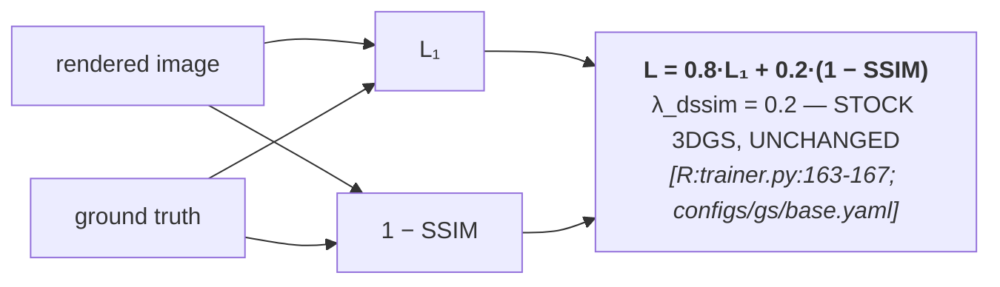
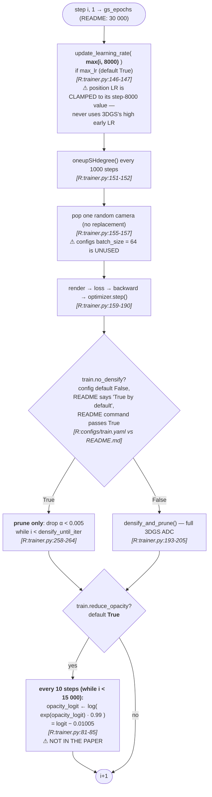
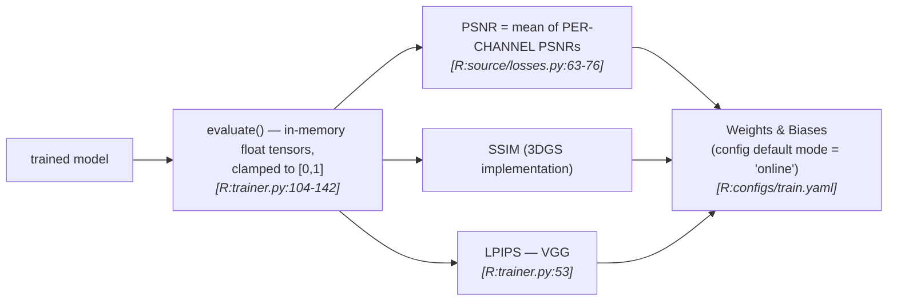

# §2 — Pipeline flowcharts

`[R:file:line]` = `[repo: file:line]`; `[P §x]` = `[paper §x]` (arXiv:2504.13204v2).
The initialization is the method, so it gets three of the six diagrams.

---

## Stage A — Data → poses → reference-view selection

> The paper says reference neighbours are found "based on camera parameters and spatial
> proximity. We measure proximity between camera matrices using the Frobenius norm"
> `[P §3.2]` — that describes `k_closest_vectors` ✅. But the **selection of the reference
> views themselves is K-means over pose vectors** `[R:corr_init.py:555]`, which the paper
> does not mention. See D-5.

---

## Stage B — Dense matching (RoMa) → triangulation

---

## Stage C — Gaussian seeding (where the paper and the code diverge most)

> **Three undocumented mechanics live in this stage:**
> **(a)** `f_rest ← 0` — the entire §3.5 SH-fitting contribution is missing from the code
> (D-1). **(b)** `p^proj` is realised as an **opacity penalty**, not a sampling
> distribution — bad points are *kept but made invisible*, with the source comment
> *"new version that sets points with large error invisible // TODO: remove those points
> instead"* `[R:corr_init.py:660-661]` (D-2). **(c)** every scale is halved right after
> initialization `[R:trainer.py:254]` (D-6).

---

## Stage D — Loss composition

> **That is the entire objective.** No regulariser, no auxiliary term, no correspondence
> loss. The paper writes no loss equation at all beyond "Gaussians `G` are optimized with
> photometric loss" `[P §3.1]`. Same situation as `mini-splatting/`, and the same
> methodological virtue: **every reported gain is attributable to the initialization
> alone.**

---

## Stage E — Optimization (stock 3DGS, plus two undocumented tweaks)

> **`reduce_opacity` replaces 3DGS's periodic opacity reset with a continuous decay.**
> `opacity_reset_interval` is set to `30000` = `iterations` `[R:configs/gs/base.yaml]`, and
> the reset is additionally gated by `gs_step < densify_until_iter = 15000`
> `[R:trainer.py:195-205]`, so **`reset_opacity()` never fires**. Instead the logit is
> reduced by `log(0.99) ≈ −0.01005` every 10 steps for the first 15 000 steps — about
> **1500 applications**, a cumulative logit shift of ≈ **−15**. Paired with the
> `α < 0.005` prune at `[R:trainer.py:261]`, this is an aggressive, continuous
> *decay-and-cull* that steadily removes Gaussians the photometric loss does not defend.
> Neither mechanism appears in the paper. See D-3.

---

## Stage F — Evaluation

> **No disk round-trip** — metrics are computed on the in-memory float tensors
> `[R:trainer.py:120-125]`, the same clean path as `mini-splatting/`'s main variant and
> **unlike** `seasplat/`, `CompGS/` and `ms_c/`. But the PSNR *formula* is the 3DGS
> per-channel-mean one `[R:losses.py:75-76]`, **not** the pooled-MSE definition used by
> `seathru_NeRF/` and `CompGS/`. See [`10-reproducibility.md`](10-reproducibility.md).
