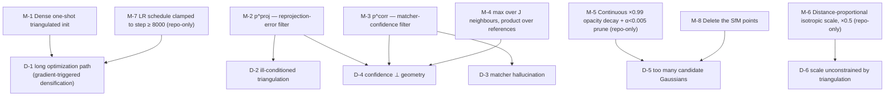

# §5 — Constraints and well-posedness

## 5.0 Restating the question for an initialization method

EDGS does not change the objective (see [`04-loss.md`](04-loss.md)), so as with
`mini-splatting/` the §5 question has to be restated:

> The 3DGS photometric objective is underdetermined **with respect to where primitives
> live**. Densification is 3DGS's answer, and it is a *slow, indirect, gradient-mediated*
> answer. EDGS replaces it with a *direct geometric* answer computed once from image
> correspondences — which introduces its **own** set of degeneracies, because triangulation
> of learned dense correspondences is itself ill-posed.

So this folder's degeneracies are of two kinds: those in the 3DGS optimization that EDGS
must still address, and those in the correspondence-triangulation pipeline that EDGS
introduces.

## 5.1 Degeneracies

### D-1 — The optimization-path degeneracy that motivates the paper

Many Gaussian configurations fit the training images; the photometric loss does not
distinguish them; and gradient descent from a sparse SfM start reaches a *bad* one slowly.
The paper's diagnosis is specific:

> "The original 3DGS detects under-reconstructed regions using **the gradient norm of the
> photometric loss**. But this metric often **fails in high-frequency regions** and does not
> align well with human perception." `[paper §1]`

and

> "It requires many update steps, as Gaussians must iteratively adjust their parameters
> before the model determines that additional splats are necessary. This results in a **long
> optimization path**, where individual Gaussians undergo multiple refinements before
> reaching their final states." `[paper §1]`

Quantified in `[paper §4.5, Eqs. 14-15]`: 3DGS Gaussians travel **~30× further** in
coordinate space and end **~50× further** from their initialization than EDGS's do.

### D-2 — Triangulation is ill-posed for near-degenerate pairs

`[paper Eq. 7]` solves `argmin_x ‖Ax + b‖²`. When the two view rays are nearly parallel
(small baseline) or nearly collinear with the point, `A` is ill-conditioned and the
least-squares solution is unstable in depth — arbitrarily far, arbitrarily wrong. Dense
matchers happily return matches for such pairs.

### D-3 — Dense matchers hallucinate

A dense matcher outputs a warp for **every** pixel, including occluded regions, sky, water,
and textureless surfaces where no correspondence exists. `[paper Fig. 5]` visualises exactly
this: "Correspondence confidence is **not uniform** across the scene."

Unfiltered, every hallucinated match becomes a floater.

### D-4 — Confidence and geometry are independent failure modes

A match can be **confident but geometrically inconsistent** (matcher is sure, but the pair is
degenerate) or **geometrically consistent but low-confidence** (two hallucinations that
happen to triangulate). Filtering on either alone leaves the other class through. The paper
states the complementarity directly `[paper §4.5]`.

### D-5 — Dense initialization means *too many* Gaussians

`num_refs × matches_per_ref` = 180 × 15 000 = **2.7 M** candidate Gaussians before any
filtering `[repo: configs/train.yaml]`, and up to 3.6 M with the README's 20 000. With
densification disabled there is **no mechanism to add** primitives — but equally, 3DGS's
usual counterweights (opacity reset, screen-size pruning) are also gone. Nothing bounds the
count downward except the `α < 0.005` prune.

### D-6 — Scale is unconstrained by triangulation

Triangulation gives **position only**. A point has no size. Seeded wrong — too large — a
Gaussian covers many pixels and blurs; too small, it contributes nothing and receives no
gradient (a dead primitive that pruning will remove). The photometric loss can recover from
neither quickly.

---

## 5.2 The resolving mechanisms



### M-1 — Dense one-shot initialization (the method)

> "each Gaussian is immediately supervised by **rich per-pixel photometric signal**, allowing
> for efficient optimization of the entire scene." `[paper §1]`

The key insight is that **a dense correspondence field already contains the geometry that
densification spends 15 000 iterations rediscovering** — and it contains it *uniformly*,
including in the high-frequency regions where the gradient-norm criterion is blind:

> "Unlike methods that rely on sparse keypoints, our dense initialization ensures **uniform
> detail across the scene**, even in high-frequency regions where other methods struggle."
> `[paper Abstract]`

Note the honest framing: "**Although this initialization is noisy** (see Fig. 1), we show
that it remains robust and leads to faster convergence" `[paper §1]`. The claim is not that
triangulated geometry is accurate — it is that it is a far better *starting point*.

### M-2 / M-3 / M-4 — The three-stage correspondence filter

The paper's own statement of complementarity `[paper §4.5]` is the cleanest summary:

| Filter | Removes | Cannot remove |
|---|---|---|
| `p^corr` (Eq. 9) | hallucinated / occluded matches | confident-but-degenerate pairs |
| `p^proj` (Eq. 10) | geometrically inconsistent triangulations | confident hallucinations that happen to triangulate |
| `max_j` / `Π_i` (Eq. 11) | correspondences good in no view pair | — |

Table 6 confirms both are needed: dropping either degrades LPIPS by 27–40%.

⚠️ **`p^proj` is not a sampling distribution in the code.** `[repo: corr_init.py:660-666]`
keeps failing points and sets their opacity logit to `−10`. The source comment —
*"TODO: remove those points instead. However it doesn't affect the performance"* — shows the
authors are aware of the gap. Combined with M-5 they are pruned within a few hundred steps. See D-2 in
[`06-implementation-deltas.md`](06-implementation-deltas.md).

### M-5 — Continuous opacity decay replaces opacity reset (repo-only, and load-bearing)

`[repo: source/trainer.py:81-85]`:
```python
if self.gs_step < self.training_config.densify_until_iter and self.gs_step % 10 == 0:
    opacities_new = torch.log(torch.exp(self.GS.gaussians._opacity.data) * 0.99)
    self.GS.gaussians._opacity.data = opacities_new
```
`_opacity` is a **logit**, so this is `logit ← logit + log(0.99) = logit − 0.01005`, applied
**every 10 steps for the first 15 000 steps** — about **1500 applications**, a cumulative
shift of ≈ **−15** in logit space, i.e. a factor of ~`e^{-15}` on the odds.

Paired with the `α < 0.005` prune `[repo: trainer.py:258-264]`, this is a **continuous
decay-and-cull**: every Gaussian's opacity bleeds away, and only those the photometric loss
actively pushes back up survive. It is a smooth analogue of 3DGS's periodic opacity reset —
which is **disabled** here (`opacity_reset_interval = 30000 = iterations`, and the call is
gated by `gs_step < 15000`, so it never fires `[repo: configs/gs/base.yaml; trainer.py:195-205]`).

This closes D-5 and is what turns 2.7 M candidates into the 1.4–1.9 M final counts of
`[paper Tab. 1]`. **Absent from the paper.** The halved `opacity_lr` (0.025 vs 3DGS's 0.05)
is presumably tuned against it. `[inferred]`

### M-6 — Distance-proportional isotropic scale (repo-only)

`[repo: corr_init.py:668-670]`: `scale = inv_act(‖μ − campos_ref‖ · 0.001)`, isotropic, then
globally **× 0.5** `[repo: trainer.py:254]`.

Each Gaussian comes from **one pixel**, so its world extent should subtend a roughly constant
solid angle — hence proportional to depth. `scaling_factor = 0.001` sets that angle; the
extra ×0.5 biases toward under-covering, which the optimizer can fix by growing (cheap)
more easily than it can fix over-covering blur (which competes with neighbours).
`[inferred]` The paper claims "well-informed color, scale, and position" `[paper §1]` but
gives no scale formula.

### M-7 — Clamped learning-rate schedule (repo-only)

`[repo: trainer.py:146-147]`: `update_learning_rate(max(gs_step, 8000))` when `max_lr=True`
(default). The position LR never exceeds its step-8000 value.

The logic follows directly from the paper's own Fig. 4 argument: if Gaussians start ~50×
closer to their final positions, the high early LR that 3DGS needs to move them across the
scene is not merely unnecessary but *harmful* — it would scatter a good initialization.
**Undocumented**, and arguably a second contribution.

### M-8 — Deleting the SfM points

`[repo: trainer.py:243-251]`, default `add_SfM_init: False` `[repo: configs/train.yaml]`.
The COLMAP points that seeded the model are pruned once the correspondence Gaussians are
appended. They are redundant (the triangulated set is denser and better-informed) and would
otherwise be un-prunable low-information primitives. The trainer docstring says so:
*"Initializes image with matchings. **Also removes SfM init points.**"*
`[repo: trainer.py:218-219]`

---

## 5.3 What is *not* resolved

- **Everything geometric is inherited from the matcher.** Table 5 shows the method degrades
  below 3DGS with a badly-matched matcher (RAFT: 26.90 vs 3DGS's 27.49) `[paper §4.5]`.
  Dense matchers are weakest on textureless, non-Lambertian and view-dependent surfaces —
  **sky, water, glass, specular highlights**. For your underwater work this is the central
  risk: the water column is exactly a region where RoMa will produce low-confidence or
  hallucinated matches, and the same regions where `seasplat/` reports 3DGS floaters and
  `mini-splatting/` reports its depth-reinit failing.
- **No mechanism to add primitives.** With densification off, a region missed by the matcher
  stays empty forever. 3DGS's ADC, for all its faults, is a recovery mechanism; EDGS has
  none. This is the flip side of Table 4's asymmetry and is not discussed as a limitation.
- **Reference-view budget is fixed, not adaptive.** `num_refs = 180` is a constant
  `[repo: configs/train.yaml]`, so a 30-view scene and a 300-view scene get very different
  coverage. `[paper Fig. 6]` shows saturation but no adaptive rule.
- **`τ_corr` is not exposed.** `[paper Eq. 9]`'s confidence threshold has no config key; the
  code uses `roma_model.sample_thresh` `[repo: corr_init.py:541]`, i.e. RoMa's internal
  default. Swapping matchers silently changes the operating point.
- **The paper's §3.5 well-posedness argument is untested in code.** Estimating 16 SH
  coefficients from `n` observations is rank-deficient when `n < 16`; `[paper Eq. 13]` uses
  the Moore–Penrose pseudoinverse "ensuring stable estimation under limited observations".
  **This code path does not exist** — `f_rest ← 0` `[repo: corr_init.py:659, 871]` — so
  neither the degeneracy nor its remedy is exercised by the released implementation.
- **Two undocumented optimizer changes (M-5, M-7) partially undercut the "we don't modify
  the optimization algorithm" claim** `[paper §1]`. They do not touch the *loss*, but they do
  change the *schedule*, and Table 3's composability result was presumably obtained with
  them on.
