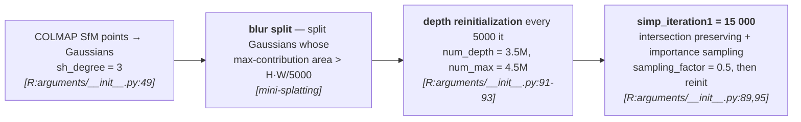
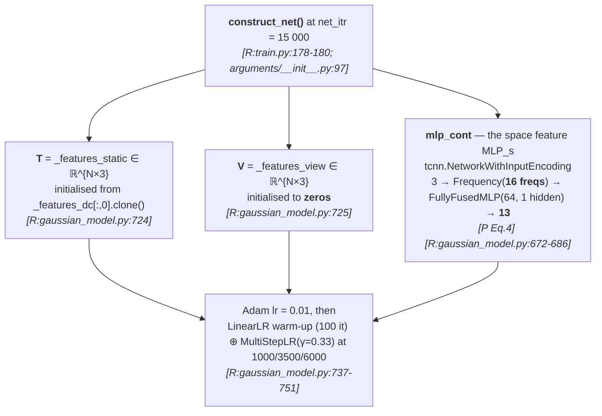
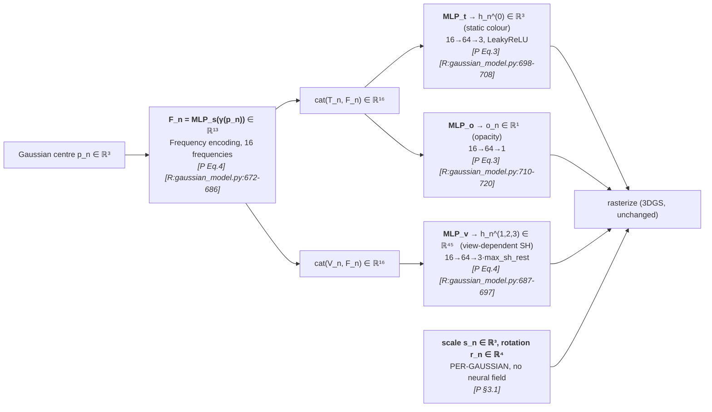
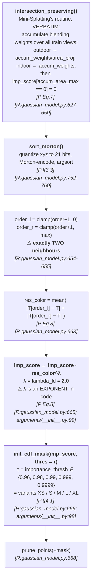
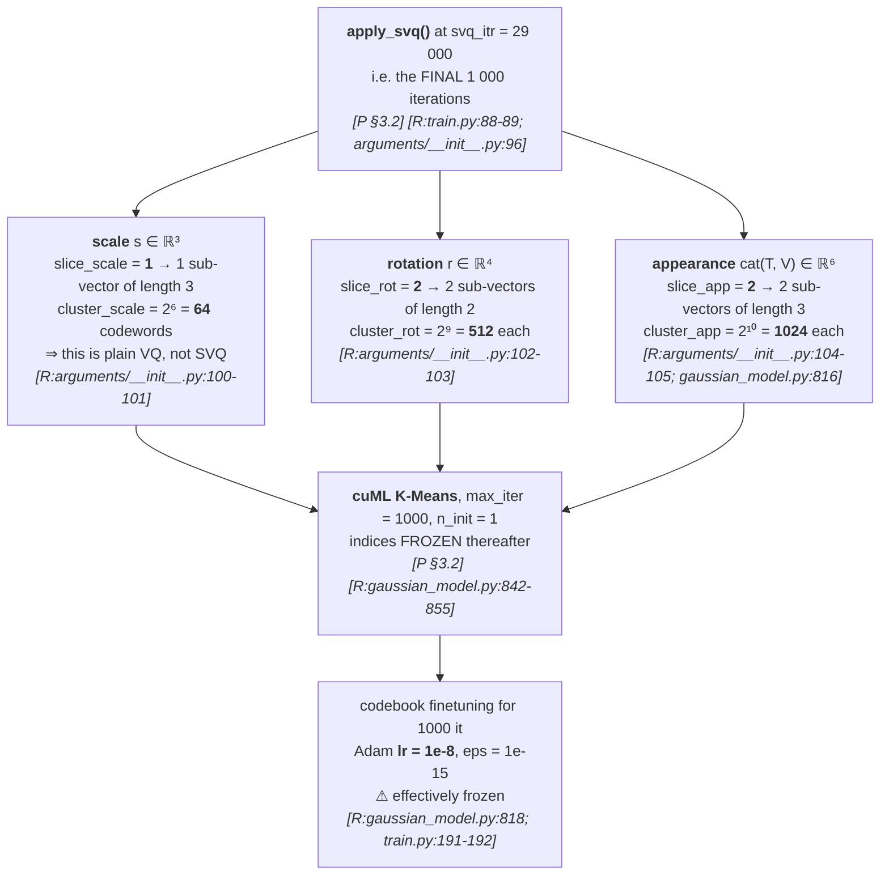
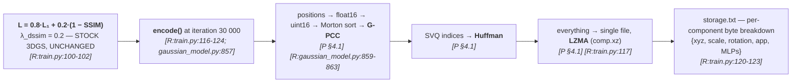

# §2 — Pipeline flowcharts

`[R:file:line]` = `[repo: file:line]`; `[P §x]` = `[paper §x]`.
Stages A–B are **inherited unchanged from `../mini-splatting/`**; C–F are OMG's contribution.

---

## Stage A — The inherited Mini-Splatting backbone (iterations 1 → 15 000)

> ⚠️ **Everything documented in `../mini-splatting/research-methodology-output/` applies
> here**, including its *undocumented* mechanisms — the removed `reset_opacity()`, the
> `(1 − α_accum)`-weighted depth-reinit pixel sampling, and the LR-schedule rewind
> `update_learning_rate(i − simp_iteration1 + 5000)` `[R:train.py:73-77]`. OMG inherits all of
> them without comment.

---

## Stage B — The neural field switches on (iteration 15 000)

> **`D = 3`.** The paper writes `T ∈ ℝ^{N×D}`, `V ∈ ℝ^{N×D}` and says "`D` is the
> dimensionality of each feature" `[P §3.1]` **without ever giving its value**. Code: both are
> 3-dimensional `[R:gaussian_model.py:724-725]`, which is why the downstream MLPs take
> `n_input_dims = 16 = 3 + 13`.

---

## Stage C — Appearance decoding (per Gaussian, per frame)

> **The asymmetry is the design.** Appearance goes through the neural field; **geometry does
> not**. The paper's reason `[P §3.1]`: "Especially for geometry, each Gaussian covers a larger
> spatial region, requiring a more specific scale and rotation to accurately capture structural
> details. Therefore, we **retain the per-Gaussian parameterization** for scale `s` and
> rotation `r` as in 3DGS." This is the sharpest departure from LocoGS.
>
> **All four MLPs are `tcnn.FullyFusedMLP` with 64 neurons and 1 hidden layer**
> `[R:gaussian_model.py:672-720]` — "a **tiny MLP**" `[P §4.2]`. `mlp_cont` uses ReLU; the
> other three use LeakyReLU. None of this is in the paper.

---

## Stage D — Local distinctiveness scoring & pruning (iteration 20 000)

> **This one block replaces Mini-Splatting's plain CDF prune** at `simp_iteration2`. Everything
> before `res_color` is inherited; the `· res_color^λ` factor is OMG's contribution.
>
> ⚠️ **"K-nearest neighbors" is exactly 2.** `[P Eq. 8]` sums over `N_i^K`, "the set of
> K-nearest neighbors of Gaussian `i`", approximated "by sorting Gaussians in **Morton order**
> and selecting Gaussians with **adjacent indices**" `[P §3.3]`. In code that is precisely the
> Morton **predecessor and successor** — `K = 2`, not a tunable parameter. See D-1.
>
> ⚠️ **`res_color` uses `T` (the 3-D static appearance feature) once the net is enabled**, and
> falls back to `_features_dc[:,0]` before then `[R:gaussian_model.py:657-662]`. Since
> `net_itr = 15 000 < simp_iteration2 = 20 000`, the `T` branch is the one that runs.

---

## Stage E — Sub-vector quantization (iteration 29 000 → 30 000)

> **The paper's stated strategy** `[P §3.2]`: "we adopt a **fine-tuning strategy in the final
> 1K iterations**: after initializing with K-means, we **freeze the indices** and **finetune
> only the codebook** using the rendering loss, without introducing any additional losses."
> ✅ The schedule matches exactly. ⚠️ But `lr = 1e-8` over 1000 Adam steps moves each codeword
> by ~1e-5 — the codebook is finetuned in name only. See D-2.
>
> ⚠️ **`slice_scale = 1` means the scale attribute is *not* sub-vector quantized** — it gets a
> single 64-entry codebook, i.e. ordinary VQ. Only rotation and appearance are actually
> partitioned. The paper presents SVQ as applied uniformly to "geometric attributes `s_n`,
> `r_n`" and the concatenated appearance features `[P §3.2]`.

---

## Stage F — Loss and post-processing

> **The objective is untouched 3DGS** `[R:train.py:100-102]` — no rate term, no regulariser, no
> auxiliary loss. Same situation as `../mini-splatting/` and `../EDGS/`, and unlike
> `../CompGS/` (which puts `λR` in the loss) and `../compact3d/` (opacity regulariser).
>
> ✅ **The MLPs are counted in the reported size** — `byte = {'xyz':0, 'scale':0, 'rotation':0,
> 'app':0, **'MLPs':0**}` `[R:train.py:121]`, and the reported figure is
> `os.path.getsize(comp.xz)` — the **actual file on disk**, not an estimate
> `[R:train.py:119]`. Honest accounting, matching `../CompGS/`'s practice.
