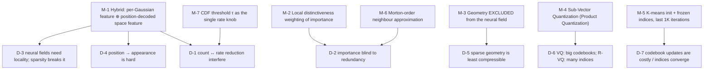

# §5 — Constraints and well-posedness

## 5.0 Restating the question

OMG leaves the 3DGS objective untouched (see [`04-loss.md`](04-loss.md)), so — as with
`../mini-splatting/` and `../EDGS/` — the §5 question must be restated:

> The photometric objective is underdetermined **with respect to which primitives to keep and
> how coarsely to encode them**. OMG's contributions are all *selection* and *quantization*
> rules operating outside the loss, and each addresses a specific way the naive choice fails.

There is an additional, OMG-specific twist: the paper identifies a **coupling** between the two
reductions that makes doing both harder than doing either.

## 5.1 Degeneracies

### D-1 — Count reduction and rate reduction interfere ⭐ **the paper's framing contribution**

> "existing 3DGS compression methods still rely on a relatively large number of Gaussians …
> This is because **a smaller set of Gaussians becomes increasingly sensitive to lossy
> attribute compression**, leading to severe quality degradation." `[paper Abstract]`

Spelled out into two distinct mechanisms `[paper §1]`:

1. **"each Gaussian needs to represent a larger portion of the scene, making it more
   susceptible to compression loss"** — with 5.7 M Gaussians, quantizing one badly is
   invisible; with 430 K, it is a visible artifact.
2. **"the increased spacing between Gaussians disrupts spatial locality, leading to higher
   attribute irregularity and posing challenges for entropy minimization"** — the neural-field
   compression methods (`Compact-3DGS`, `LocoGS`) *rely* on neighbouring Gaussians having
   similar attributes. Sparsify, and that assumption fails.

This is a genuine, non-obvious observation and it is the reason the two literatures had not
composed.

### D-2 — Blending-weight importance is blind to redundancy

`Ī_i` measures global contribution `[paper Eq. 7]`, and nearby Gaussians have nearly identical
contributions. Thresholding then produces two symmetric failures:

> "(1) **abrupt performance degradation when all similar Gaussians are simultaneously
> removed**, and (2) **redundancy when multiple Gaussians with near-identical contributions
> are retained**." `[paper §3.3]`

This is the **same spatial-autocorrelation problem `../mini-splatting/` §4.2 identifies** —
and the two papers answer it differently (see M-2).

### D-3 — Neural fields need a spatial-locality assumption that sparsity breaks

> "Existing approaches [32, 53] have leveraged neural fields to exploit the local continuity of
> Gaussian attributes. While effective in dense representations, **this assumption weakens as
> Gaussians become sparser**." `[paper §3.1]`

But the converse also fails: "entirely disregarding local continuity leads to an **inefficient
representation**, limiting the ability to capture meaningful spatial relationships"
`[paper §3.1]`. Neither pure per-Gaussian storage nor a pure neural field is right.

### D-4 — Mapping positions to appearance is hard, unlike NeRF

> "unlike NeRF, where the query input is a direct spatial point, mapping Gaussian center
> points to corresponding appearances is inherently challenging. **This requires a larger
> neural field model to maintain high fidelity.**" `[paper §2.2, §3.1]`

A Gaussian's centre does not determine its appearance the way a sample point determines
radiance — so a naive position→attribute field must be large, which defeats the purpose.

### D-5 — Geometry is the *least* compressible attribute under sparsity

> "Especially for geometry, each Gaussian covers a larger spatial region, **requiring a more
> specific scale and rotation** to accurately capture structural details." `[paper §3.1]`

A sparse Gaussian's scale/rotation is doing real work; smoothing it through a field destroys
structure.

### D-6 — VQ and R-VQ each fail in a different direction

> Plain **VQ**: "to maintain high fidelity, a **large codebook** size is required, inevitably
> resulting in substantial computational overhead and increased training complexity."
> **R-VQ**: "**multiple code indices per attribute** result in increased storage overhead,
> illustrating a **tradeoff** between reducing per-codebook complexity and increasing overall
> storage requirements." `[paper §3.2]`

### D-7 — Codebook optimization is expensive and unstable late in training

> "the process of **updating both the indices and codes at every training iteration increases
> training time**. Moreover, we observe that **as training converges, the selected codebook
> indices remain largely unchanged**." `[paper §3.2]`

---

## 5.2 The resolving mechanisms

### M-1 — The hybrid appearance representation (D-1, D-3, D-4)

`h_n^(0) = MLP_t(cat(T_n, F_n))`, `F_n = MLP_s(γ(p_n))` `[paper Eqs. 3-4]`.

**Neither horn of D-3 is taken.** The per-Gaussian features `T`, `V` capture *irregularity*;
the space feature `F` captures *continuity*. Because `T` and `V` only need to encode what `F`
cannot, they can be **tiny — 3 dimensions each** `[repo: gaussian_model.py:724-725]`, and
because they carry the irregular part, `MLP_s` can also be tiny (64 neurons, 1 hidden layer,
13 outputs `[repo: gaussian_model.py:672-686]`) — which is exactly the answer to D-4.

The paper states the joint benefit: OMG "achieves high computational efficiency" through "the
reduced number of Gaussians and **the absence of a large neural field**" `[paper §4.2]`.

Quantified: removing `F` costs **0.25 dB (M)** / **0.21 dB (XS)** `[paper Tab. 4]`.

### M-2 / M-6 — Local distinctiveness (D-2)

`I_i = Ī_i · res_color^λ` `[paper Eq. 8]` `[repo: gaussian_model.py:665]`.

A Gaussian whose appearance feature matches its neighbours' is *redundant* and gets its
importance suppressed; a locally unique one is protected. Both halves of D-2 are addressed at
once — clusters are thinned rather than deleted wholesale, and duplicates are not retained.

**M-6** makes it affordable: exact KNN over hundreds of thousands of Gaussians is prohibitive,
so neighbours are the **Morton-order predecessor and successor**
`[repo: gaussian_model.py:653-655]`. The paper discloses the approximation `[paper §3.3]`
(though not that `K = 2` exactly — see D-1 in
[`06-implementation-deltas.md`](06-implementation-deltas.md)).

> **Contrast with `../mini-splatting/`, which faces the identical degeneracy.** Mini-Splatting's
> answer is **stochastic sampling** (`P_i ∝ I_i`, decorrelating the decision); OMG's is a
> **deterministic distinctiveness reweighting**. Two different resolutions of the same problem,
> in a base method and its descendant — a nice pairing for your write-up.

Quantified: removing LD scoring costs **0.12 dB (M)** / **0.23 dB (XS)** `[paper Tab. 4]`,
and — without attribute compression — matches Mini-Splatting using **20–30% fewer Gaussians**
`[paper Fig. 5]`.

### M-3 — Geometry stays per-Gaussian (D-5)

`s ∈ ℝ^{N×3}`, `r ∈ ℝ^{N×4}` are ordinary parameters `[paper §3.1]`; only appearance goes
through the field. This is the paper's sharpest departure from LocoGS, which neural-fields
everything except DC colour `[paper §2.2]`.

⚠️ **Argued but never ablated.** No experiment isolates "geometry through a field" vs "geometry
per-Gaussian". The claim rests on the D-5 reasoning plus OMG's overall win over LocoGS — which
confounds it with LD scoring, SVQ and the smaller Gaussian count.

### M-4 — Sub-vector quantization (D-6)

Partition, then quantize each part with its own small codebook `[paper Eqs. 5-6]`, "motivated
by **Product Quantization** [26]" `[paper §3.2]`. Reducing the **dimensionality** of each
quantized unit — rather than the number of levels (VQ) or the number of stages (R-VQ) — shrinks
codebooks *and* keeps one index per sub-vector.

Config `[repo: arguments/__init__.py:100-105]`: scale `(M=1, B=64)`, rotation `(M=2, B=512)`,
appearance `(M=2, B=1024)` — total **3136 codewords** across all attributes, versus the `2¹⁴`
per attribute the paper reports VQ needing `[paper §4.3]`.

Quantified: SVQ costs **≤0.05 dB for a 4.9× size reduction** `[paper Tab. 4]`, and beats both
VQ and R-VQ on rate–distortion `[paper Tab. 5]`.

### M-5 — Freeze the indices, finetune only at the end (D-7)

> "we adopt a fine-tuning strategy in the **final 1K iterations**: after initializing with
> K-means, we **freeze the indices** and finetune only the codebook … Since K-means
> initialization is completed **within seconds** due to the small codebooks, this approach adds
> minimal additional training time." `[paper §3.2]`

✅ Schedule confirmed: `svq_itr = 29 000` of 30 000 `[repo: arguments/__init__.py:96]`, cuML
K-means with `max_iter=1000, n_init=1` `[repo: gaussian_model.py:842-855]`.

⚠️ **The "finetuning" is nominal** — `Adam(lr = 1e-8)` `[repo: gaussian_model.py:818]`. Over
1000 steps each codeword moves ~1e-5. Effectively, the codebook is **frozen at its K-means
initialisation**. See D-2 in [`06-implementation-deltas.md`](06-implementation-deltas.md).

This is validated indirectly: quantization costs ≤0.05 dB `[paper Tab. 4]`, so K-means alone
is evidently good enough — which is consistent with the paper's own observation that "as
training converges, the selected codebook indices remain largely unchanged" `[paper §3.2]`.

### M-7 — τ as the single rate knob

> "**The only factor controlling the storage is the CDF-based threshold value τ** of Gaussian
> importance, which is set to 0.96, 0.98, 0.99, 0.999, and 0.9999" for XS–XL `[paper §4.1]`
> = `[repo: arguments/__init__.py:98]`.

One scalar produces a clean five-point rate–distortion family (Table 3) — comparable to
`../CompGS/`'s λ sweep, but **without** a rate term in the loss.

---

## 5.3 What is *not* resolved

- **OMG never matches its own base method on quality.** Mini-Splatting 27.39 / 0.822 / 0.216 vs
  OMG-XL 27.34 / 0.819 / 0.218 `[paper Tab. 3]`. The claim is **−0.05 dB for 17.5× smaller**,
  which is excellent — but the framing "outperforms" applies only to *compression* baselines,
  not to Mini-Splatting.
- **Every hyperparameter of the three contributions is unstated.** `λ = 2.0`, `K = 2`, `D = 3`,
  the 13-dim space feature, 16 frequencies, 64-neuron MLPs, and all six SVQ constants live only
  in code. Applying OMG to a new domain (e.g. underwater) means re-tuning quantities the paper
  does not name.
- **The geometry-exclusion claim (M-3) is untested.** It is the paper's most distinctive
  architectural decision and has no ablation.
- **All of Mini-Splatting's unresolved issues are inherited**, including the depth-driven
  reinitialization failing in regions without valid depth — sky in `train`
  `[mini-splatting paper App. G]`, and by extension the **water column** in underwater scenes.
  OMG neither fixes nor mentions this.
- **`res_color` compares a 3-D learned feature, not colour.** The variable is *named*
  `res_color` and the paper calls it "the similarity of the static appearance feature"
  `[paper §3.3]` — but `T` is a learned latent whose relation to perceived colour is only
  indirect (it is *initialised* from DC colour, then trained). Two Gaussians could be
  perceptually identical yet have distinct `T`. Not discussed.
- **Rendering still requires per-frame MLP evaluation** for appearance — cheaper than the
  anchor-based methods' per-view MLPs `[paper §2.2]`, but not free, and it means the output is
  **not a plain 3DGS `.ply`** renderable by a standard viewer without decoding.
- **A hard external dependency chain**: tiny-cuda-nn, cuML/RAPIDS, and a separately compiled
  G-PCC binary whose path is **hard-coded** at `utils/gpcc_utils.py` lines 243/258
  `[repo: README.md]`.
