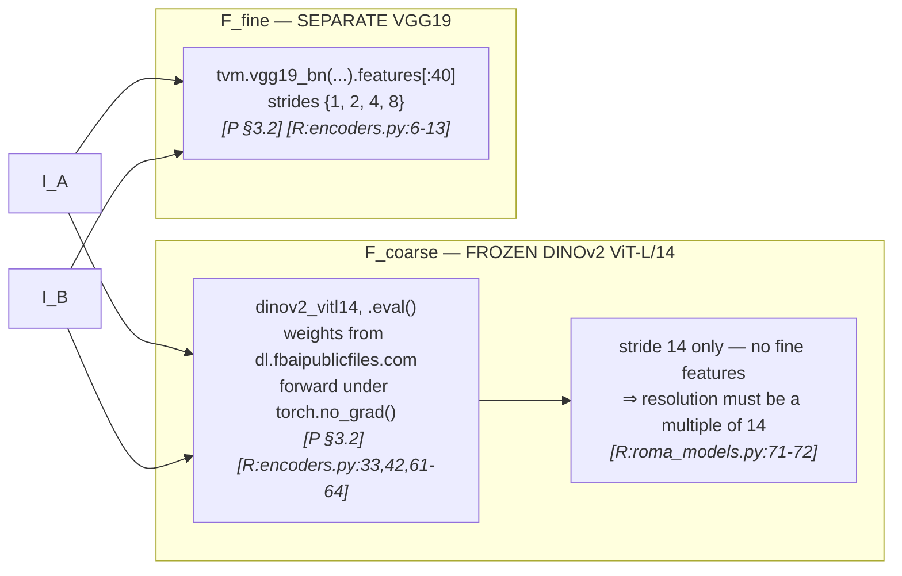
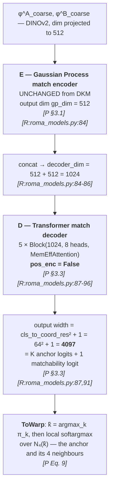
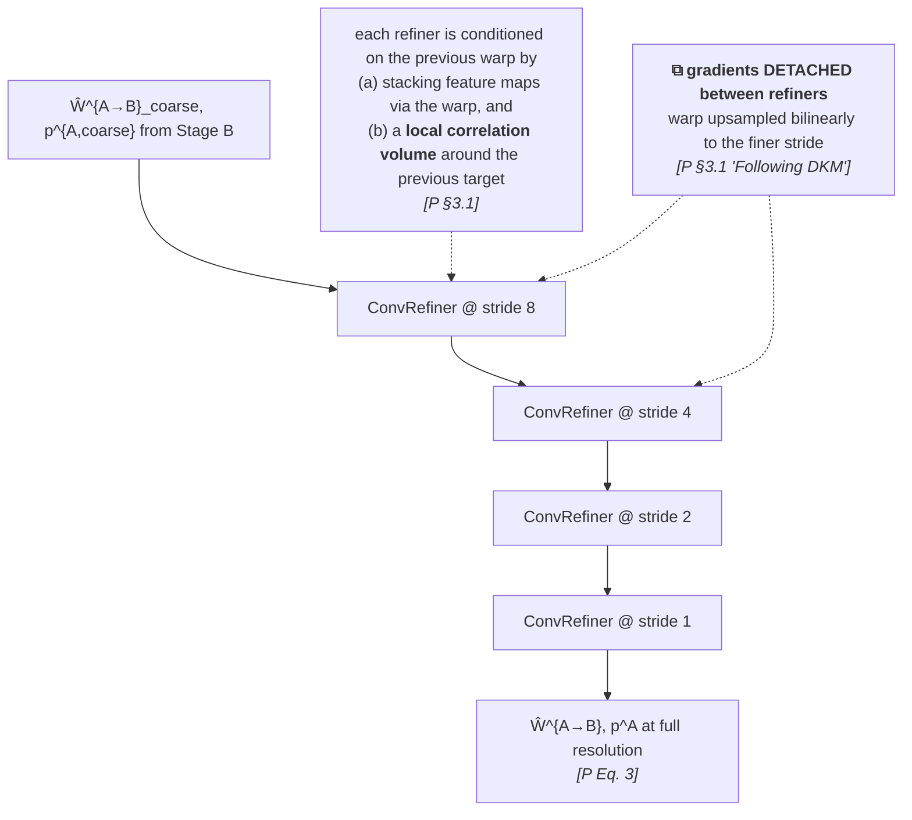
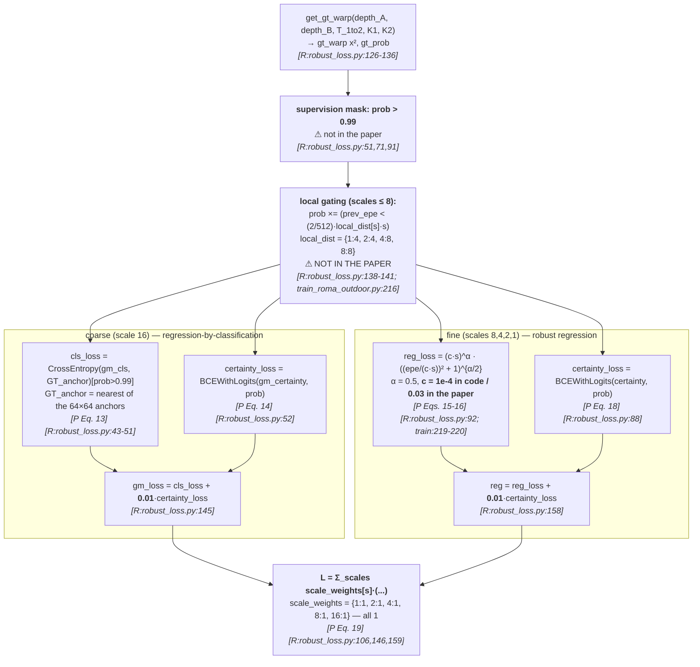
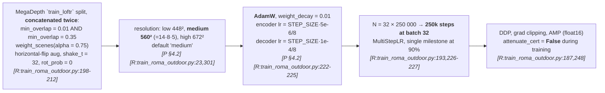
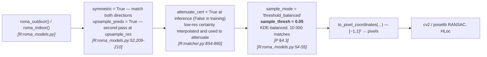

# §2 — Pipeline flowcharts

`[R:file:line]` = `[repo: file:line]`; `[P §x]` = `[paper §x]`.
Unlike `../RoMaV2/`, **training code is released here**, so every stage is verifiable.

---

## Stage A — Decoupled feature extraction

> **The decoupling *is* the contribution.** DKM used one encoder for both roles; RoMa splits
> `F` into `{F_coarse,θ, F_fine,θ}` and sets `F_coarse,θ = DINOv2` `[P §3.2 / Eq. 7]`.
> Setup II of Table 2 shows that **decoupling alone** — same architecture, just unshared
> weights — improves 100-PCK@1px from 17.0 → 16.0, *before* any encoder is changed.
>
> **Frozen is enforced structurally, not by a flag.** The DINOv2 module is stored inside a
> *Python list* — `self.dinov2_vitl14 = [dinov2_vitl14]`, with the source comment
> *"ugly hack to not show parameters to DDP"* `[R:encoders.py:50]` — so it is never registered
> as a submodule, never sees the optimizer, and is additionally run under `torch.no_grad()`
> `[R:encoders.py:61]`. ✅ matches "We keep the DINOv2 encoder frozen throughout training"
> `[P §3.2]`.

---

## Stage B — Global matcher `G = D ∘ E` (coarse, stride 14, keyed `16`)

> **Every architectural number in §3.3 checks out**: "5 ViT blocks, with 8 heads, hidden size
> D 1024, and MLP size 4096" `[P §3.3]` ⇒ `Block(decoder_dim=1024, 8)` × 5, and 4096 is the
> default 4× MLP ratio. `K = 64 × 64` ⇒ `cls_to_coord_res = 64`, output `64² + 1`.
> ✅ `[R:roma_models.py:87-96]`.
>
> **`pos_enc = False` is deliberate and argued** `[P §3.3]`: "In early experiments, we found
> that ConvNet coarse match decoders **overfit to the training resolution**. Additionally,
> they tend to be **over-reliant on locality** … it leads to oversmoothing for the coarse warp.
> … **By restricting the model to only propagate by feature similarity, we found that the
> model became significantly more robust.**"
>
> ⚠️ **Naming trap:** the coarse level is keyed **`16`** in the `corresps` dict
> `[R:matcher.py:856]` and in `scale_weights` `[R:robust_loss.py:106]`, even though the actual
> stride is **14** (DINOv2 patch size). See D-6.

---

## Stage C — Refiners (strides 8 → 4 → 2 → 1)

> Refiners "predict a **residual offset** for the estimated warp, and a **logit offset** for
> the certainty" `[P §3.1]`. `hidden_blocks = 8`, `kernel_size = 5`,
> `displacement_emb_dim = 64`, depthwise convs (`dw = True`) `[R:roma_models.py:99-129]`.
>
> **The inter-refiner detach is what makes the two losses independent** — see
> [`04-loss.md`](04-loss.md) §4.3.

---

## Stage D — Loss composition ✅ **verified against code**

> **`λ = ce_weight = 0.01`** `[R:train_roma_outdoor.py:215]` — the paper introduces `λ` in
> Eq. 14 but **never states its value**.
>
> **`c = 1e-4`** in the training script `[R:train_roma_outdoor.py:220]` versus **"we choose
> c = 0.03"** `[P §3.4]` — a **300× discrepancy**, and the single most significant delta in
> this folder. See D-1.
>
> **Two undocumented masks** gate all supervision: `prob > 0.99`, and the local-EPE window.

---

## Stage E — Training ✅ **verified**

> The LR expressions **are** the paper's linear scaling made explicit: "a canonical learning
> rate (for batchsize = 8) of 10⁻⁴ for the decoder, and 5 × 10⁻⁶ for the encoder(s)"
> `[P §4.2]` ⇒ `STEP_SIZE * 1e-4 / 8` and `STEP_SIZE * 5e-6 / 8` ✅.
>
> **Step count, optimizer, weight decay, LR schedule, augmentation and scene weighting are
> all absent from the paper.** So is the two-way `min_overlap` concatenation, which is a
> deliberate easy/hard mixture. See D-3, D-4.

---

## Stage F — Inference & downstream sampling

> ⭐ **`sample_thresh = 0.05` is what `../EDGS/` reads as its confidence threshold**:
> `upper_thresh = roma_model.sample_thresh` `[EDGS repo: source/corr_init.py:541]`. EDGS's
> `τ_corr` of `[EDGS paper Eq. 9]` is therefore *this constant*, inherited silently.
>
> ⚠️ **EDGS disables two of these**: `upsample_preds = False` and `symmetric = False`
> `[EDGS repo: source/corr_init.py:538-539]` — so EDGS runs a single-pass, one-directional
> RoMa, not the configuration benchmarked in the paper.
