# §5 — Constraints and well-posedness

## 5.0 Restating the question for a feed-forward matcher

As with `../RoMaV2/`, there is no scene to under-constrain. The ill-posedness is in the task
and in the objective:

> Dense two-view matching must emit a value at **every** pixel, including occluded and
> textureless ones that have **no correct answer**. And at coarse scales the correct answer is
> genuinely **not unique** — which makes the standard regression objective not merely
> imprecise but *systematically wrong*.

RoMa is unusual in your comparison set because it **derives** its remedies from an explicit
probabilistic model rather than adding priors empirically.

## 5.1 Degeneracies

### D-1 — The coarse conditional is **multimodal**, so L2 regression targets a non-answer

This is the paper's central diagnosis, and it is derived, not asserted.

**The model** `[paper Eq. 10]`:
`q(x^A, x^B; s) = 𝒩(0, s²I) ∗ p(x^A, x^B; 0)`
— matchability at scale `s` is the exact infinite-resolution match distribution **diffused**
by a Gaussian of width `s`.

**The consequence** `[paper §3.4, Fig. 3]`: at **motion boundaries** — "discontinuities in the
matches" where two objects project to adjacent pixels — the diffusion mixes two distinct
correct answers. The coarse conditional therefore has **two modes**.

An L2 loss on a bimodal target converges to the **mean of the modes**, a coordinate that is
correct for *neither* object. DKM used non-robust L2 at both stages `[paper §1]`, so this is a
concrete defect of the baseline, not a hypothetical.

### D-2 — The refinement initialisation may be far outside the support

Conditioned on a previous estimate the distribution is locally unimodal — but only *locally*:

> "However, if this initial choice is **far outside the support** of the distribution, using a
> non-robust loss function is problematic." `[paper §3.4]`

A gross coarse error produces an enormous residual, which a quadratic loss weights
quadratically, and the refiner's update is dominated by pixels it cannot fix.

### D-3 — Occlusion: most pixels have no correspondence at all

A dense matcher emits a warp for every pixel including occluded ones. Without a co-visibility
channel, downstream consumers cannot separate "here is the match" from "there is no match".

### D-4 — Coarse robustness and fine localizability are in tension

The paper's empirical surprise, measured twice (Table 1 for coarse, Table 2 Setup III for
fine): **VGG19 is the *worst* coarse encoder and the *best* fine encoder**; ResNet50 is the
reverse.

> "Our finding indicates that there is an **inherent tension between fine localizability and
> coarse robustness**." `[paper §3.2]`

A single shared encoder — DKM's design — must compromise between the two and is optimal for
neither.

### D-5 — Trained features overfit; ImageNet-frozen features are too weak

> "since collecting real-world 3D datasets is expensive, the amount of available data is
> limited, which means models risk **overfitting to the training set**. This in turn limits the
> models robustness to scenes that differ significantly from what has been seen during
> training." `[paper §1]`

And the obvious fix does not work: "using frozen backbones pretrained on ImageNet
classification, the out-of-the-box performance is **insufficient** for feature matching (see
experiments in Table 1)" `[paper §1]` — VGG19 at 43.2% robustness, RN50 at 57.5%.

### D-6 — ConvNet decoders overfit to resolution and over-smooth

> "In early experiments, we found that ConvNet coarse match decoders **overfit to the training
> resolution**. Additionally, they tend to be **over-reliant on locality**. While locality is a
> powerful cue for refinement, it leads to **oversmoothing for the coarse warp**."
> `[paper §3.3]`

Over-smoothing is precisely the wrong behaviour at a motion boundary (D-1) — a ConvNet
decoder actively blurs the discontinuity the model needs to represent.

### D-7 — The two stages could fight each other

A coarse loss and a fine loss over shared parameters would require a tuned balance, and
gradients from the fine stage could corrupt the coarse matcher.

---

## 5.2 The resolving mechanisms

```mermaid
flowchart TD
    D1["D-1 multimodal coarse conditional"]
    D2["D-2 refinement init far from support"]
    D3["D-3 occlusion / no correct answer"]
    D4["D-4 coarse robustness ⊥ fine localizability"]
    D5["D-5 trained features overfit; ImageNet too weak"]
    D6["D-6 ConvNet decoder overfits resolution, oversmooths"]
    D7["D-7 the two stages could compete"]

    M1["M-1 Regression-by-classification over K=64² anchors"]
    M2["M-2 Robust generalized-Charbonnier (α = 0.5)"]
    M3["M-3 Explicit matchability channel p^A + BCE"]
    M4["M-4 DECOUPLED encoders: DINOv2 coarse, VGG19 fine"]
    M5["M-5 FROZEN DINOv2 foundation backbone"]
    M6["M-6 Transformer decoder with pos_enc = False"]
    M7["M-7 Gradient detachment between stages/refiners"]
    M8["M-8 prob > 0.99 supervision mask (repo-only)"]
    M9["M-9 Local-EPE gate on refiner supervision (repo-only)"]

    M1 --> D1
    M6 --> D1
    M2 --> D2
    M9 --> D2
    M3 --> D3
    M8 --> D3
    M4 --> D4
    M5 --> D5
    M6 --> D6
    M7 --> D7
```



### M-1 — Regression-by-classification (the answer to D-1)

`p_coarse,θ(x^B | x^A) = Σ_k π_k(x^A) B_{m_k}` with `K = 64 × 64` anchors, `B = U`
`[paper Eq. 8]`. A categorical distribution over 4096 anchors **can** put mass on two modes;
a regressed coordinate cannot.

Two design details matter:
- **The anchors tile the grid exactly** — "positioned uniformly as a tight cover of the image
  grid … This ensures that there is **no overlap between anchors and no holes** in the cover"
  `[paper §3.3, footnote 2]`. Verified: `linspace(−1+1/64, 1−1/64, 64)`
  `[repo: robust_loss.py:48]`.
- **Decoding recovers sub-anchor precision** via `argmax` then a **local softargmax** over
  `N₄(k̂)` `[paper Eq. 9]` — classification for expressiveness, local regression for accuracy.
  Without the softargmax the coarse warp would be quantised to a 64×64 grid.

Measured: Setup V→VI, **14.3 → 13.6** 100-PCK@1px `[paper Tab. 2]`.

### M-2 — Robust regression (the answer to D-2)

Generalized Charbonnier with `α = 0.5` `[paper §3.4, ref 3]`. Fig. 4 shows the gradient
"locally matches L2 gradients, but globally decays with `|x|^{-1/2}` toward zero"
`[paper Fig. 4]`. A pixel the coarse stage placed 200 px away contributes almost nothing.

Measured: Setup VI→VII, **13.6 → 13.1** `[paper Tab. 2]`.

⚠️ The transition point between the two regimes is set by `c`, and **`c = 1e-4` in code vs
`0.03` in the paper** `[repo: train_roma_outdoor.py:220]` vs `[paper §3.4]`. Since `c` is
exactly the scale at which the loss stops behaving like L2, a 300× difference materially
changes *how aggressively* this mechanism operates. See D-1 in
[`06-implementation-deltas.md`](06-implementation-deltas.md).

### M-3 / M-8 — Making occlusion observable rather than solving it

`p^A(x^A)` is a first-class output, the `+1` in the decoder's `K + 1` channels
`[paper §3.3]` `[repo: roma_models.py:87]`, trained with BCE against ground-truth
co-visibility `[repo: robust_loss.py:52, 88]`. D-3 is not *solved* — it is **reported**, which
is the only correct move.

**M-8**, repo-only: all *warp* losses are masked to `prob > 0.99`
`[repo: robust_loss.py:51, 71, 91]`. The certainty BCE stays unmasked (it needs negatives).
So the geometry heads are supervised **only** where the answer is certain — a clean
separation of "learn where the match is" from "learn whether there is a match". Not in the
paper.

### M-4 — Decoupled, specialised encoders (the answer to D-4)

`F → {F_coarse,θ, F_fine,θ}` with `F_coarse,θ = DINOv2` `[paper Eq. 7]`. The paper isolates
the two halves of the benefit:
- **Decoupling alone** (Setup II, both still RN50): 17.0 → 16.0. "This is due to the feature
  extractor being able to **specialize** in the respective tasks" `[paper §3.2]`.
- **Then choosing the right encoder per role** (Setup III): 16.0 → 14.5.

Together **−2.5** 100-PCK@1px, the largest single contribution in Table 2 — larger than the
Transformer decoder or either loss change.

### M-5 — Freezing the foundation backbone (the answer to D-5)

> "The main benefit is that keeping the representations fixed **reduces overfitting** to the
> training set, enabling RoMa to be more robust." `[paper §3.2]`

Enforced *structurally*, not by a flag: DINOv2 is stored inside a Python list —
`self.dinov2_vitl14 = [dinov2_vitl14]`, commented *"ugly hack to not show parameters to
DDP"* `[repo: encoders.py:50]` — so it is never registered as a submodule and cannot reach
the optimizer, and its forward runs under `torch.no_grad()` `[repo: encoders.py:61]`.

The payoff is not on MegaDepth (where Setup IV→V moves 1px by only 0.1) but on
**out-of-distribution** data: **WxBS 58.9 → 80.1 mAA, +36%** `[paper Tab. 4]`. That gap
*is* the anti-overfitting argument, measured.

### M-6 — Transformer decoder without position encodings (D-1 and D-6)

`pos_enc = False` `[repo: roma_models.py:96]`, and the reasoning is unusually direct:

> "**By restricting the model to only propagate by feature similarity**, we found that the
> model became significantly more robust." `[paper §3.3]`

Denying the decoder access to absolute coordinates forces it to match on appearance alone,
which (a) removes the resolution overfitting of D-6 and (b) removes the locality bias that
smooths across motion boundaries (D-1).

Measured by the **leave-one-out** Setup VIII: reverting to a ConvNet decoder costs
**13.1 → 14.0** `[paper Tab. 2]`.

> Note `../RoMaV2/` later reaches the opposite conclusion about *position encodings in
> general* — it uses RoPE, but on a **normalized grid**, and fixes the absolute-embedding
> scale to 1 to keep frequencies low `[RoMaV2 paper §3.5]`. Same underlying concern
> (resolution robustness), different remedy.

### M-7 — Gradient detachment (the answer to D-7)

Two cuts, both inherited from DKM:
1. **Between coarse matcher and refiners**, and **between refiners**: "Following DKM, we
   **detach the gradients between the refiners**" `[paper §3.1]`.
2. Consequence, stated as a feature: "we do **not need to tune any scaling** between these
   losses as the coarse matching and fine stages are decoupled as gradients are cut in the
   matching, and encoders are not shared" `[paper §3.4]`.

Confirmed in code: `scale_weights = {1:1, 2:1, 4:1, 8:1, 16:1}` — all ones
`[repo: robust_loss.py:106]`.

**This is the same design pattern as the detached auxiliary heads elsewhere in your set**
(`../RoMaV2/`'s `detach(r)`, `../seasplat/`'s `Ẑ.detach()`, `../seathru_NeRF/`'s
`stop_gradient(t_delta)`) — but used for a different purpose: here it makes two *objectives*
independent rather than protecting a primary prediction from an auxiliary one.

### M-9 — The local-EPE gate (repo-only)

`[repo: robust_loss.py:138-141]`:
```python
if self.local_largest_scale >= scale:
    prob = prob * (interpolate(prev_epe) < (2/512) * (self.local_dist[scale] * scale))
```
with `local_dist = {1:4, 2:4, 4:8, 8:8}` `[repo: train_roma_outdoor.py:216]` and `prev_epe`
**detached** `[repo: robust_loss.py:160]`.

A refiner at scale `s` is supervised **only where the coarser scale was already within
~`local_dist[s]·s` pixels**. This is the *implementation* of the paper's claim that
refinement is conditional on a previous estimate — but as a **hard gate** rather than the
soft down-weighting the robust loss provides. It closes D-2 twice over.

**Absent from the paper**, and it means the robust loss never actually sees the extreme
outliers it was designed to tolerate. See D-2 in
[`06-implementation-deltas.md`](06-implementation-deltas.md).

---

## 5.3 What is *not* resolved

- **Multimodality is representable but never *used* downstream.** The decoder outputs a full
  categorical over 4096 anchors, and then `ToWarp` immediately collapses it to a single
  coordinate by `argmax` + softargmax `[paper Eq. 9]`. At a motion boundary the model *knows*
  there are two answers and reports one. `../RoMaV2/` later adds a **2×2 precision matrix**
  `[RoMaV2 paper §3.3]` to expose second-order uncertainty — but even that is unimodal.
  Propagating genuine multimodality to a consumer remains open, and it matters for
  `../EDGS/`, which triangulates single point estimates.
- **Anchor resolution caps coarse precision.** `K = 64²` over the image grid; the local
  softargmax over `N₄` mitigates but does not remove the quantisation.
- **Training is MegaDepth-only for the outdoor model** `[repo: train_roma_outdoor.py:197]`,
  with a separate ScanNet-trained model for ScanNet-1500 `[paper §4.2]`. This is exactly the
  narrowness `../RoMaV2/` attacks with its 10-dataset mixture `[RoMaV2 paper Tab. 3]`, and it
  is why v2 wins so heavily on TA-WB, FlyingThings3D and AerialMegaDepth.
- **No multi-view or cycle consistency.** Strictly two-view. `../EDGS/` aggregates
  `num_refs × nns_per_ref = 540` pairs `[EDGS repo: configs/train.yaml]` and must re-derive
  consistency itself through reprojection error `[EDGS paper Eq. 10]` — RoMa offers no
  guarantee that its warps agree across pairs.
- **A train/test asymmetry in `attenuate_cert`**: `False` during training
  `[repo: train_roma_outdoor.py:187]`, `True` at inference `[repo: roma_models.py:56]`, where
  the low-resolution certainty is interpolated and used to attenuate the fine certainty
  `[repo: matcher.py:854-860]`. The mechanism is never described in the paper and the model is
  never trained with it on.
- **`c`'s 300× discrepancy means the deployed robustness profile is not the analysed one.**
  The Fig. 4 gradient curves are drawn for the paper's `c`; the shipped model was trained with
  a different one.
