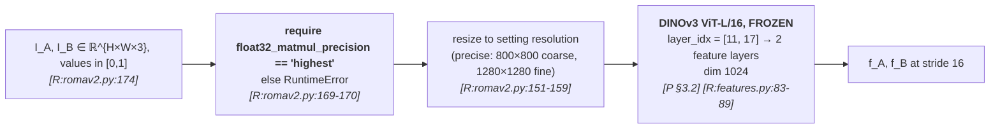
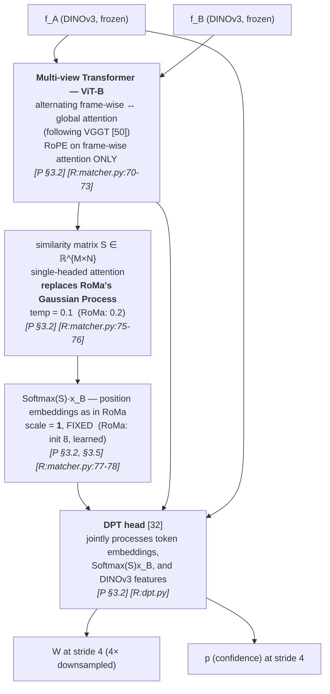
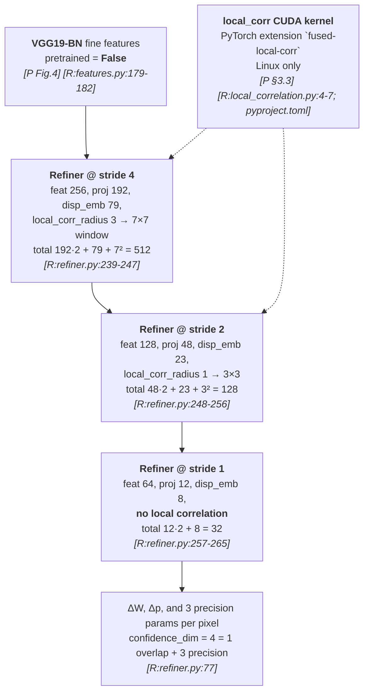
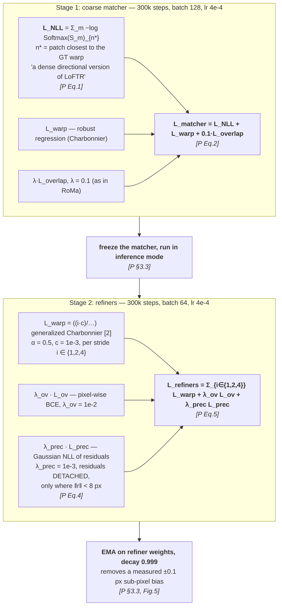
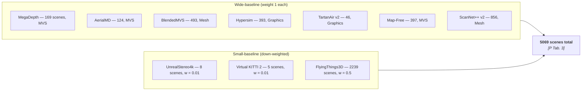
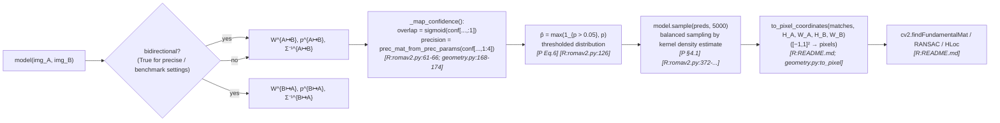

# §2 — Pipeline flowcharts

`[R:file:line]` = `[repo: file:line]`; `[P §x]` = `[paper §x]`.
⚠️ Training is **not released** `[R:src/romav2/romav2.py:172]`, so Stages D–E are
**paper-only**; Stages A–C and F are verified against code.

---

## Stage A — Input → frozen DINOv3 features

> **Frozen is the whole argument.** `frozen: bool = True` `[R:features.py:85]`. The paper's
> case against UFM is that finetuning the backbone costs robustness to extreme appearance
> change `[P §1]`. Table 1 justifies the DINOv2→DINOv3 swap with a linear-probe study:
> EPE **27.1 → 19.0**, robustness **77.0% → 86.4%** `[P Tab. 1]`.
>
> Patch size grows 14 → 16, which the paper notes and accepts: DINOv3 "is more robust than
> its predecessor **despite its slightly larger patch size**" `[P §3.2]`.

---

## Stage B — Coarse matcher (stride 4 output)

> **Why the GP had to go** `[P §3.2]`: "we found that in practice the **gradients through the
> GP were not sufficiently informative** to yield improvements, and caused **stability
> issues** during training." The GP is replaced by plain single-headed attention, and the
> lost supervision is restored by the auxiliary `L_NLL` (Stage D).
>
> **Two resolution-robustness fixes**, both verified in code `[R:matcher.py:75-78]`:
> `temp` **0.2 → 0.1** (undocumented in the paper — see D-1) and `scale` **8 (learned) → 1
> (fixed)**, the latter explained in `[P §3.5]`: high-frequency absolute position embeddings
> interpolate badly across resolutions, and the paper speculates this is "the cause of the
> issue that requires UFM to be run at a fixed resolution".

---

## Stage C — Refiners (strides 4 → 2 → 1)

> **All channel dimensions are powers of two** — the comments in `refiner.py` show the
> arithmetic (512 / 128 / 32), matching `[P §3.3]`: "We further change all channel dimensions
> to be powers of two, which further boosts performance." The refiner type is literally named
> `"roma-4-pow2"` `[R:refiner.py:228]`.
>
> **Only 3 refiners are needed, vs RoMa's 5.** "As the matcher predicts at **stride 4**, in
> contrast to RoMa's **stride 14**, we only need to refine at strides ≤ 4" `[P §3.3]`. This is
> a direct consequence of the DPT head, and it is where much of the 1.7× speedup comes from.
>
> **The CUDA kernel is optional but Linux-only**: `local_corr` is imported in a `try/except`
> `[R:local_correlation.py:4-7]` and the dependency is gated `sys_platform == 'linux'`
> `[R:pyproject.toml]`. Table 8 measures its effect: **5.6 → 4.8 GB** at nearly identical
> throughput (30.3 → 30.9 pairs/s) `[P Tab. 8]`.

---

## Stage D — Training objectives ⚠️ **paper-only, no released code**

> **The two-stage decoupling is inherited from UFM** `[P §3.1]`: "While some previous works
> [11,12] decouple gradients between matchers and refiners but still **train both jointly**,
> we instead opt for a **two-stage training paradigm** inspired by UFM. This enables rapid
> experimentation."
>
> **None of this is in the repo.** `assert not self.training, "Currently only inference mode
> released"` `[R:romav2.py:172]`. See [`04-loss.md`](04-loss.md).

---

## Stage E — Training data mixture ⚠️ **paper-only**

> RoMa v1 trained on **MegaDepth alone**. The stated purpose of each half `[P §3.4]`: the
> **aerial** datasets give robustness to "large rotations and air-to-ground viewpoint
> changes"; the **small-baseline** ones make the model "significantly better at predicting
> fine-grained details" and — notably — enable **textureless-surface** matching in driving
> scenes "despite only training on the very small-scale dataset VKITTI2".

---

## Stage F — Inference & downstream sampling

> **Precision parameterisation, verified end-to-end.** `[P §3.3]` specifies Cholesky factors
> `l11 = Softplus(z11) + 1e-6`, `l21 = z21`, `l22 = Softplus(z22) + 1e-6`, then
> `Σ⁻¹ = LLᵀ`. Code: `chol_eps = 1e-6`; `l00 = F.softplus(delta_confidence[..., 1]) + chol_eps`;
> `l11 = F.softplus(delta_confidence[..., 3]) + chol_eps` `[R:refiner.py:201-204]`, assembled
> into a symmetric 2×2 by `prec_mat_from_prec_params` `[R:geometry.py:168-174]`. ✅ matches.
>
> **Precision is accumulated additively across strides**: `Σ⁻¹_i = Σ_{j≥i} Σ⁻¹_j`, "using the
> fact that information is additive in the precision parameterization" `[P §3.3]` — the
> correct way to fuse independent Gaussian estimates.
