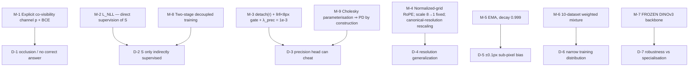

# §5 — Constraints and well-posedness

## 5.0 Restating the question for a feed-forward matcher

RoMa v2 is not a per-scene optimization, so "what makes the naive objective underdetermined"
has a different shape here than in the eight radiance-field folders. There is no scene to
under-constrain. Instead:

> Dense two-view matching is **ill-posed per pixel**: occluded, textureless and
> non-co-visible pixels have **no correct answer**, yet a dense model must emit a value for
> every one of them. And the training objective — regression to a ground-truth warp — is
> *itself* degenerate in several ways that the architecture, not the loss, has to close.

## 5.1 Degeneracies

### D-1 — Occlusion: most pixels have no correspondence

The paper defines the task so that this is explicit from the first paragraph:

> "for a perfect matcher, the confidence `p^{A↦B}` is **1** for pixels corresponding to a 3D
> point in the scene that is observable from both views, i.e., that are co-visible, and **0**
> for occluded pixels." `[paper §1]`

A warp value is still produced for occluded pixels — it is simply meaningless. Without a
co-visibility channel, downstream consumers cannot tell the two cases apart.

### D-2 — The similarity matrix is only indirectly supervised

Once the Gaussian Process is removed, `S ∈ ℝ^{M×N}` sits between the Transformer and the DPT
head with **no direct target**. Gradients reach it only through the warp regression, which is
a weak and highly non-convex path — many attention patterns produce the same regressed warp.

The paper reports that the GP itself had the same problem in the other direction: "we found
that in practice **the gradients through the GP were not sufficiently informative** to yield
improvements, and caused **stability issues** during training" `[paper §3.2]`.

### D-3 — The precision head can cheat

`L_prec` is a Gaussian NLL over residuals `r`. If gradients flowed into `r`, the model could
minimise it by **making residuals match its predicted covariance** rather than by predicting
covariance well — inflating errors wherever it had predicted low precision. A
self-fulfilling prophecy, and a well-known failure mode of learned aleatoric uncertainty.

Additionally, Gaussian NLL has **no robustness**: a single gross outlier (`r` of hundreds of
pixels, common in dense matching) dominates the loss and drags the whole precision field
toward zero.

### D-4 — Resolution generalization

Convolutions and position embeddings are tied to a pixel grid. A model trained at 640×640
and run at 1280×1280 sees out-of-distribution coordinate ranges, and interpolated
high-frequency position embeddings alias. The paper attributes a competitor's limitation to
exactly this: "It is possible that the high frequency of the position embeddings is the
cause of the issue that **requires UFM to be run at a fixed resolution** of 420 × 560 during
inference" `[paper §3.5]`.

### D-5 — Sub-pixel bias, from nowhere in particular

Empirically observed and *not* a data artifact:

> "we empirically observed that predictions tend to have a small, but noticeable, **sub-pixel
> bias** (typically around ±0.1 pixels in resolution 640 × 640). At first, this seemed like a
> data issue, but after plotting this bias over the course of training we found that it
> appears **almost random**" `[paper §3.3, Fig. 5a]`

A 0.1 px systematic offset is negligible for most tasks and **decisive** for MegaDepth-1500
(Table 13 shows precision *is* the benchmark).

### D-6 — Training-distribution narrowness

RoMa v1 trained on MegaDepth alone. That is a single regime — outdoor, wide-baseline,
MVS-supervised — and the model inherits its blind spots: small-baseline motion, textureless
surfaces, aerial/ground viewpoint change, in-plane rotation.

### D-7 — Robustness vs. specialisation

Freezing a foundation backbone buys out-of-distribution robustness; finetuning buys in-domain
accuracy. UFM finetunes and loses WxBS; RoMa freezes and is slower and less precise. This is
a genuine trade-off, not a solved problem — and RoMa v2 does **not** fully escape it (§5.3).

---

## 5.2 The resolving mechanisms

### M-1 — An explicit co-visibility channel

`p` is a first-class output, trained with pixel-wise BCE against `p_GT ∈ {0,1}` derived "from
either **consistent depth** (for MVS style datasets) or from **warp cycle consistency** (for
flow datasets)" `[paper §3.3]`. D-1 is not *solved* — it is **made observable**, which is the
only correct move: the model reports where it cannot know.

This is the signal every downstream consumer actually filters on. `../EDGS/` builds its
`p^corr` sampling distribution directly from it `[EDGS paper Eq. 9]`.

### M-2 — `L_NLL` restores direct supervision of `S`

The auxiliary target closes D-2 by making `S` a classification problem with a known answer
(`n*` = the patch closest to the GT warp) `[paper Eq. 1]`. The paper's positioning —
"a dense directional version of, e.g. LoFTR" `[paper §3.2]` — is exact: LoFTR supervises a
coarse assignment matrix; so does this, densely and one-directionally.

### M-3 / M-9 — Three independent devices keep the precision head honest

1. **`detach(r)`** `[paper §3.3]` — the residual is a constant as far as `L_prec` is
   concerned. Closes D-3's self-fulfilling loop. Structurally identical to
   `../seasplat/`'s `Ẑ.detach()` and `../seathru_NeRF/`'s detached sample spacing: **auxiliary
   heads may explain the primary prediction, never shape it.** Three papers in your set, three
   different domains, same mechanism.
2. **`‖r‖ < 8 px` gate** `[paper §3.3]` — "To ensure stability, we only train the model to
   predict this covariance for covisible regions where `r < 8` pixels." Removes the outlier
   sensitivity of a Gaussian NLL.
3. **`λ_prec = 1e-3`** `[paper Eq. 5]` — three orders below `L_warp`. The head is a passenger.

And **M-9**: the Cholesky parameterisation `Σ⁻¹ = LLᵀ` with `Softplus(·) + 1e-6` on the
diagonal makes positive-definiteness **structural**, not a constraint to be enforced
`[paper §3.3]` = `[repo: refiner.py:201-204]` ✅. The `+1e-6` prevents a singular `L`.

### M-4 — Three separate resolution-robustness fixes

| Fix | Where | Verified |
|---|---|---|
| **Normalized-grid RoPE** — "Following DINOv3 we use RoPE on a **normalized grid, rather than a pixel grid**. This ensures that distances are always in distribution, even when changing resolution significantly" `[paper §3.5]` | coarse matcher | `[repo: matcher.py:71 mv_vit_use_rope=True; vit/rope.py]` |
| **`scale` 8 (learned) → 1 (fixed)** — low-frequency absolute position embeddings interpolate cleanly `[paper §3.5, ref [57]]` | match embeddings | ✅ `[repo: matcher.py:77-78 — "# NOTE: 8 in RoMa"]` |
| **Canonical-resolution rescaling** of the input displacement — "the approach used in RoMa … generalizes best" `[paper §3.5]` | refiners | `[repo: romav2.py:76-77 anchor_width/height = 512]` |

The payoff is the eight-way `Setting` enum `[repo: romav2.py:119-160]`: the *same* checkpoint
runs at 320², 512², 640², 800²+1024², and 800²+1280². UFM cannot.

### M-5 — EMA against an unexplained bias

Decay **0.999** `[paper §3.3]`. The reasoning is unusually clean: the bias "appears almost
random" across training (Fig. 5a), and *because* it is uncorrelated over time, **averaging
kills it** (Fig. 5b). No mechanism is proposed for *why* the bias exists — the paper simply
observes, diagnoses the statistics, and applies the matching remedy. Table 9 confirms the
effect is selective (MegaDepth +1.4 AUC@5, ScanNet +0.0).

### M-6 — Data diversity as a well-posedness mechanism

**10 datasets, 5069 scenes**, deliberately split into wide-baseline (weight 1) and
small-baseline (weights 0.5, 0.01, 0.01) halves `[paper Tab. 3]`. Each half has a stated job
`[paper §3.4]`:
- **Aerial** (AerialMD, BlendedMVS) → "significantly more robust to large rotations and
  air-to-ground viewpoint changes";
- **Small-baseline** (FlyingThings3D) → "significantly better at predicting fine-grained
  details";
- **VKITTI2**, at weight 0.01, → textureless road surfaces in driving scenes, "despite only
  training on the very small-scale dataset".

That last point is striking: a 5-scene dataset at 1% sampling weight is credited with a
qualitative capability (Fig. 6b). Plausible, but **not ablated** — treat it as a hypothesis.

### M-7 — Freezing the backbone (the deliberate side of D-7)

`frozen: bool = True` `[repo: features.py:85]`. The paper's whole positioning against UFM
rests here `[paper §1]`, and Table 1 supplies the linear-probe evidence.

### M-8 — Two-stage decoupling

Matcher trained → **frozen and run in inference mode** → refiners trained `[paper §3.3]`.
Beyond "rapid experimentation" `[paper §3.1]`, this removes a real optimization pathology:
jointly training a coarse matcher and refiners that consume its output means the refiners
chase a moving target. Freezing makes Stage 2 a stationary problem.

⚠️ **Not ablated.** Adopted from UFM on stated convenience grounds, not measured.

---

## 5.3 What is *not* resolved

- **D-7 is not escaped — it is repositioned, and the paper says so.**
  `[paper §5]`: "Compared to RoMa, our model is **slightly less robust to extreme changes in
  modality**, such as in WxBS." Table 11: RoMa **60.8** vs RoMa v2 **55.4** mAA. Table 10
  shows the same sign at the backbone level (DINOv2 35.6 vs DINOv3 34.2 on WxBS). Traced in
  §4.5 to the **IR-to-RGB** subset specifically. **For cross-modal work, `../RoMa/` v1 remains
  the better model.**
- **Satellite imagery is out of distribution**, conceded: SatAst is hard partly because
  "satellite images are OOD for most matchers (**including RoMa v2**)" `[paper §4.6]`.
  Score 37.0 AUC@10px — best in class, but far from solved.
- **No temporal or multi-view consistency.** The model is strictly two-view. A downstream
  consumer that aggregates many pairs — which is exactly what `../EDGS/` does across
  `num_refs × nns_per_ref = 540` pairs — gets no guarantee that the triangulations agree.
  EDGS has to re-derive consistency itself via reprojection error `[EDGS paper Eq. 10]`.
- **Precision is 2D image-space, not 3D.** `Σ⁻¹` describes uncertainty in the *warp*, not in
  a triangulated point. Propagating it through triangulation is left to the consumer;
  Table 12's experiment does it for pose refinement on Hypersim only.
- **`L_NLL` is a sum over patches**, so its scale depends on resolution — and the matcher is
  trained on mixed resolutions `[paper §3.5]`. Whether this is normalised is not stated.
  `[unverified]`
- **The training-side well-posedness story is entirely unverifiable.** Every mechanism in
  §5.2 except M-4, M-7 and M-9 lives in code that was not released
  `[repo: romav2.py:172]`.
