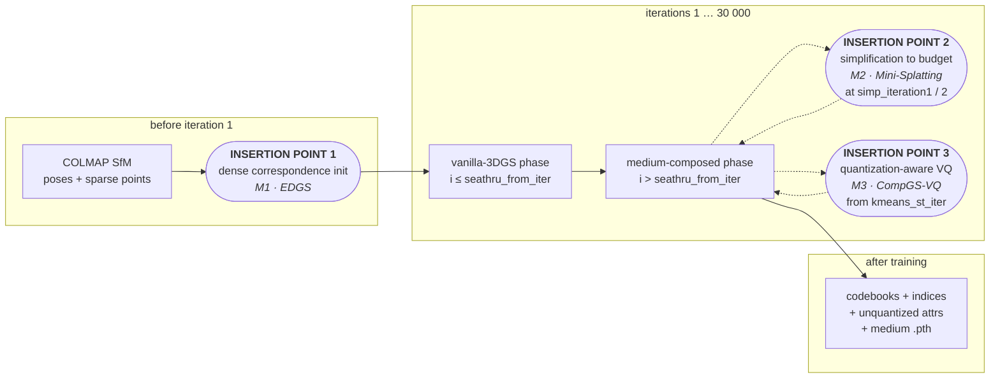
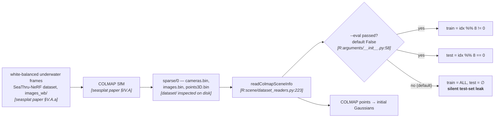
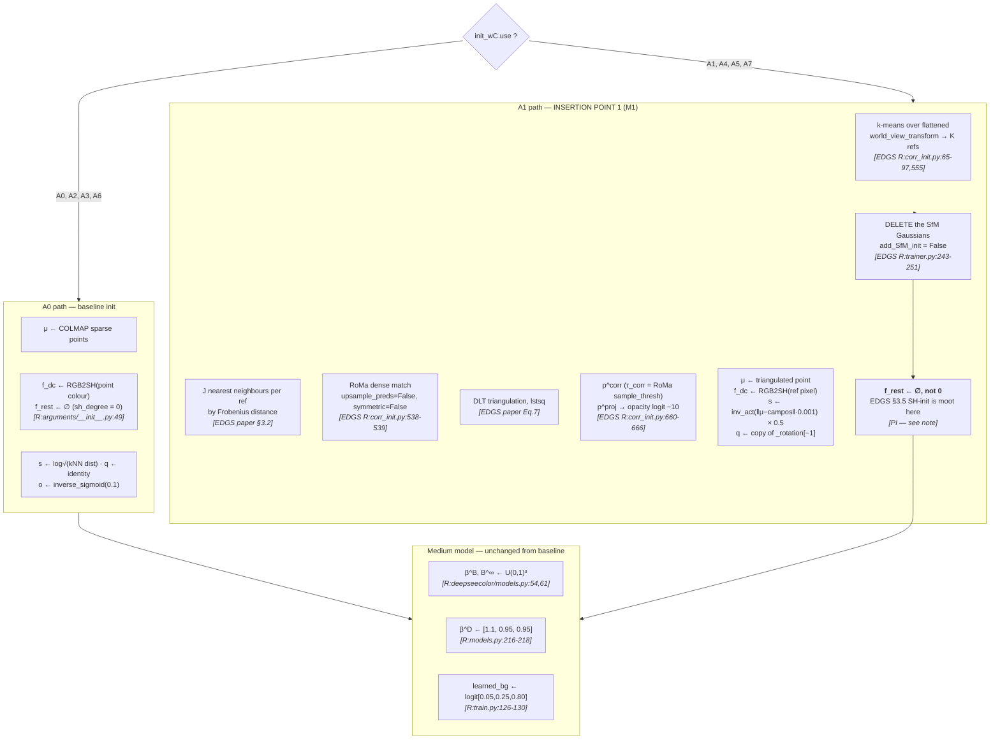
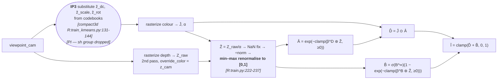
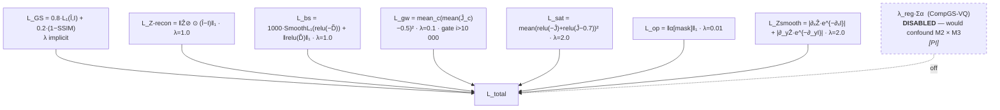
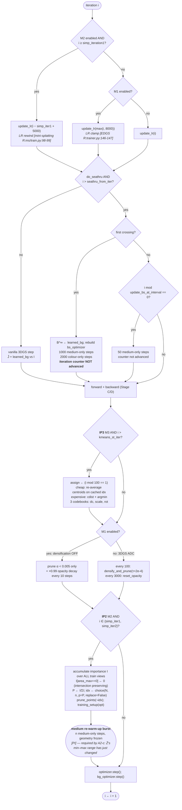
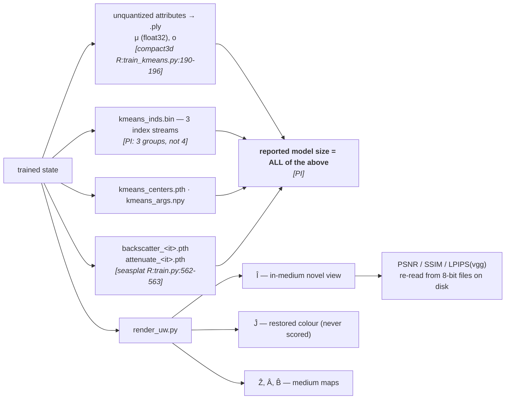

# §2 — Pipeline: baseline loop, three insertion points, and the composition view

Node labels carry evidence tags; `[R:file:line]` abbreviates `[repo: file:line]` and the
repository is named in the surrounding text. `[PI]` abbreviates `[proposed integration]`.

---

## 2.1 The three insertion points, at a glance

The combined method does **not** interleave the three mechanisms. Each one occupies a
distinct, non-overlapping slot in SeaSplat's existing control flow, and that separation is
what makes the 2³ matrix interpretable.

| # | Mechanism | When it fires | Trigger condition | Runs how often |
|---|---|---|---|---|
| **IP1** | M1 — dense init | **once**, before optimization step 1 | flag `init_wC.use` | once per run |
| **IP2** | M2 — simplification | mid-training | `i == simp_iteration1` (15 000) and `i == simp_iteration2` (20 000) | twice per run |
| **IP3** | M3 — quantization | every iteration after a start gate | `i > kmeans_st_iter`; expensive reassignment only when `i mod t == 1` | every iteration (cheap branch), every `t = 100` (expensive branch) |

**The ordering is forced, not chosen.** Initialization must precede optimization; the
quantizer must see a converged-enough model to cluster; and simplification must precede
quantization because quantizing attributes of primitives that are about to be deleted is
pure waste, and because the codebook fitted before a 60–90% prune is fitted to a different
population. See `07-pseudocode.md` §"Why this order" for the argument in full.

---

## 2.2 Stage A — Data → preprocessing (unchanged from the baseline)

> **Carried-forward trap.** `--eval` defaults to `False` and SeaSplat's README command omits
> it `[../seasplat/10-reproducibility.md §10.2]`. Under M1 this compounds: EDGS's config also
> sets `dataset.eval: false` **and** hard-codes `"eval": False` into the emitted `cfg_args`
> `[../EDGS/11-paper-vs-repo-disagreements.md D-12]`. Two independent defaults now point the
> same wrong way. `[PI]` The combined method must pass `--eval` explicitly and assert a
> non-empty test set at startup.

---

## 2.3 Stage B — Model initialization, with INSERTION POINT 1

> **A convenient collision.** EDGS's single highest-severity paper-vs-repo delta is that
> §3.5's spherical-harmonics initialization (Eqs. 12–13) is **not implemented** — `f_rest ← 0`
> `[../EDGS/11-paper-vs-repo-disagreements.md D-1]`. On this baseline that delta is
> **inert**, because `sh_degree = 0` means `f_rest` does not exist
> `[../seasplat/03-variables.md]`. `[inferred: combining EDGS D-1 with SeaSplat's
> sh_degree=0]` The combined method therefore inherits EDGS's *implemented* v1 method
> without inheriting its largest reproducibility problem. This is worth stating in the
> chapter — it is one of the few places where the composition is *easier* than either part.

> **Candidate-count arithmetic.** `num_refs × matches_per_ref` bounds the initial set:
> 180 × 15 000 = **2.7 M**, or 3.6 M at the README's 20 000
> `[../EDGS/03-variables.md]`. On a 4-scene underwater dataset of 18–29 views per scene
> (see `chapter/01-dataset.md`), `num_refs = 180` **exceeds the total view count**, so the
> k-means reference selection degenerates to "every view is a reference."
> `[PI]` `num_refs` must be re-derived per scene — the natural choice is
> `min(num_refs, |train views|)` — and this must be reported, because EDGS's saturation
> analysis `[paper Fig. 6]` was measured on 9–13-scene datasets with far more views.
> This is a concrete, checkable consequence of applying EDGS to small-baseline underwater
> captures and belongs in the implementation details.

---

## 2.4 Stage C — Forward pass (one training iteration, after `seathru_from_iter`)

Unchanged from the baseline in structure; INSERTION POINT 3 substitutes quantized attributes
upstream of the first rasterization.

**The detach map is unchanged and remains load-bearing.** Each medium map is computed
**twice** — once on live `Ẑ` (inside `Î`, so gradients reach the geometry through the
physically-correct composition) and once on `Ẑ.detach()` (inside `L_bs`, so the medium priors
can never move a Gaussian) `[../seasplat/02-pipeline.md Stage C]`. None of M1/M2/M3
introduces a `.detach()` of its own — EDGS and Mini-Splatting contain none at all
`[../EDGS/07-pseudocode.md pt.5; ../mini-splatting/07-pseudocode.md pt.1]` — so the
combined method's gradient routing is exactly the baseline's.

> **The one place IP3 perturbs the detach argument.** `L_bs` is computed on
> `D̃ = I.detach() − B̂'`, which involves no Gaussian attributes at all
> `[../seasplat/04-loss.md term 2]`, so quantization cannot corrupt it. But `Î` — and hence
> `L_GS`, `L_Z-recon`, and `L_op`'s mask — is built from quantized `f_dc`, `s`, `q`.
> `[inferred]` The straight-through estimator routes those gradients back to the
> *unquantized* parameters `[../compact3d/07-pseudocode.md line 20]`, which is exactly what
> the baseline's optimizer groups expect, so the composition is type-correct. What changes
> is that the loss now measures *quantized-model* quality while the medium parameters are
> fitted against it — meaning **the medium model absorbs part of the quantization error.**
> That is a genuine, non-obvious coupling and is flagged again in `05-constraints.md` §5.4.

---

## 2.5 Stage D — Loss composition

The objective is SeaSplat's seven terms, unchanged, plus **at most one** optional term from
M3 which the combined method **disables** (see `01-taxonomy.md` A3-c and `04-loss.md` §4.3).

`[../seasplat/04-loss.md §4.3]` for every weight; `[../compact3d/04-loss.md]` for the
disabled term.

---

## 2.6 Stage E — Optimization / update schedule, with INSERTION POINTS 2 and 3

This is the diagram that matters. It shows both mechanisms firing inside SeaSplat's
alternating schedule, and the `[PI]` medium re-warm-up that A2-c requires.

> **Three learning-rate schedules now compete for the same parameter group.** The baseline
> uses 3DGS's exponential decay; M1 clamps it to its step-8000 value (`max_lr`); M2 rewinds
> it to its step-5000 value after simplification. `[inferred: combining
> ../EDGS/05-constraints.md M-7 with ../mini-splatting/05-constraints.md M-8]` Under **A4
> and A7 both apply**, and their intent is contradictory: M1 clamps *down* because the
> initialization is already near-correct; M2 rewinds *up* because freshly reinitialized
> Gaussians need LR to move. `[PI]` The resolution adopted here is **precedence by
> recency** — M2's rewind takes effect from `simp_iteration1` onward and overrides M1's
> clamp, because after simplification the population genuinely is new. This is a design
> decision with no source and no measurement, and it is listed as such in
> `06-implementation-deltas.md`.

> **The bursty medium schedule consumes no iteration budget, and this compounds.** SeaSplat's
> `continue` statements sit above `iteration += 1`, so a "30 000-iteration" run performs
> ≈43 000 optimizer steps `[../seasplat/08-computational-profile.md §8.3]`. The `[PI]`
> re-warm-up bursts at IP2 add to that count. Any wall-clock comparison must report
> **effective optimizer steps**, not the nominal iteration count.

---

## 2.7 Stage F — Outputs and stored artifact

> **Storage accounting is a combined-method-specific obligation.** CompGS-VQ's published
> `Mem` column is codebooks + indices + unquantized attributes and nothing else — "there is
> **no decoder network to account for**" `[../compact3d/08-computational-profile.md §8.2]`.
> Here there are two additions: the nine medium scalars (negligible, but they exist) and the
> index bit-width bug — CompGS-VQ derives `n_bits = ceil(log2(N))` rather than
> `ceil(log2(K))`, inflating `kmeans_inds.bin` by ~1.7×
> `[../compact3d/11-paper-vs-repo-disagreements.md D-4]`. `[PI]` The combined method should
> fix that bit-width, and if it does, must say so, because its compression ratio then is not
> directly comparable to CompGS-VQ's published one.

---

## 2.8 Composition view — all eight configurations

| ID | IP1 dense init | IP2 simplification | IP3 quantization | Evidence status of each cell |
|---|---|---|---|---|
| **A0** | off | off | off | Baseline. **Measured externally** — SeaSplat's Tab. I/II on these four scenes `[../seasplat/08-computational-profile.md §8.1]`. Not re-measured here. |
| **A1** | **on** | off | off | Mechanism verified in EDGS's repo `[../EDGS/07-pseudocode.md Part 1]`; **composition with a medium model unmeasured.** Requires A1-a, A1-b, A1-c adaptations. |
| **A2** | off | **on** | off | Mechanism verified in Mini-Splatting's repo `[../mini-splatting/07-pseudocode.md Phase 2]`; **composition unmeasured.** Requires A2-a, A2-c, A2-d adaptations. |
| **A3** | off | off | **on** | Mechanism verified in CompGS-VQ's repo `[../compact3d/07-pseudocode.md]`; **composition unmeasured.** Requires A3-a, A3-c, A3-d adaptations. |
| **A4** | **on** | **on** | off | ⚠️ **Degeneracy risk.** If M1's post-init count already sits below M2's budget, the sampling step is a no-op and **A4 ≡ A1**. See the note below. |
| **A5** | **on** | off | **on** | Composition of two upstream/downstream stages that never touch; the least-coupled pair. Still inherits A1-c and A3-a. |
| **A6** | off | **on** | **on** | The pair `../OMG/` predicts to be sub-additive: "a smaller set of Gaussians becomes increasingly sensitive to lossy attribute compression" `[../OMG/00-index.md]`. |
| **A7** | **on** | **on** | **on** | Fully stacked; inherits every adaptation and both degeneracy risks. |

> ⚠️ **The A4/A7 degeneracy is structural and must be designed around, not discovered.**
> M2's simplification samples `n = N · sampling_factor · |{P≠0}|/N` primitives
> `[../mini-splatting/07-pseudocode.md line 45]`, but a *budget* formulation samples to a
> fixed target count. If M1's converged count is already at or below that target, IP2
> removes nothing and A4 becomes an expensive re-run of A1 — and A7 an expensive re-run of
> A5. `[inferred: combining EDGS's reported final counts of 1.4–1.9 M on terrestrial scenes
> (../EDGS/08-computational-profile.md §8.1) with the fact that a budget prune is a
> one-sided constraint]`
> `[PI]` Two mitigations, and the design must pick one explicitly: **(i)** set the budget from
> the *baseline's* (A0) converged count so that it binds in every cell, or **(ii)** run M1 at
> a density high enough that it binds — EDGS exposes `matches_per_ref` and `num_refs` for
> exactly this, and a higher-density M1 variant is a legitimate second point on the
> initialization axis rather than a ninth cell of the matrix. Reporting A4 without checking
> which regime it landed in would produce a "no interaction detected" result that is an
> artifact of the configuration, not a finding.

---

## 2.9 What the pipeline view establishes

1. **The three mechanisms genuinely occupy disjoint slots** — before step 1, at two
   mid-training events, and continuously after a start gate. Nothing about the *plumbing*
   forces them to interact.
2. **They nevertheless interact through three shared quantities** — opacity, the rasterized
   depth map, and the per-Gaussian attribute vector — as tabulated in `01-taxonomy.md` §3.
   The pipeline diagram makes the opacity collision visible: under A4/A7, four different
   pieces of code write to `_opacity` in a single iteration.
3. **Two `[proposed integration]` decisions are load-bearing and unmeasured**: the medium
   re-warm-up burst after simplification (§2.6), and LR-schedule precedence between M1's
   clamp and M2's rewind (§2.6). Both are stated as design decisions in
   `06-implementation-deltas.md` and both are candidates for an ablation of their own.
