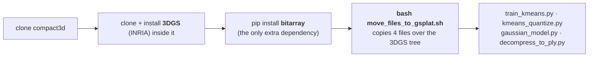
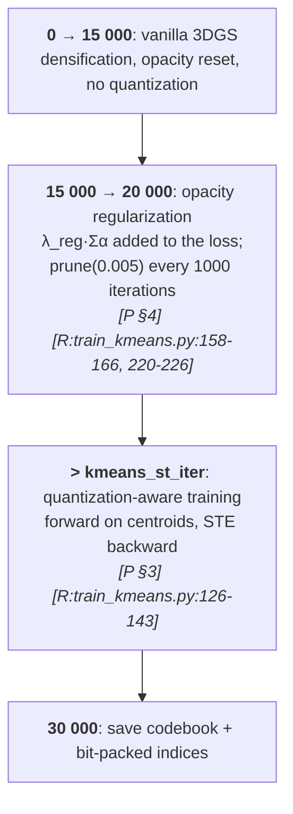
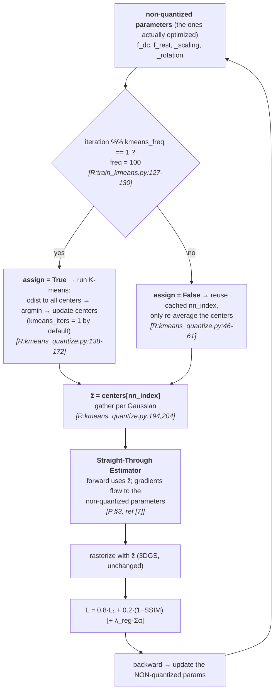
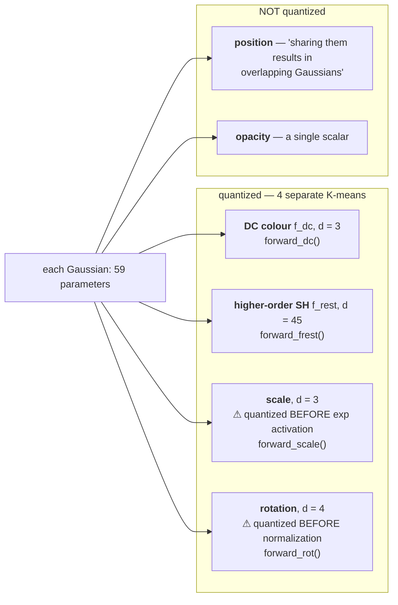
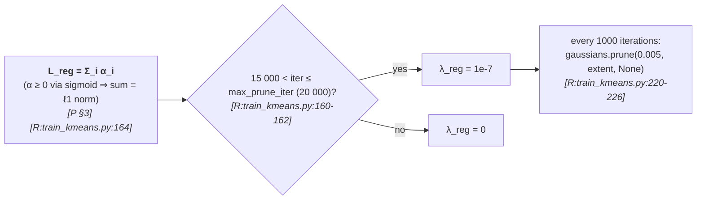
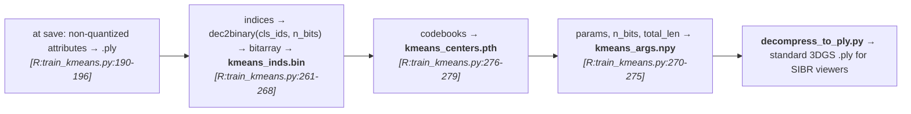

# §2 — Pipeline flowcharts

`[R:file:line]` = `[repo: file:line]`; `[P §x]` = `[paper §x]`.
Everything not shown is **stock 3DGS**, supplied by the upstream repo via the file overlay.

---

## Stage A — Setup: a file overlay onto 3DGS

> `[R:README.md]`. This is why `utils/`, `scene/`, `arguments/` are absent from this folder —
> they are 3DGS's. It also means **`safe_state`'s seed 0, `llffhold = 8`, the standard metric
> harness and `reset_opacity()` are all inherited unchanged**, unlike `../mini-splatting/` and
> `../OMG/`, which modify them.

---

## Stage B — Training timeline

⚠️ **The start of quantization differs between paper and repo:**

| | Quantization starts | Opacity reg. window | K-means iters | Codebooks |
|---|---|---|---|---|
| **Paper `[§4]`** | **20 000** | 15 000 → 20 000 | **1** | color **4096**, covariance **16384** |
| **`run.sh`** `[R:run.sh]` | **15 000** | 15 000 → 20 000 | **10** | dc 4096, **sh 512**, scale/rot **4096** |
| **CLI defaults** `[R:train_kmeans.py:367-378]` | `30000` (⇒ never) | — | **1** ✅ | all **4096** |

The `run.sh` recipe is the **post-paper "opacity regularization" configuration** announced in
the README (31 July 2024), not the configuration behind Table 1. See D-2.

---

## Stage C — Quantization-aware forward/backward (the core mechanism)

> **The asymmetric-cost trick** `[P §3]`: "K-means has two steps: updating centroids given
> assignments, and updating assignments given centroids. We note that the latter is **more
> expensive** while the former is a simple averaging. Hence, we update the centroids **after
> each iteration** and update the assignments **once every `t` iterations**. We observe that
> the modified approach works well even for values of `t` as high as **500**."
> ✅ Verified: `update_centers()` (cheap, cached indices) vs the full `cdist` path
> `[R:kmeans_quantize.py:46-61 vs 138-172]`.
>
> ⚠️ **`iteration % freq == 1`** — assignments happen at 15001, 15101, … (off-by-one, harmless).
>
> ⚠️ **The paper's assignment freeze does not exist.** `[P §4]`: "keep the assignments constant
> thereafter till the last iteration, 30K" (after 25K). In code, reassignment continues every
> 100 iterations to the end `[R:train_kmeans.py:127-130]`. See D-3.

---

## Stage D — Four independent codebooks

> **Why grouped rather than one codebook** `[P §3]`: "Performing a single K-means for the whole
> `d` dimensional parameters requires a **huge codebook** since the different parameters of the
> Gaussian are **not necessarily correlated**. Hence, we group similar types of parameters …
> and cluster them independently."
>
> **Why position and opacity are excluded** `[P §3]`: position because "sharing them results in
> **overlapping Gaussians**"; opacity because it "is a single scalar".
>
> **Activation-order detail** `[P §4]`: "The scale parameters of covariance are quantized
> **before applying the exponential activation**… quaternion based rotation parameters are
> quantized **before normalization**." Confirmed by the `forward_scale` / `forward_rot` entry
> points `[R:kmeans_quantize.py]`. This matters — quantizing post-activation would cluster in a
> distorted space.
>
> The code also supports joint variants `scale_rot` and `sh_dc` `[R:train_kmeans.py:141-144]`,
> matching the paper's Table 9 ablation.

---

## Stage E — Opacity regularization and pruning

> `[P §3]`: "we add ℓ1 norm of the opacity to the loss as a regularizer to encourage zero
> values… `L = L_3DGS + λ_reg Σ_i α_i`". ✅ `[R:train_kmeans.py:164-166]`.
>
> ⚠️ **The 15 000 boundary is hard-coded**, not a CLI argument
> `[R:train_kmeans.py:160-161, 221]` — only the *upper* bound (`--max_prune_iter`) is
> configurable.
>
> This is the **only** loss modification in the method, and it is what produces the 2–3×
> rendering speedup — see [`01-taxonomy.md`](01-taxonomy.md).

---

## Stage F — Storage

> ⚠️ **Run-length encoding is absent.** `[P §3]` describes sorting Gaussians by one index "so
> that Gaussians using the same code appear together in the list. Then … we store how many
> times each code appears… reducing the storage from `n` integers to `k` integers. This is
> similar to run-length-encoding." **No sorting and no RLE exist in the repo** —
> `grep -rn "rle\|RLE\|run_length\|argsort"` finds nothing relevant; `save_kmeans` performs
> plain bit-packing. See D-1.
>
> ⚠️ **Bit width is derived from the Gaussian count, not the codebook size:**
> `n_bits = int(np.ceil(np.log2(len(kmeans.cls_ids))))` `[R:train_kmeans.py:263]`, and
> `cls_ids` is set to `nn_index` — the **per-Gaussian assignment vector of length N**
> `[R:kmeans_quantize.py:118]`. For `N ≈ 10⁶` that is **20 bits** where `log2(4096) = 12`
> would do. See D-4.
