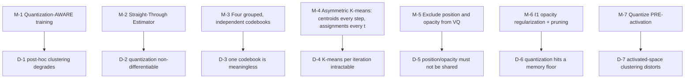

# §5 — Constraints and well-posedness

## 5.0 Restating the question

CompGS adds one loss term, so the §5 question is partly answerable in the usual way — but its
central mechanism (K-means in the training loop) introduces its own degeneracies that have
nothing to do with the photometric objective.

> The naive approach — **train 3DGS, then cluster** — fails. And clustering *during* training
> is itself ill-posed: the quantization operator is non-differentiable, K-means over millions of
> vectors is intractable per-iteration, and a single codebook over 59 heterogeneous parameters
> has no meaningful metric.

## 5.1 Degeneracies

### D-1 — Post-hoc clustering degrades quality

> "However, **clustering the model parameters after training results in performance
> degradation**, hence, we perform quantization aware training to ensure that the parameters
> are **amenable to quantization**." `[paper §3]`

Nothing in the 3DGS objective encourages parameters to be clusterable. A freely-trained model
occupies a continuum; projecting it onto `K` centroids afterwards moves every Gaussian by an
uncontrolled amount, and the loss has no opportunity to compensate.

### D-2 — Quantization is not differentiable

`ẑ = C[argmin_j ‖z − C_j‖]` has zero gradient almost everywhere. A literal implementation
severs the optimization entirely.

### D-3 — A single codebook over all 59 parameters is meaningless

> "Performing a single K-means for the whole `d` dimensional parameters requires a **huge
> codebook** since the different parameters of the Gaussian are **not necessarily
> correlated**." `[paper §3]`

Position, rotation, scale and SH live in different units and different geometries; Euclidean
distance over their concatenation is not a meaningful similarity.

### D-4 — K-means per iteration is intractable

`N` in the millions × `K` in the thousands × 30 000 iterations. Naively, this dominates
training entirely.

### D-5 — Some parameters must not be shared

> Position: "sharing them results in **overlapping Gaussians**." Opacity: it "is a single
> scalar." `[paper §3]`

Two Gaussians assigned the same position centroid become **the same Gaussian** — a structural
collapse, not a quality loss. And quantizing a scalar to a codebook saves nothing.

### D-6 — Quantization hits a hard floor

> "after quantization, they **dominate the memory (more than 80% of memory)**. This means
> **quantization cannot improve the compression any further**." `[paper §3]`

Once the compressible attributes are cheap, the *incompressible* ones (position, opacity) are
the entire budget. Better VQ buys nothing.

### D-7 — Clustering in activated space distorts the metric

Scale is stored pre-`exp`, rotation pre-normalization. Clustering *after* activation would
apply Euclidean distance in a non-linearly warped space, so equal codebook error would mean
very different geometric error depending on magnitude.

---

## 5.2 The resolving mechanisms

### M-1 / M-2 — Quantization-aware training with STE

The forward pass renders with centroids; the backward pass updates the **non-quantized**
parameters `[paper §3]` `[repo: train_kmeans.py:126-143]`. The loss therefore *sees* the
quantization error and the optimizer can compensate — parameters drift toward configurations
that quantize well. **STE** `[paper §3, ref 7]` supplies the missing gradient by treating the
quantizer as the identity in backward.

This is the same class of mechanism as `../CompGS/`'s additive-noise relaxation and
`../OMG/`'s frozen-index finetuning — all three make a discrete operation trainable — but
CompGS's is the most direct.

⚠️ **`../OMG/` later argues this is unnecessary**: it applies K-means only in the final 1000
iterations and reports ≤0.05 dB cost `[OMG Tab. 4]`. So the *value* of full quantization-aware
training over the last 10 000 iterations is not settled by either paper.

### M-3 — Grouped codebooks

Four independent K-means over DC colour (`d=3`), SH (`d=45`), scale (`d=3`), rotation (`d=4`)
`[paper §3]` `[repo: train_kmeans.py:131-144]`. "**We group similar types of parameters, e.g.,
all rotation matrices, together and cluster them independently to learn a separate codebook for
each.**"

Cost: "This requires storing **multiple indices for each Gaussian**" — four indices instead of
one. That is precisely the trade-off `../OMG/` later attacks with Sub-Vector Quantization, and
`../OMG/` §3.2's critique of R-VQ ("multiple code indices per attribute result in increased
storage overhead") applies here too.

### M-4 — The asymmetric K-means schedule ⭐ **the enabling trick**

> "K-means has two steps: updating centroids given assignments, and updating assignments given
> centroids. We note that **the latter is more expensive** while the former is a **simple
> averaging**. Hence, we update the centroids **after each iteration** and update the
> assignments **once every `t` iterations**. … This is **crucial in limiting the training time**
> of the method." `[paper §3]`

✅ Verified: the cheap path re-averages using cached `nn_index` `[repo: kmeans_quantize.py:46-61]`;
the expensive `cdist` + `argmin` path runs only when `assign=True`
`[repo: kmeans_quantize.py:138-172]`, gated by `iteration % freq_cls_assn == 1`
`[repo: train_kmeans.py:127-130]`.

The centroids therefore **track the drifting parameters continuously** while the (expensive)
partition is refreshed occasionally — a genuinely elegant decomposition, and the reason
training overhead is only 1.4–1.7× rather than orders of magnitude.

⚠️ Even so, this is the method's acknowledged limitation `[paper §4]`, and
`../CompGS/` (Liu) measures its encode time at **68.29 s vs 0.54–2.23 s** for other methods
`[CompGS-Liu Tab. 7]`.

### M-5 — Excluding position and opacity

Structural, not tuned: position sharing causes **collapse** (D-5), so it is excluded outright
`[paper §3]`. The code still *supports* `pos` quantization `[repo: train_kmeans.py:131-132]`
for the Table 9 ablation, but the default `--quant_params` excludes it
`[repo: train_kmeans.py:381]`.

### M-6 — Opacity regularization as the answer to the memory floor

The logic chain is fully stated (D-6 → M-6) and is the paper's cleanest piece of reasoning:
quantization saturates → the remaining budget is incompressible → reduce the *number* of
Gaussians → and get a speedup for free `[paper §3]`.

Implementation: `λ_reg · Σα` for iterations 15 000–20 000 with `prune(0.005)` every 1000
`[repo: train_kmeans.py:158-166, 220-226]`.

> **Every later method in your set inherits this diagnosis.** `../OMG/` and `../CompGS/` (Liu)
> both spend real effort on **position** coding (G-PCC in both cases) precisely because CompGS
> showed position dominates the post-quantization budget. CompGS itself leaves position at
> float32 (or 16-bit in BitQ).

### M-7 — Quantize before activation

> "The scale parameters of covariance are quantized **before applying the exponential
> activation** on them. Similarly, quaternion based rotation parameters are quantized **before
> normalization**." `[paper §4]`

Confirmed by the `forward_scale` / `forward_rot` entry points `[repo: kmeans_quantize.py]`.
Clustering in the pre-activation space keeps Euclidean distance meaningful; post-`exp`,
identical codebook error would mean wildly different geometric error at different scales.
A small detail, correctly reasoned, and easy to get wrong in a reimplementation.

---

## 5.3 What is *not* resolved

- **Position is never compressed.** The paper identifies it as >80% of the post-quantization
  budget `[paper §3]` and then only bit-quantizes it to 16 bits in the BitQ variant. `../OMG/`
  and `../CompGS/` both use **G-PCC**; CompGS does not. This is the clearest place its
  successors improved on it.
- **Training is slower, and the paper says so** `[paper §4]`: 1.4–1.7× for CompGS 32K. K-means
  cost scales with `N × K`, so the 32K variant is the expensive one.
- **The claimed RLE index compression is not implemented** (D-1 in
  [`06-implementation-deltas.md`](06-implementation-deltas.md)), so one of the two storage
  mechanisms described in §3 cannot be reproduced.
- **The number of Gaussians is controlled indirectly.** `λ_reg` + a 5 000-iteration window +
  a fixed 0.005 prune threshold — there is **no target count**, unlike `../OMG/`'s τ or
  `../mini-splatting/`'s `sampling_factor`. So the rate–distortion "curve" here is two points
  (16K/32K) plus BitQ, not a sweep.
- **No entropy coding of the indices.** Indices are bit-packed uniformly
  `[repo: train_kmeans.py:261-268]`; the code distribution after K-means is typically far from
  uniform, so Huffman/arithmetic coding would help. `../OMG/` adds Huffman; `../CompGS/` (Liu)
  adds a learned entropy model. `[inferred]`
- **Quantization-aware training's necessity is unsettled.** `../OMG/` reaches comparable quality
  by K-means-ing only in the last 1 000 iterations `[OMG §3.2]`. Neither paper runs the
  head-to-head.
- **`safe_state`'s seed 0 is inherited but K-means initialisation is not obviously seeded** —
  see [`10-reproducibility.md`](10-reproducibility.md).
