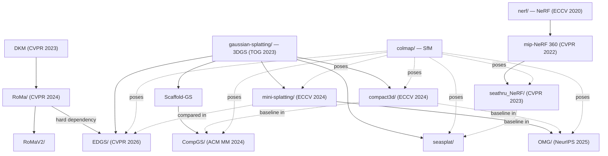

# Comparison Glossary — nine methods, one symbol table

Merged from the nine per-folder glossaries at
`<FOLDER>/research-methodology-output/09-glossary.md`. Each row carries a **method** column;
symbols that mean **different things in different methods** are flagged and explained.

| Key | Folder | Paper | Venue |
|---|---|---|---|
| `seasplat` | `seasplat/` | SeaSplat (arXiv:2409.17345v2) | — |
| `seathru_nerf` | `seathru_NeRF/` | SeaThru-NeRF (arXiv:2304.07743v1) | CVPR 2023 |
| `mini-splatting` | `mini-splatting/` | Mini-Splatting (arXiv:2403.14166v3) | ECCV 2024 |
| `compgs-liu` | `CompGS/` | CompGS: *Efficient 3D Scene Representation…* (arXiv:2404.09458v1) | ACM MM 2024 |
| `edgs` | `EDGS/` | EDGS (arXiv:2504.13204v2) | CVPR 2026 |
| `romav2` | `RoMaV2/` | RoMa v2 (arXiv:2511.15706v3) | — |
| `roma` | `RoMa/` | RoMa (arXiv:2305.15404v2) | CVPR 2024 |
| `omg` | `OMG/` | OMG (arXiv:2503.16924v2) | NeurIPS 2025 |
| `compgs-vq` | `compact3d/` | CompGS: *Smaller and Faster…* (arXiv:2311.18159v3) | ECCV 2024 |

---

## 0. The check called out in the methodology §9 note — **confirmed, and worse than stated**

> *"flag any symbol that means different things across methods — e.g. SeaSplat's `β^D` vs.
> SeaThru-NeRF's per-ray backscatter term are not the same object despite similar notation."*

**Confirmed, with a correction to the pairing.** The two papers' `β` symbols are not even each
other's counterparts:

| | `seasplat` | `seathru_nerf` |
|---|---|---|
| **Where `β^D`, `β^B` appear** | **the learned quantities** — Eq. 3, and the whole method | **§3.2 and §5.1 only** — the Akkaynak–Treibitz model being *reduced to*, and the constants used to *synthesise* the Fern-underwater benchmark |
| **What is actually learned** | `β^D, β^B ∈ ℝ³` — **9 global scalars** for the entire scene | **`σ^attn`, `σ^bs` ∈ ℝ³ per ray** — outputs of an MLP conditioned on viewing direction |
| **Cardinality** | one 3-vector **per scene** | one 3-vector **per ray** (≈16 384 per training batch) |
| **Mathematical type** | constants | a **field** over viewing directions |
| **Implementation** | a `(3,1,1,1)` 1×1 conv kernel applied to the depth map `[seasplat repo: models.py:216]` | `Dense(3) → softplus` heads on a direction-only MLP `[seathru repo: models.py:878, 889]` |
| **Units** | inverse **per-frame min–max-normalised** depth `[seasplat repo: train.py:233-237]` | inverse **NDC** units (`near=0, far=1`) `[seathru repo: configs/llff_256_uw.gin]` |

**⇒ The correct correspondence is `seasplat β^D ↔ seathru_nerf σ^attn` and
`seasplat β^B ↔ seathru_nerf σ^bs`.** Even correctly paired they are objects of different type,
cardinality and units, and **neither is in inverse metres**. They must never be tabulated as
the same measured quantity.

Two further consequences found while verifying this:

- **`seathru_nerf` explicitly argues against `seasplat`'s assumption**, a year earlier: constraining the medium per-ray is *"far less restrictive compared to models that assume constancy **per image or even per scene**"* `[seathru §4.1]`. Not a contradiction — a deliberate expressiveness/cost trade — but it is the field's sharpest axis and both papers sit on opposite ends of it.
- **The two "simulated underwater" benchmarks are unrelated.** `seathru_nerf` uses `β^D = [1.3, 1.2, 0.9]` on LLFF `Fern`; `seasplat` uses `β^D = [2.6, 2.4, 1.8]` on Mip-NeRF-360 `garden` — **exactly 2× the medium strength**, different base scene.

---

## 1. Merged symbol table

Rows are grouped by concept. ⚠️ marks a cross-method collision, expanded in §2.

### 1.1 Geometry / primitives

| Symbol | Method | Meaning | Shape |
|---|---|---|---|
| `μ` | `seasplat`, `compgs-vq` | Gaussian **mean / 3D position** | `(N,3)` |
| `μ_ω`, `μ_k` | `compgs-liu` | anchor / coupled-primitive **position** (anchor's is **frozen**, lr = 0) | `(N,3)` |
| `p` ⚠️ | `mini-splatting`, `omg` | Gaussian **position** (this glyph, not `μ`) | `(N,3)` |
| `g_i^x` ⚠️ | `edgs` | Gaussian **position** (superscript convention, unique in-set) | `(N,3)` |
| `μ` ⚠️ | `compgs-liu`, `roma`, `romav2` | **mean of a Gaussian *distribution*** — entropy-model mean / refiner's estimated warp mean | varies |
| `Σ` ⚠️ | `seasplat`, `mini-splatting`, `compgs-vq`, `edgs` | Gaussian **covariance**, `Σ = R S Sᵀ Rᵀ` | `(3,3)` |
| `Σ_ω` ⚠️ | `compgs-liu` | called "covariance", but in code a **6-D scaling vector** + quaternion | `(N,6)`+`(N,4)` |
| `Σ`, `Σ⁻¹` ⚠️ | `romav2` | **2×2 error covariance / precision of a warp residual, in pixels** | `(H,W,2,2)` |
| `σ` ⚠️ | `seathru_nerf` | **volumetric density** (`σ^obj`, `σ^attn`, `σ^bs`) | per-sample / per-ray |
| `σ` ⚠️ | `compgs-liu` | **scale of an entropy model's Gaussian** (`σ_f`, `σ_Σ`, `σ_g`) | — |
| `s`, `r` | `omg`, `compgs-vq`, `mini-splatting` | per-Gaussian **scale**, **rotation** | `(N,3)`, `(N,4)` |
| `S`, `R` ⚠️ | `seasplat`, `edgs`, `compgs-vq` | **scale / rotation matrices** factoring `Σ` | — |
| `S` ⚠️ | `mini-splatting` | **maximum-contribution area** — a *pixel count* | integer |
| `S` ⚠️ | `romav2` | **patch similarity matrix**, *and* the stride set `{1,2,4}` | `(M,N)` |
| `S_k` ⚠️ | `compgs-liu` | predicted **scaling matrix** | `(·,3)` |
| `o` ⚠️ | `seasplat`, `compgs-vq`, `omg` | **opacity** | `(N,1)` |
| `o` ⚠️ | `mini-splatting` (App. D), `roma`, `romav2` | **ray origin** | `(3,)` |
| `α` ⚠️ | 3DGS family | **opacity** / per-Gaussian alpha (∈ [0,1]) | scalar |
| `α_k` ⚠️ | `compgs-liu` | opacity ∈ **[−1, 1]** — `Tanh`-activated; **`≤ 0` means the primitive is culled** | `(·,1)` |
| `α` ⚠️ | `roma`, `romav2` | **generalized-Charbonnier shape parameter** = 0.5 | scalar |
| `N` ⚠️ | `mini-splatting`, `omg`, `compgs-vq`, `edgs` | **number of Gaussians** | integer |
| `N` ⚠️ | `compgs-liu` | number of **anchors** — ~10× fewer than rendered primitives | integer |
| `N` ⚠️ | `seathru_nerf` | **samples per ray** (32 at the final level) | integer |
| `N` ⚠️ | `seasplat` | **Gaussians per ray** (Eq. 1) *and* **pixels per image** (Eq. 5) | integer |
| `N`, `M` ⚠️ | `romav2` | **patch counts** in images A and B | integers |

### 1.2 Appearance / colour

| Symbol | Method | Meaning |
|---|---|---|
| `c` | `seasplat`, `seathru_nerf`, `mini-splatting`, `compgs-vq`, `compgs-liu` | **colour** |
| `g_i^c` | `edgs` | **colour** (superscript convention) |
| `c^obj`, `c^med` | `seathru_nerf` | **object** / **medium** colour — the latter per-ray, MLP-predicted |
| `c` ⚠️ | `roma`, `romav2` | **Charbonnier scale constant** (1e-4 / 1e-3) |
| `c` ⚠️ | `mini-splatting` App. D | a **quadratic coefficient** |
| `c_ij` ⚠️ | `edgs`, `roma` | **correspondence confidence** map |
| `f_dc`, `f_rest` | 3DGS family | **SH coefficients** (DC / higher-order) |
| `h^(0)`, `h^(1,2,3)` | `omg` | **SH coefficients** (DC / degrees 1–3) |
| `T` ⚠️ | `omg` | **static appearance feature** — a learned 3-D latent |
| `V` ⚠️ | `omg` | **view-dependent appearance feature** — 3-D |
| `F` ⚠️ | `omg` | **space feature** — 13-D MLP output from position |
| `f_ω`, `g_k` | `compgs-liu` | anchor **reference embedding** (32-D) / coupled **residual embedding** (8-D) |

### 1.3 Underwater / medium (the two-folder subset)

| Symbol | Method | Meaning |
|---|---|---|
| `I` | `seasplat`, `seathru_nerf` | the **captured in-medium image** |
| `J` | `seasplat`, `seathru_nerf` | the **medium-free true colour** ✅ *genuinely shared* |
| `J'` ⚠️ | `seasplat` | the **SeaThru residual term** — a *different* quantity from `J`; present in code, disabled |
| `Î`, `Ĉ` | `seasplat` / `seathru_nerf` | the **reconstructed in-medium** image |
| `Z`, `z` | `seasplat`, `seathru_nerf` | **range from the camera** (not depth below surface) ✅ shared, but `seasplat`'s `Ẑ` is **min–max normalised per frame** |
| `β^D`, `β^B` ⚠️ | `seasplat` | **learned global scalars** — see §0 |
| `β^D`, `β^B` ⚠️ | `seathru_nerf` | the **Akkaynak–Treibitz constants**, used only in §3.2 and to synthesise benchmarks |
| `σ^attn`, `σ^bs` | `seathru_nerf` | the **actually-learned** per-ray medium coefficients — the true counterparts of `seasplat`'s `β` |
| `B^∞` / `B` / `c^med` | `seasplat` / `seathru_nerf` | **backscatter colour at infinity**. `seasplat`: one global RGB triple. `seathru_nerf`: per-ray, direction-dependent |
| `D` ⚠️ | `seasplat` | the **direct image** `J·e^{−β^D Z}`. ⚠️ **Overloaded within the paper**: §III.B uses `D̂ = Ĵ⊙Â`, Eq. 4 uses `D̂ = I − B̂` |
| `T^obj` | `seathru_nerf` | object-only **transmittance** |
| `α` | `seathru_nerf` | per-interval **object alpha** |

### 1.4 Matching (the two-folder subset)

| Symbol | Method | Meaning |
|---|---|---|
| `W^{A↦B}` ⚠️ | `romav2` | **dense warp** field |
| `Ŵ^{A→B}` ⚠️ | `roma` | **dense warp** field |
| `W_ij` ⚠️ | `edgs` | **dense warp** field (from RoMa) |
| `p^{A↦B}` | `romav2` | **confidence / overlap** |
| `p^A` | `roma` | **confidence / matchability** — the paper *deliberately* drops the `B` "to avoid confusion with the conditional" `[roma §3.1 fn.1]` |
| `Σ⁻¹` | `romav2` | **2×2 precision matrix** — new in v2, no v1 counterpart |
| `π_k`, `m_k` | `roma` | **anchor probabilities** / anchor coordinates (`K = 64²`) |
| `q` ⚠️ | `roma` | the **theoretical matchability distribution** `𝒩(0,s²I) ∗ p(·;0)` |
| `q` ⚠️ | 3DGS family | Gaussian **rotation quaternion** |
| `r` ⚠️ | `romav2` | **residual** `W_θ − W_GT` |
| `r(t)` ⚠️ | `seathru_nerf`, `mini-splatting` | a **ray** |
| `r` ⚠️ | `omg`, `compgs-vq` | Gaussian **rotation** |
| `ε` ⚠️ | `edgs` | **reprojection error** |
| `ε` ⚠️ | `seathru_nerf` | RawNeRF denominator floor = 1e-3 |

### 1.5 Losses, weights and thresholds

| Symbol | Method | Meaning | Value |
|---|---|---|---|
| `λ_dssim` | all 3DGS-family | D-SSIM mix weight | **0.2** everywhere ✅ |
| `λ` ⚠️ | `compgs-liu` | **rate–distortion multiplier** | {1e-3, 5e-3, 1e-2} |
| `λ` ⚠️ | `seathru_nerf` | weight of `L_objnorm` | 1e-4 |
| `λ` ⚠️ | `roma` | **marginal vs. conditional** weight (`ce_weight`) | **0.01 — value never stated in the paper** |
| `λ` ⚠️ | `romav2` | **two meanings**: overlap weight (0.1) *and* the position-embedding **scale** (1) | — |
| `λ` ⚠️ | `omg` | **local-distinctiveness exponent** (`lambda_ld`) | **2.0 — never stated** |
| `λ_reg` ⚠️ | `compgs-vq` | **ℓ1 opacity** weight | 1e-7 |
| `λ` (×6) ⚠️ | `seasplat` | six distinct loss weights spanning **200×** | 0.01 … 2.0 |
| `τ` ⚠️ | `omg` | **CDF pruning threshold** — the single rate knob | 0.96 … 0.9999 |
| `τ_corr`, `τ_proj` ⚠️ | `edgs` | confidence / reprojection thresholds | `τ_corr` **= RoMa's `sample_thresh` = 0.05**, inherited silently |
| `T_sat`, `T_sim` ⚠️ | `seasplat` | oversaturation / colour-similarity thresholds | 0.7 / 0.2√3 |
| `T` ⚠️ | `seathru_nerf`, `mini-splatting` | **transmittance** ∈ [0,1] |
| `T` ⚠️ | `edgs` | number of **optimization steps** |
| `L` ⚠️ | all | **loss** prefix |
| `L` ⚠️ | `romav2` | the **Cholesky factor**, `Σ⁻¹ = LLᵀ` |
| `L` ⚠️ | `omg` | **SVQ sub-vector length** |
| `k` | `seasplat` | `L_bs` asymmetry factor | **1000** (paper says only "`k > 1`") |
| `α`, `c` | `roma`, `romav2` | Charbonnier shape / scale | 0.5 / **1e-4 (roma code) vs 0.03 (roma paper)** |

### 1.6 Quantization / compression

| Symbol | Method | Meaning | Value |
|---|---|---|---|
| `K` ⚠️ | `compgs-vq` | **codebook size** | 4096 / 16384 / 32768 |
| `K` ⚠️ | `compgs-liu` | **coupled primitives per anchor** | 10 |
| `K` ⚠️ | `roma` | **number of classification anchors** | 64² |
| `K` ⚠️ | `omg` | **neighbourhood size** in Eq. 8 | **2** (Morton predecessor + successor) |
| `K` ⚠️ | `mini-splatting` | **rays intersecting a Gaussian** | — |
| `K` ⚠️ | `seasplat`, `seathru_nerf` | camera **intrinsics matrix** | `(3,3)` |
| `M`, `L`, `B` ⚠️ | `omg` | SVQ **partitions / sub-vector length / codewords** | (1,3,64), (2,2,512), (2,3,1024) |
| `M` ⚠️ | `mini-splatting`, `compgs-liu` | **number of training views** | — |
| `M` ⚠️ | `edgs` | the **matching network**, *and* `matches_per_ref` | — |
| `B` ⚠️ | `seasplat`, `seathru_nerf` | **backscatter** | — |
| `B` ⚠️ | `roma` | image **B**, *and* the Eq. 8 **base distribution** | — |
| `d` ⚠️ | `compgs-vq` | **parameter-vector dimensionality** per group | 3 / 45 / 3 / 4 |
| `D` ⚠️ | `omg` | **feature dimensionality** | **3 — never stated in the paper** |
| `D` ⚠️ | `compgs-liu` | **distortion** | — |
| `D` ⚠️ | `roma` | the **match decoder** | — |
| `R` ⚠️ | `compgs-liu` | **BITRATE** (Eq. 1) — *and* **rotation matrix** `R_k` (Eq. 3), **within one paper** | — |
| `t` ⚠️ | `compgs-vq` | K-means **assignment interval** | 100 |
| `I` ⚠️ | `mini-splatting`, `omg` | **importance score** ✅ shared (same lineage) |
| `I` ⚠️ | `seasplat`, `seathru_nerf` | the **captured image** |
| `w` | `mini-splatting`, `omg`, `seathru_nerf` | **blending / quadrature weight** ✅ structurally analogous (all are `T·α`) |

---

## 2. The ten worst collisions, ranked

| Rank | Symbol | Why it is dangerous |
|---|---|---|
| **1** | **`R`** | **Bitrate in `compgs-liu` Eq. 1, rotation matrix in `compgs-liu` Eq. 3** — the same glyph, two meanings, **inside a single paper**, and rotation is what `R` means in every other folder. |
| **2** | **`β^D` / `β^B`** | See §0. The two underwater papers use the same glyphs for objects of different type, cardinality and units — and the correct correspondence is to a *different* symbol (`σ^attn`/`σ^bs`) entirely. |
| **3** | **`K`** | **Six meanings**: codebook size, coupled primitives per anchor, classification anchors, neighbourhood size, rays-per-Gaussian, camera intrinsics. |
| **4** | **`Σ` / `σ`** | Gaussian covariance (3DGS family) · a 6-D scaling *vector* (`compgs-liu`) · volumetric **density** (`seathru_nerf`) · 2×2 **error precision in pixels** (`romav2`) · entropy-model scale (`compgs-liu`) · summation. |
| **5** | **`N`** | Gaussians · **anchors** (~10× fewer) · samples per ray · pixels · patch count. **Directly corrupts any "number of primitives" table** — see §3.2. |
| **6** | **`p`** | Gaussian **position** (`mini-splatting`, `omg`) · **confidence** (`roma`, `romav2`) · a **pixel** (`edgs`) · **probability** (`compgs-liu`) · sampling probability (`mini-splatting`). |
| **7** | **`α`** | Opacity ∈[0,1] · opacity ∈**[−1,1]** with `≤0` = culled (`compgs-liu`) · Charbonnier **shape** (`roma`, `romav2`) · per-interval object alpha (`seathru_nerf`). The *range* differs, not just the meaning. |
| **8** | **`λ`** | Seven distinct roles, including **two within `romav2`** and **two within `omg`** (which also has `lambda_dssim`). Always subscript. |
| **9** | **`o`** | **Opacity** in most 3DGS papers vs **ray origin** in `mini-splatting` App. D, `roma`, `romav2`. `mini-splatting` uses `α` for opacity — the opposite convention to its own descendant `omg`. |
| **10** | **`T`** | Transmittance · **thresholds** (`seasplat`, `mini-splatting`) · optimization steps (`edgs`) · camera transform (`seasplat`) · **static appearance feature** (`omg`). |

### Position: four glyphs, one concept

The single most common concept in the set is written **four different ways**:

| `μ` | `p` | `g^x` | `μ_ω` / `μ_k` |
|---|---|---|---|
| `seasplat`, `compgs-vq` | `mini-splatting`, `omg` | `edgs` | `compgs-liu` |

The risk here is **failing to align rows**, not mis-aligning them.

### Genuinely shared symbols (rare, and worth relying on)

| Symbol | Shared by | Meaning |
|---|---|---|
| `λ_dssim = 0.2` | all six 3DGS-family folders | D-SSIM mix weight |
| `J` | `seasplat`, `seathru_nerf` | medium-free true colour |
| `z` / `Z` | `seasplat`, `seathru_nerf` | range from camera |
| `w` | `mini-splatting`, `omg`, `seathru_nerf` | blending weight `T·α` |
| `I` | `mini-splatting`, `omg` | importance score (same lineage) |

---

## 3. Cross-cutting hazards found while merging — **not notational**

These are the ones most likely to corrupt a results table.

### 3.1 PSNR is computed **three different ways** across the set

| Convention | Folders | Effect |
|---|---|---|
| **Per-channel mean** — `mse.view(3,-1).mean(1)` then average 3 PSNRs | `seasplat` (in-training) | **Higher** by Jensen; the gap grows as channel errors diverge — **maximal underwater** (red attenuated, blue not) |
| **Pooled MSE** — all pixels and channels | `seathru_nerf`, `compgs-liu`, and — via a call-site subtlety — `edgs`, `omg` | The standard, stricter definition |
| **Inherited/ambiguous** | `mini-splatting`, `compgs-vq` | Depends on which harness produced the number |

⚠️ **`edgs` and `omg` both contain the same accidental flip**: a `psnr()` written for `(3,H,W)`
(per-channel) is *called* with `(1,3,H,W)` (pooled). `edgs`'s own docstring says
"NOT BATCHED!".

⚠️ **`seasplat`'s Table I compares its per-channel-mean numbers against `seathru_nerf`'s
pooled-MSE numbers**, in the direction that favours SeaSplat.

⭐ **`compgs-vq` is the only paper in the nine that names this problem** and introduces
**PSNR-AM** (average the error *before* the log) to fix it `[compgs-vq §4]`. Cite that passage
when you standardise.

**Additional axis:** `seathru_nerf` scores **linear, pre-photofinishing** images; every 3DGS
folder scores 8-bit sRGB — and `seasplat`, `compgs-liu`, `omg` and `mini-splatting`'s `ms_c`
**round-trip through disk** (JPEG in `seasplat`'s case, when GT has no PNGs).

### 3.2 "Number of primitives" is not comparable

| Folder | What the reported count means |
|---|---|
| `mini-splatting`, `omg`, `compgs-vq`, `edgs` | **rendered Gaussians** ✅ |
| `compgs-liu` | **anchors** — up to **10× fewer** than rendered (`K = 10`) |
| `edgs` Tab. 1, ScaffoldGS row | **derived splats** — the paper footnotes this itself |

Also: `seasplat` uses **`sh_degree = 0`** (14 floats/Gaussian) where the compression folders
assume 59. Normalising compression ratios against a 59-float baseline for one and 14 for the
other is a category error waiting to happen.

### 3.3 "Model size" — does it include the decoder?

| Folder | Decoder stored? | Counted in the reported size? |
|---|---|---|
| `compgs-vq` | none | n/a ✅ cleanest |
| `mini-splatting` (`ms_c`) | none | n/a — but an **undocumented voxel dedup** removes primitives |
| `omg` | 4 MLPs | ✅ **yes**, `getsize("comp.xz")` with an explicit `MLPs` line |
| `compgs-liu` | MLPs + entropy model | ✅ **yes** — and they are **29.6 → 46.0%** of the bitstream as λ grows |

### 3.4 Ablation tables use **four different structures**

Per the methodology's warning about additive-vs-leave-one-out:

| Structure | Folders |
|---|---|
| **Cumulative-additive** (row = previous + one) | `seasplat` Tab. III, `mini-splatting` Tab. 3, `compgs-liu` Tab. 4, `roma` Tab. 2 (rows I–VII), `romav2` Tab. 12 |
| **Leave-one-out** | **`omg` Tab. 4** (the cleanest in the set), `roma` **Setup VIII only**, `romav2` Tab. 9 |
| **Mutually-exclusive variants** | `seathru_nerf` Tab. 1, `mini-splatting` Tab. 4, `compgs-liu` Tab. 6, `romav2` Tabs. 2/10, `roma` Tab. 5 |
| **Curves / factorial** | `mini-splatting` Fig. 10, `edgs` Tab. 4 (2×2), `omg` Fig. 5 |
| ⚠️ **Ambiguous** | **`edgs` Tab. 6** — row labels say "w/o X" but the monotone ladder suggests cumulative removal; the checkmark column survives neither `pdftotext -layout` nor `-raw`. **Inspect visually before citing.** |

Two traps worth repeating:
- **`seasplat` Tab. III row 9 ≠ row 8** ("all losses" 27.11 vs "+DS+BG+C+BS" 26.64), so the additive ladder does **not** enumerate the full objective.
- **`roma` Setups IV and VIII measure the same component and disagree by 9×** — which is the paper's point about interaction, but means Setup IV must never be quoted alone.

### 3.5 A shared design pattern: **detached auxiliary supervision**

Four folders independently arrive at the same mechanism — *let the auxiliary head explain the
primary prediction, never shape it*:

| Folder | Detached tensor | Consumer | Degeneracy prevented |
|---|---|---|---|
| `seasplat` | `Ẑ.detach()` | `L_bs`, `L_Z-recon` | medium params dragging geometry; the `Ẑ → 0` shortcut |
| `seathru_nerf` | `stop_gradient(t_delta)` | all medium transmittances | the sampler gaming the `σ·s` product |
| `romav2` | `detach(r)` | `L_prec` | the precision head inflating residuals to match its own prediction |
| `roma` | inter-refiner detach | `L_coarse` vs `L_fine` | the two objectives competing (⇒ no loss weighting needed) |

### 3.6 Hardware disclosure, ranked

| Folder | GPU | Transferable to an H100? |
|---|---|---|
| `romav2` | **H200** | ✅ best match in the set |
| `seathru_nerf`, `edgs` | **A100** | ✅ close |
| `mini-splatting` (3090), `omg` (3090+4090), `compgs-vq` (RTX 6000) | consumer/workstation | ⚠️ sub-linear |
| **`seasplat`, `compgs-liu`, `roma`** | ❌ **none named** | ❌ — `roma` reports **no computational profile at all** |

---

## 4. Method-name collision

**"CompGS" denotes two unrelated papers**, and the local PDFs make it worse:

| | `compgs-vq` = `compact3d/` | `compgs-liu` = `CompGS/` |
|---|---|---|
| Title | *Smaller and Faster GS with **Vector Quantization*** | *Efficient 3D Scene Representation via **Compressed GS*** |
| Venue / arXiv | ECCV 2024 / 2311.18159 | ACM MM 2024 / 2404.09458 |
| Base method | vanilla 3DGS | **Scaffold-GS** |
| Mechanism | **K-means VQ**, quantization-aware | **predictive coding + learned entropy model**, RD-optimized |

✅ **Resolved 2026-08-25.** `CompGS.pdf` previously held a byte-identical copy of
`compact3d.pdf` (MD5 `d38c06cf…`), i.e. the wrong paper. It now holds arXiv:2404.09458v1,
verified byte-identical (MD5 `89f5638d…`) to `arxiv.org/pdf/2404.09458v1`. Current state:

| File | MD5 | Paper |
|---|---|---|
| `CompGS.pdf` | `89f5638d…` | Liu et al., arXiv:2404.09458v1 (ACM MM 2024) |
| `compact3d.pdf` | `d38c06cf…` | Navaneet et al., arXiv:2311.18159v3 (ECCV 2024) |

Note also that `compgs-vq` is a **baseline inside** `compgs-liu` (as `Navaneet et al. [33]`)
and inside `omg` (as `CompGS [44]`).

---

## 5. Lineage map

**Two live dependency edges inside your set:**
1. **`edgs` → `roma`.** EDGS calls `roma_outdoor()` for *all* its geometry, and its `τ_corr` **is** RoMa's `sample_thresh = 0.05`, inherited silently. It also runs RoMa **cheapened** (`upsample_preds=False`, `symmetric=False`). `romav2` is an untested upgrade — but a real port, not a swap.
2. **`omg` → `mini-splatting`.** Verbatim inheritance of the parameter block and `intersection_preserving()`, including Mini-Splatting's *undocumented* mechanisms (no `reset_opacity()`, `(1−α)`-weighted depth-reinit sampling, LR-schedule rewind).

---

## 6. Recommended notation for your own write-up

To avoid all ten collisions in §2:

| Concept | Use | Never use |
|---|---|---|
| Gaussian position | `μ` | `p`, `g^x` |
| Gaussian covariance | `Σ_3D` | bare `Σ` |
| Volumetric density | `σ_vol` | `σ` |
| Warp-error precision | `P_2D` | `Σ⁻¹` |
| Opacity | `o` | `α` (and state the range) |
| Rendered primitive count | `N_rend` | `N` |
| Anchor count | `N_anch` | `N` |
| Codebook size | `K_cb` | `K` |
| Camera intrinsics | `K_cam` | `K` |
| Bitrate | `R_bits` | `R` |
| Rotation | `R_rot` | `R` |
| Every loss weight | `λ_<name>` | bare `λ` |
| Attenuation coefficient | `β_att` (state: global or per-ray; state the units) | `β^D`, `σ^attn` |
| Backscatter coefficient | `β_bs` (same) | `β^B`, `σ^bs` |
| PSNR | `PSNR_pooled` or `PSNR_perchan` | bare `PSNR` |
