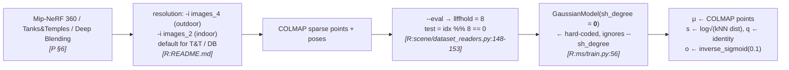
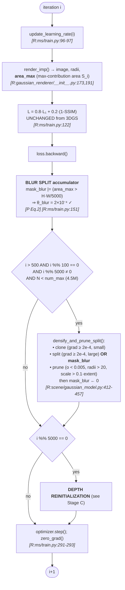
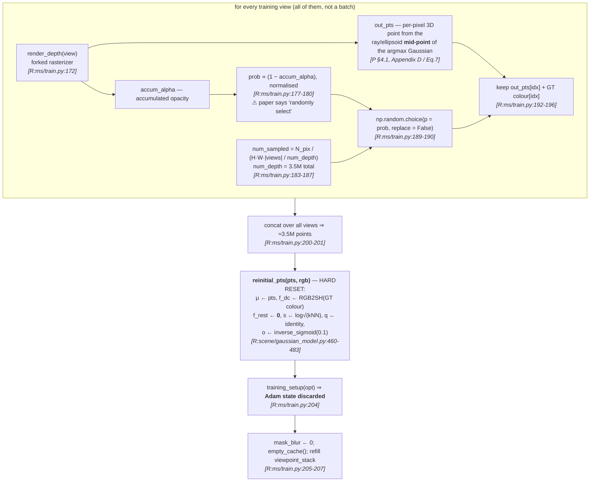
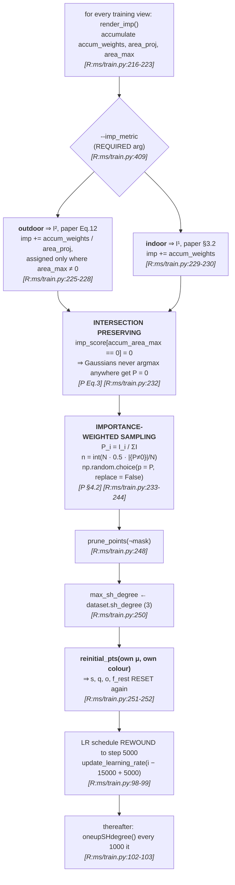
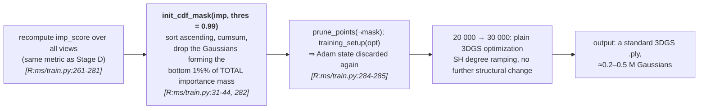

# §2 — Pipeline flowcharts

`[R:file:line]` = `[repo: file:line]`; `[P §x]` = `[paper §x]`. Line numbers refer to `ms/`.

---

## Stage A — Data → preprocessing → init

> `sh_degree=0` at init is **not** the config default (`ModelParams.sh_degree = 3`
> `[R:arguments/__init__.py:49]`). The constructor argument is hard-coded, and the model's
> `max_sh_degree` is only raised to `dataset.sh_degree` at 15 K `[R:ms/train.py:250]`.

---

## Stage B — Phase 1: densification (iterations 1 → 15 000)

> **⚠ There is no `reset_opacity()` anywhere in `ms/train.py` or `ms_d/train.py`.**
> `grep -c reset_opacity` returns **0** for both, and **1** for `gs/train.py` (the vanilla
> baseline in the same repo). 3DGS's periodic opacity reset — its main floater-suppression
> device — has been removed, and the paper never says so. `opacity_reset_interval` survives
> only as a magic number in `size_threshold = 20 if i > opacity_reset_interval else None`
> `[R:ms/train.py:155]`. See D-1.

---

## Stage C — Depth reinitialization (every 5 000 iterations)

> **Two things the diagram makes plain that the prose hides.**
> (a) `reinitial_pts` discards **every learned attribute except position and colour** —
> scale, rotation, opacity and all higher-order SH are reset to their initialisation values.
> This is a full restart of the representation, three times over (at 5 K and 10 K, since
> 15 K is the densification boundary), not an incremental refinement.
> (b) The pixel sampling is **weighted by `1 − α_accum`**, biasing point selection toward
> *low-opacity, poorly-reconstructed* pixels. `[P §4.1]` says only "we randomly select a
> certain number of points". See D-2.

---

## Stage D — Simplification step 1 (iteration 15 000)

> **Intersection preserving is not a separate pass in the code** — `[P Alg. 1]` lists
> `Intersection()` and `Sampling()` as two calls, but the implementation folds Eq. 3 into a
> single line, `imp_score[accum_area_max==0] = 0` `[R:ms/train.py:232]`, which zeroes the
> sampling probability of any Gaussian that is never the argmax contributor in any view.
> Mathematically equivalent to Eq. 3; structurally invisible if you go looking for a
> function named after it.

---

## Stage E — Simplification step 2 (iteration 20 000) and the tail

> `[P Alg. 1:21]` calls this step only "`Pruning()` ▷ Directly Prune a Few Gaussians".
> The threshold **0.99** and the CDF-over-importance-mass formulation appear nowhere in the
> paper. Note this is a *deterministic* prune — the paper's own §4.2 argument against
> deterministic pruning applies to large ratios, and 1% is small, so there is no
> inconsistency; it just is not documented.

---

## Stage F — Mini-Splatting-C: post-hoc compression

```mermaid
flowchart LR
    M0["trained Mini-Splatting model"]
    VOX["voxelize μ to a 2¹⁶ grid<br/>μ_v = round( (μ−min)/(max−min) · (2¹⁶−1) )<br/><i>[R:ms_c/run.py:135,141-143]</i>"]
    UNIQ["<b>np.unique(μ_v, axis=0)</b><br/>⇒ deduplicates colliding Gaussians<br/>(an extra, undocumented reduction)<br/><i>[R:ms_c/run.py:144]</i>"]
    FEAT["feat = [f_dc, f_rest, s, q, o] concatenated<br/><i>[R:ms_c/run.py:156-163]</i>"]
    RAHT["RAHT / Haar3D transform, depth = 16<br/><i>[P App.F, ref [6]]</i> <i>[R:ms_c/run.py:167]</i>"]
    Q["CT_q = round(CT / Qstep), Qstep = 0.02<br/><i>[P App.F]</i> <i>[R:ms_c/run.py:136,169]</i>"]
    ZIP["np.savez_compressed(pos_remain(float32), CT_q, Qstep, depth)<br/><i>[R:ms_c/run.py:173]</i>"]
    DEC["inv_haar3D → render → PSNR/SSIM/LPIPS<br/><i>[R:ms_c/run.py:214, 105-125]</i>"]

    M0 --> VOX --> UNIQ --> FEAT --> RAHT --> Q --> ZIP --> DEC
```

> `depth = 16` and `Qstep = 0.02` match `[paper Appendix F]` exactly. The **`np.unique`
> deduplication** at `[R:ms_c/run.py:144]` does not appear in Appendix F and silently drops
> any Gaussians that land in the same 65 536³ voxel — a second source of size reduction
> attributed to "transform coding + zip".
