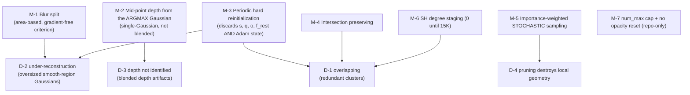

# §5 — Constraints and well-posedness

## 5.0 A note on what "well-posedness" means here

The methodology's §5 asks what makes the *naive objective* underdetermined. For
`seasplat/` and `seathru_NeRF/` that is a question about a loss with too many free
parameters. **Mini-Splatting does not change the loss at all** (see
[`04-loss.md`](04-loss.md)), so the question has to be restated to be meaningful:

> The 3DGS photometric objective is underdetermined **with respect to the spatial
> distribution of primitives**. Many different Gaussian configurations render the training
> views equally well; the loss cannot distinguish them; and the ones gradient-based ADC
> actually finds are bad. Mini-Splatting's contribution is a set of *non-gradient*
> mechanisms that select among photometrically-equivalent configurations.

That reframing is the paper's own: it "shifts from traditional graphics and 2D computer
vision to the perspective of point clouds" `[paper Abstract]`.

## 5.1 The degenerate solutions the naive objective admits

### D-1 — `overlapping`: redundant clustered Gaussians

Many small Gaussians stacked in the same place render identically to a few well-placed
ones. The photometric loss is indifferent; ADC actively creates the clusters, because a
high-gradient region is cloned/split repeatedly and every child inherits a high gradient.

> "the first row illustrates the `overlapping' phenomenon, where most Gaussians are
> clustered in certain areas but sparse in neighboring parts" `[paper §3.2]`

**Cost:** rasterization sorts and blends every Gaussian touching a tile, so redundancy is
paid for in FPS and memory at *every* frame, forever, for zero quality.

### D-2 — `under-reconstruction`: oversized Gaussians in smooth regions

A large Gaussian covering a smoothly-varying region has **small positional gradient** — the
photometric residual is low and evenly spread — so 3DGS's `‖∇_μ L‖ ≥ τ` criterion never
fires and the Gaussian is never split.

> "The gradient-based split and clone strategy [17] may fail in areas with smooth color
> transitions … Consequently, the corresponding oversized Gaussians `G_i` tend to be
> preserved during optimization." `[paper §4.1]`

**This is a genuine blind spot of the gradient criterion, not a tuning problem** — the
signal that should trigger splitting (blur) is orthogonal to the signal ADC measures
(gradient magnitude). 3DGS's own remedy, screen-size pruning, *removes* the Gaussian
without replacing it, which "does not address the issue of `under-reconstruction'"
`[paper §4.1]`.

### D-3 — Depth is not identified by the photometric loss

Alpha blending is a weighted sum; infinitely many `(σ, d)` configurations produce the same
blended colour. So the *rendered depth* is not a well-defined quantity — which matters
enormously here, because the whole method bootstraps geometry from it. The paper's
Appendix C names three specific ways blended depth is wrong:

| Artifact | Mechanism `[paper App. C]` |
|---|---|
| **Depth collapse** | 3DGS composites against a default background colour (black on Mip-NeRF 360). Dark background objects are "explained" by the background, so accumulated opacity along the ray stays low and the blended depth collapses toward the near plane. |
| **Object misalignment** | Large Gaussians and floaters — optimized to represent reflections and noise — carry non-trivial weight, corrupting the weighted mean. |
| **Blending boundary** | A weighted sum cannot represent a step. At an occlusion edge all Gaussians have low weight, so the depth map smooths across the boundary. |

Table 4 quantifies the consequence: reinitializing from blended depth gives PSNR **17.67**
versus **27.54** from mid-point depth — a **9.87 dB** collapse `[paper Tab. 4]`.

### D-4 — Pruning destroys local geometry (a degeneracy of the *fix*, not the objective)

Deterministic top-`k` pruning by importance looks reasonable but fails at high ratios:

> "neighboring Gaussians often exhibit similar importance in a given area, causing them to
> be either removed or preserved simultaneously, thus risking the destruction of local
> geometry" `[paper §4.2]`

Importance is **spatially autocorrelated**, so a threshold cuts out whole *regions* rather
than thinning uniformly.

---

## 5.2 The resolving mechanisms



### M-1 — Blur split: a criterion **orthogonal to the gradient**

`G^blur = {G_i : S_i > θ_blur·H·W}` `[paper Eq. 2]`. `S_i` is a *count of pixels dominated*,
which has nothing to do with residual magnitude. This is the whole point: it fires exactly
where the gradient criterion is blind.

The two criteria are **unioned**, not chained
`[repo: scene/gaussian_model.py:440 — selected_pts_mask = logical_or(selected_pts_mask, padded_mask)]`,
so blur-split is strictly additional capacity, never a replacement.

Cheap to compute: `S_i` "can be computed during the forward pass of rasterization"
`[paper §4.1]`, returned as `accum_max_count` `[repo: gaussian_renderer/__init__.py:191]`.

### M-2 — Mid-point depth of the **single argmax Gaussian**

Two decisions, both essential:

1. **Ellipsoid mid-point rather than Gaussian center.** Derived in Appendix D by solving
   `at² + bt + c = 0` for the ray/ellipsoid intersection and taking `t^mid = −b/2a`.
   The paper proves `t^mid = t^opt` (the density argmax along the ray) and chooses the
   mid-point form purely because it yields a **discriminant** `Δ = b² − 4ac` that tests
   whether an intersection exists at all `[paper App. D]`.
2. **`d = d_{i_max}`, no blending** — "we only collect the Gaussian with the maximum
   contribution to the pixel **to avoid the artifacts from alpha blending**" `[paper §4.1]`.

This closes D-3 by *refusing to use* the ill-posed quantity: rather than regularising the
blended depth, the method replaces it with a hard geometric quantity that is well-defined
for a single primitive.

### M-3 — Periodic hard reinitialization (the strongest mechanism, and the least documented)

Every 5 000 iterations the entire representation is destroyed and rebuilt from ≈3.5 M
backprojected depth points `[repo: ms/train.py:164-207]`. `reinitial_pts`
`[repo: gaussian_model.py:460-483]` keeps **only** `μ` and the DC colour; `s`, `q`, `o` and
all higher-order SH return to their initialisation values, and the following
`training_setup(opt)` **discards all Adam moment state** `[repo: ms/train.py:204]`.

Why this resolves D-1 and D-2: a cluster of 50 overlapping Gaussians produces, at most, one
argmax depth point per pixel it covers. Backprojecting the depth map therefore yields a
**view-uniform, surface-adherent** point set by construction — clusters cannot survive the
round trip. It is a projection of the representation onto "one primitive per visible
surface sample", repeated until it sticks.

The cost is that it is an extremely blunt instrument: three full restarts of a
30 000-iteration optimization, throwing away all second-order optimizer information. The
LR schedule is explicitly rewound to compensate `[repo: ms/train.py:98-99]` — see M-8.

### M-4 — Intersection preserving

`G^int = {G_i : i ∈ I_max}` `[paper Eq. 3]`: keep only Gaussians that are the argmax
contributor for **at least one pixel in at least one training view**. A Gaussian that is
never anyone's dominant contributor is, by definition, always occluded or always
subordinate — pure redundancy (D-1).

Implemented not as a separate pass but as `imp_score[accum_area_max == 0] = 0`
`[repo: ms/train.py:232]`, which sets those Gaussians' sampling probability to zero so
`np.random.choice` can never select them. Mathematically identical to Eq. 3.

> The paper motivates this by analogy: "Drawing inspiration from the concept of ray-mesh
> intersection … we avoid strictly converting the smooth opacity or blending weights into
> binary values of 0, 1, as this could potentially compromise the rendering quality."
> `[paper §4.2]` — i.e. binarise *membership*, not *opacity*. Contrast `seathru_NeRF/`'s
> `L_objnorm`, which does exactly the thing this paper declines to do (push transmittance
> to {0,1}) — for a different purpose.

### M-5 — Stochastic sampling instead of deterministic pruning

`P_i = I_i / Σ_k I_k`, then `np.random.choice(N, n, p=P, replace=False)`
`[paper §4.2]` `[repo: ms/train.py:233-241]`.

Randomisation **breaks the spatial autocorrelation** that makes thresholding destroy whole
regions (D-4): within a uniform-importance patch, each Gaussian now has an *independent*
chance of survival, so the patch thins rather than vanishing.

**Validated with Chamfer distance** against the unsimplified centers `[paper Fig. 6]` —
a point-cloud metric, not a rendering metric. This is the cleanest evidence in the paper
that the mechanism does what it claims, precisely because it does not go through PSNR.

### M-6 — SH degree staging

Training runs at SH degree **0** until 15 K `[repo: ms/train.py:56]`, then ramps
`[repo: ms/train.py:102-103, 250]`.

> "we observe that incorporating view-dependent colors barely enhance densification.
> Therefore, we only enable SH coefficients and increase the SH level after simplification
> (15K)." `[paper §5]`

Two effects: (a) it removes 45 of 48 colour parameters per Gaussian during the phase when
`N` is largest, which is why Mini-Splatting-D can hold 5.40 M Gaussians in the same 7.45 GB
as 3DGS's 4.86 M `[paper Tab. 2]`; (b) it prevents view-dependent colour from *absorbing*
error that should be driving geometry — a Gaussian that can be a different colour from
every angle has less need to be in the right place. Only (a) is stated in the paper;
(b) is `[inferred]`.

### M-7 — Repo-only guards

- **`num_max = 4.5 M`** `[repo: ms/train.py:153]`: densification simply stops when the
  count is reached. An unconditional bound on D-1's blow-up, absent from the paper and
  absent from `ms_d/` `[repo: ms_d/train.py:133]`.
- **Opacity reset is removed** `[repo: grep -c reset_opacity → 0 in ms/ and ms_d/, 1 in gs/]`.
  In 3DGS, resetting all opacities to a low value every 3 000 iterations forces floaters to
  re-earn their existence. Mini-Splatting deletes it — plausibly because depth
  reinitialization every 5 000 iterations already resets `o` to `inverse_sigmoid(0.1)` for
  *every* Gaussian `[repo: gaussian_model.py:475]`, making the separate reset redundant.
  That reading is `[inferred]`; the paper never mentions either fact.

### M-8 — Learning-rate schedule rewind

`[repo: ms/train.py:96-99]`:
```python
if iteration < simp_iteration1:  gaussians.update_learning_rate(iteration)
else:                            gaussians.update_learning_rate(iteration - simp_iteration1 + 5000)
```
After simplification the exponentially-decaying position LR is **rewound to its
step-5 000 value**, giving the freshly-reinitialized Gaussians enough LR to actually move.
Without it they would be born into a nearly-frozen schedule. Undocumented.

---

## 5.3 What is *not* resolved

- **No depth ⇒ no reinitialization.** The mechanism is entirely depth-driven, so regions
  where no Gaussian is a confident argmax contributor are never fixed:
  > "This strategy fails in areas without a certain depth value, such as the sky in
  > *train*" `[paper App. G]`
  offered as the explanation for the PSNR regression on Tanks&Temples `[paper §6.1]`.
  **Directly relevant to your underwater work:** the water column is the same kind of
  depth-less region as the sky, and it is exactly where `seasplat/` reports 3DGS placing
  floaters. Mini-Splatting's densification would likely inherit that failure.
- **The Gaussian budget is set by hand.** "the number of Gaussians in our Mini-Splatting is
  manually controlled by the sampling ratio. However, finding the minimal number of
  Gaussians while maintaining high-quality rendering remains a challenge" `[paper App. G]`.
  `--sampling_factor` defaults to `0.5` `[repo: ms/train.py:407]` and is the knob that
  generates the Fig. 7 curve; the paper never states this default.
- **High sampling ratios distort the background** `[paper App. G, Fig. 15b]`; the proposed
  fix (per-image uncertainty) is left to future work.
- **The importance metric is hand-picked per scene type.** `--imp_metric` is a *required*
  argument with no default `[repo: ms/train.py:409]`; the paper calls it "case-dependent
  and hand-crafted … an experimental trick" `[paper App. E]`. There is no automatic
  selection, so applying the method to a new domain (e.g. underwater) requires choosing —
  or designing — a metric first.
- **Dense initialization subsumes much of the benefit.** Table 5 `[paper App. B]`:
  3DGS with dense MVS init reaches **0.831 / 27.78 / 0.180**, versus Mini-Splatting-D with
  sparse init at **0.832 / 27.54 / 0.175**. Densification and dense initialization are
  largely substitutes on PSNR; Mini-Splatting-D still leads on SSIM/LPIPS, which is the
  claim the paper actually makes. Worth keeping in view when comparing against `EDGS/`,
  whose entire contribution is better initialization.
