# §2 — Unified pipeline

One canonical pipeline with three feature-flagged insertion points. All eight configurations
are flag subsets of this single diagram; none is a separate pipeline.

---

## 2.1 Canonical pipeline with insertion points

```mermaid
flowchart TD
    subgraph OFF["OFFLINE — before training"]
        IMG["Training views<br/>(LLFF split, i mod 8 ≠ 0)"] --> COLMAP["COLMAP sparse/0<br/>cameras.bin · images.bin"]
        COLMAP --> SFM["Sparse SfM cloud<br/>~500 points"]
        COLMAP -.-> P1
        IMG -.-> P1
        P1{{"⬢ INSERTION 1 — A1<br/>source/roma_init.py<br/>RoMa match → DLT triangulate<br/>→ reproj &lt; 2 px filter → voxel dedup"}}
        P1 -.-> DENSE["Dense cloud<br/>dense_&lt;scene&gt;.ply"]
    end

    SFM --> SEL
    DENSE -.->|"if use_dense_init"| SEL
    SEL["scene/__init__.py<br/>select seed cloud"] --> CREATE["gaussians.create_from_pcd()<br/>N ← seed count"]

    CREATE --> LOOP

    subgraph LOOP["TRAINING LOOP — iterations 1 … 30 000"]
        direction TB
        RENDER["render() → Î, Ĵ, Ẑ"] --> LOSSES["7 SeaSplat losses<br/>L_GS · L_bs · L_gw · L_sat<br/>L_op · L_Zsmooth · L_Z-recon"]
        LOSSES --> BACK["backward()"]
        BACK --> DENS

        DENS{"iteration &lt; 15 000<br/><b>AND NOT use_dense_init</b>"}
        DENS -->|yes| DBLOCK["densify_and_prune(τ, α&lt;0.005)<br/>+ reset_opacity() every 3 000"]
        DENS -->|no| SKIP[" "]
        DBLOCK --> P2
        SKIP --> P2

        P2{{"⬢ INSERTION 2 — A2<br/>if use_spatial_pruning<br/>AND iter &gt; 15 000<br/>AND iter mod 500 == 0<br/>→ reorganize_gaussians()"}}
        P2 --> STEP["3 optimizer steps<br/>gaussians · backscatter · attenuate"]
        STEP --> RENDER
    end

    LOOP --> SAVE["point_cloud.ply (17 float32/primitive)<br/>+ backscatter.pth · attenuate.pth"]

    SAVE --> P3
    P3{{"⬢ INSERTION 3 — A3<br/>if use_quantization<br/>source/quantize.py — offline<br/>K-means VQ, k=256, group=4"}}
    P3 -.-> NPZ["compressed.npz<br/>(deployed size)"]
    P3 -.-> RECON["reconstructed.ply<br/>(dequantized, for eval)"]

    SAVE -->|"if not use_quantization"| EVAL
    RECON -.-> EVAL
    NPZ -.-> EVAL
    EVAL["render_uw.py + metrics.py<br/>PSNR · SSIM · LPIPS"]

    style P1 fill:#e8f4ff,stroke:#2b6cb0,stroke-width:2px
    style P2 fill:#fff4e6,stroke:#c05621,stroke-width:2px
    style P3 fill:#f0e8ff,stroke:#6b46c1,stroke-width:2px
    style LOSSES fill:#e6ffed,stroke:#22863a
```

**The medium model never appears inside any insertion point.** `backscatter.pth` and
`attenuate.pth` are written by the training loop and passed through A3 untouched; A2's
`prune_points` reaches only `gaussians.optimizer`. This is the diagrammatic form of the
separation principle asserted in `[recommended: draft §3.5.1]` and verified in §5.

---

## 2.2 Trigger conditions relative to `seathru_from_iter`

`seathru_from_iter = 10 000` and `iterations = 30 000` on **every completed run**
`[measured: master_metrics.csv, all 20 rows]`. `densify_until_iter = 15 000`,
`opacity_reset_interval = 3 000` `[implemented: arguments/__init__.py:100,102]`.

```mermaid
gantt
    title Mechanism activation timeline (iterations)
    dateFormat X
    axisFormat %s

    section SeaSplat baseline
    Densification + α-prune + opacity reset   :done, d1, 500, 15000
    Medium model active (L_bs, L_gw, L_sat)   :crit, m1, 10000, 30000

    section A1 (use_dense_init)
    Dense seed injected at t=0                :milestone, a1a, 0, 0
    Densification + prune + reset DISABLED    :active, a1b, 0, 15000

    section A2 (use_spatial_pruning)
    Reorg every 500 iters (30 events)         :active, a2a, 15500, 30000

    section A3 (use_quantization)
    Offline VQ after training                 :a3a, 30000, 31000
```

| Insertion | Trigger | Position vs `seathru_from_iter = 10 000` | Assessment |
|---|---|---|---|
| **A1** — seed injection | `t = 0`, before `create_from_pcd` | 10 000 iterations *before* medium activation | ✅ Geometry is seeded while only `L_GS` is active, matching baseline ordering. |
| **A1** — `no_densify` gate | spans `[0, 15 000)` | **straddles** activation | ⚠️ Baseline retains 5 000 iterations of densification *after* the medium model switches on, letting geometry adapt to newly-explained backscatter. A1 removes that window entirely. |
| **A2** — reorganization | `iter > 15 000 ∧ iter mod 500 == 0` → first fire **15 500** | **5 500 iterations after** activation | ✅ Correct ordering. Importance is scored on a population that has already co-adapted with `β^D`, `β^B`, `B^∞`, which is what makes the `L_op` coupling (§1.3a) work. Also never overlaps densification, so there is no add/remove thrash. |
| **A3** — quantization | after iteration 30 000, offline | 20 000 iterations after activation | ✅ No interaction with training possible by construction. |

**Order-sensitivity.** The only order-sensitive pair is A2 → A3: the codebook must be fit on
the post-pruning population, never the reverse. Because A3 is offline this holds automatically
(§7.3). The composition order A1 → A2 → A3 is stated as intentional in
`[recommended: draft §3.5.4]` — "Following deterministic initialization and spatial
reorganization, the Gaussian representation is sufficiently stabilized to permit parameter
reduction" — and it agrees with CompGS's own argument that count reduction should precede
quantization because position dominates the residual afterwards `[paper: compact3d §3]`.

---

## 2.3 The eight configurations as flag subsets

One pipeline, three booleans. Nothing else differs — same losses, same optimizer, same
schedule, same splits, same evaluation code.

| Config | `use_dense_init` | `use_spatial_pruning` | `use_quantization` | Branch | Status |
|---|:---:|:---:|:---:|---|---|
| **A0** baseline | ☐ | ☐ | ☐ | `baseline/seasplat` | ✅ **measured** |
| **A1** | ☑ | ☐ | ☐ | `feature/a1-deterministic-init` | ✅ **measured** |
| **A1v2** *(sensitivity)* | ☑† | ☐ | ☐ | same branch, denser matcher settings | ✅ **measured** |
| **A2** | ☐ | ☑ | ☐ | `feature/a2-spatial-reorganization` | ✅ **measured** |
| **A3** | ☐ | ☐ | ☑ | `feature/a3-attribute-quantization` | ✅ **measured** |
| **A4** = A1+A2 | ☑ | ☑ | ☐ | `feature/a4-init-reorg` | ⬜ implemented, **not run** |
| **A5** = A1+A3 | ☑ | ☐ | ☑ | `feature/a5-init-quant` | ⬜ implemented, **not run** |
| **A6** = A2+A3 | ☐ | ☑ | ☑ | `feature/a6-reorg-quant` | ⬜ implemented, **not run** |
| **A7** = A1+A2+A3 | ☑ | ☑ | ☑ | `feature/a7-full-integration` | ⬜ implemented, **not run** |

† A1v2 differs from A1 only in the offline matcher configuration — `matches_per_pair`
5 000 → 20 000, `certainty_thr` 0.05 → 0.02, `voxel` 0.005 → 0.002. It is a **density
sensitivity boundary, not a ninth ablation cell** `[recommended: draft §3.6.4]`.

The four combination branches are verified **clean file-level unions** of their constituents:
`git diff a4..a7 -- train.py scene/gaussian_model.py` is empty, and `source/quantize.py` is
byte-identical across `a3`/`a5`/`a6`/`a7` `[implemented]`. No mechanism was re-implemented or
altered when combined, so the flag-subset abstraction above is literally true of the code.

### ⚠️ Two combination cells are degenerate as configured

With `use_dense_init` set the population can never grow, and A2 is inert whenever the count is
under budget. A1's measured counts are **222 860 – 368 742**, all below `max_gaussians = 800 000`
`[measured]`. Therefore:

> **A4 ≡ A1** and **A7 ≡ A5**, exactly, at the A1 density.

A1v2's counts (**888 706 – 1 460 514**) are all *above* budget, so running the combinations at
the A1v2 density makes all four cells distinct. This is the single most consequential planning
consequence of the completed runs — see §8.4 and §10.4.
