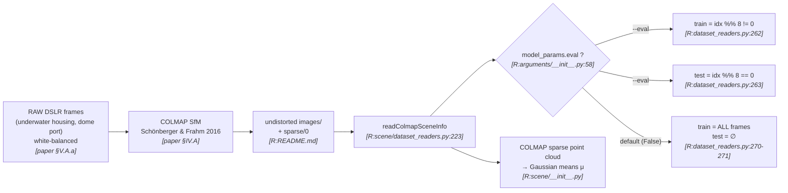
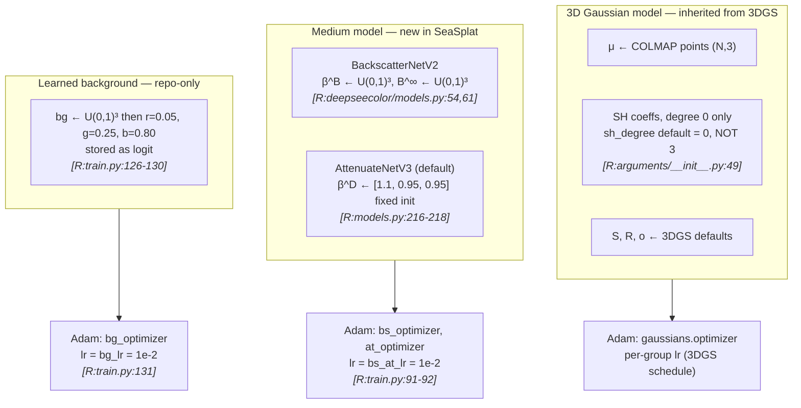
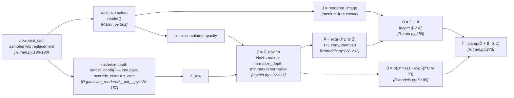
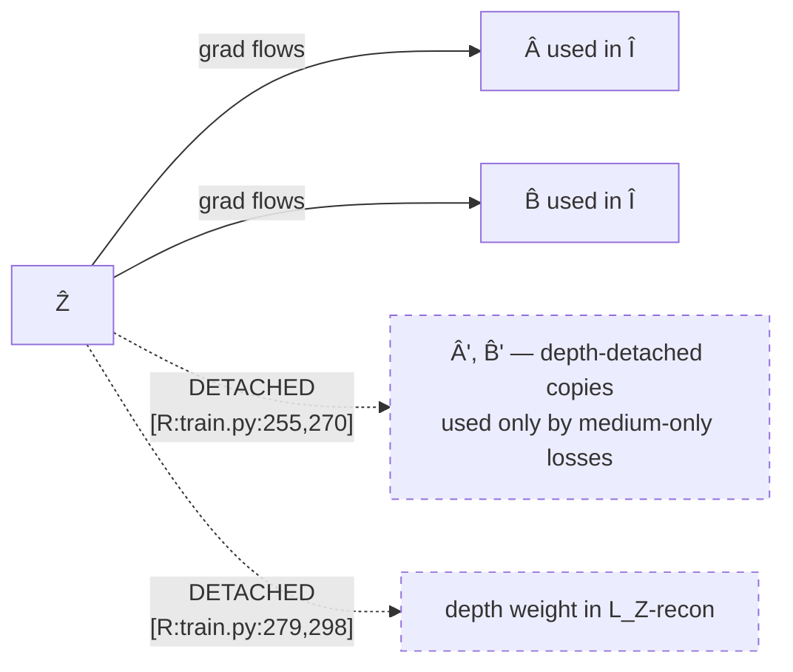
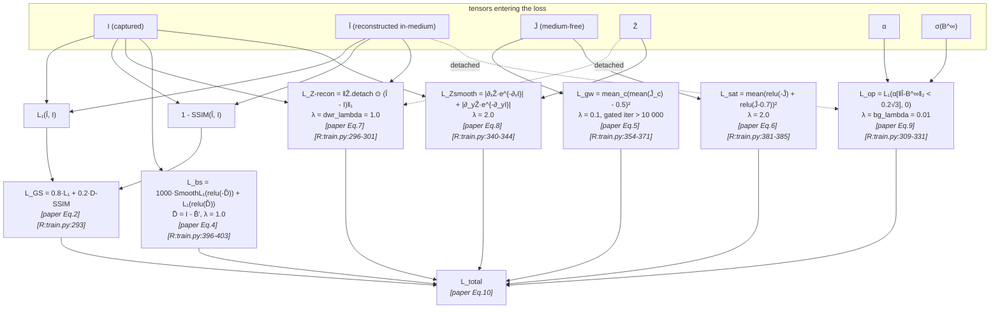
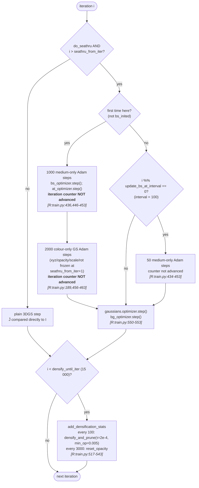
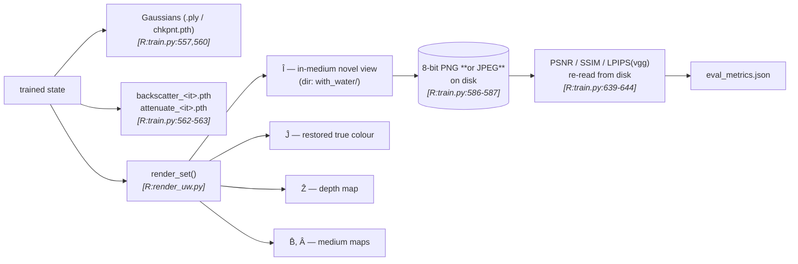

# §2 — Pipeline flowcharts

The full pipeline exceeds ~6 nodes, so it is split into one diagram per stage, as the
methodology requires. Node labels carry evidence tags; `[R:file:line]` abbreviates
`[repo: file:line]`.

---

## Stage A — Data → preprocessing

> **Trap:** `eval` defaults to `False` `[R:arguments/__init__.py:58]`. Without `--eval` the
> "test" set is empty and *every* frame is trained on. See [`10-reproducibility.md`](10-reproducibility.md).

---

## Stage B — Model initialisation

> Three **separate** Adam optimizers, stepped on different schedules — this separation is
> load-bearing for well-posedness, see [`05-constraints.md`](05-constraints.md).

---

## Stage C — Forward pass (one training iteration, after `seathru_from_iter`)

**Detach map for this stage** (the well-posedness mechanism, made visible):

> The repo computes each medium map **twice** — once on live `Ẑ` (used inside `Î` for the
> photometric loss) and once on `Ẑ.detach()` (used inside `L_bs`) `[R:train.py:254-255, 269-270]`.
> The paper describes only the detached direction: "B̂ is calculated using the estimated
> depth … which is detached to prevent gradients from flowing through" `[paper §IV.A]`.
> This is a genuine paper-vs-repo delta — see [`06-implementation-deltas.md`](06-implementation-deltas.md) D-3.

---

## Stage D — Loss composition

> **Weighting delta.** The paper writes Eq. 10 as a bare sum of seven terms with no
> coefficients. The repo attaches a distinct λ to six of them, spanning two orders of
> magnitude (0.01 → 2.0). Detailed in [`04-loss.md`](04-loss.md) and [`11-paper-vs-repo-disagreements.md`](11-paper-vs-repo-disagreements.md).

---

## Stage E — Optimization / update schedule

> **The single most easily-missed control-flow fact in this repo:** the `continue`
> statements at `train.py:453` and `train.py:463` sit *above* the `iteration += 1` at
> `train.py:567`. The medium warm-up and colour-adjustment inner loops therefore consume
> **no iteration budget at all** — they are 3000 extra optimizer steps that do not appear
> in the 30 000-iteration count. This is reflected in the pseudocode
> ([`07-pseudocode.md`](07-pseudocode.md)) and in the wall-clock discussion
> ([`08-computational-profile.md`](08-computational-profile.md)).

---

## Stage F — Outputs

> Metrics are computed on **quantised files round-tripped through disk**, and the container
> format is JPEG whenever the ground-truth directory contains no PNGs
> `[R:train.py:586-587]`. See [`10-reproducibility.md`](10-reproducibility.md).
