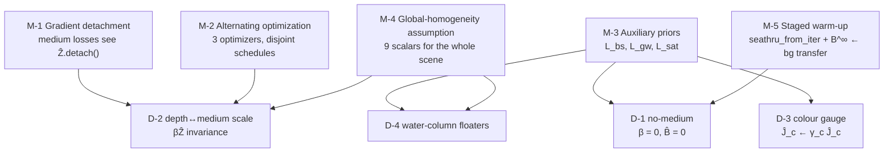

# §5 — Constraints and well-posedness

## 5.1 Why the naive objective is underdetermined

The forward model is

```
Î(x) = Ĵ(x) ⊙ exp(−β^D Ẑ(x))  +  σ(B^∞) ⊙ (1 − exp(−β^B Ẑ(x)))
```

and the naive objective is `min ‖Î − I‖`. Per pixel there are 3 observations and the model
supplies, per pixel, 3 free values in `Ĵ` plus 1 in `Ẑ` — before counting the 9 global
medium scalars. The system is underdetermined by construction. Four *specific* degenerate
solutions are admitted:

### D-1 — The "no medium" solution (named explicitly in the paper)

Set `β^D = 0`, `β^B = 0`. Then `Â = 1`, `B̂ = 0`, `Î = Ĵ`, and the objective reduces exactly
to vanilla 3DGS. Photometric loss is *identical* to the 3DGS optimum, so `L_GS` provides
**zero gradient** distinguishing SeaSplat from 3DGS.

> "a model that adds no backscatter and performs no attenuation could still satisfy the
> optimization objective" `[paper §IV.B]`

This is not a local minimum to be escaped — it is a **global optimum of `L_GS`** that is
at least as good as the intended solution. Nothing in `L_GS` can ever break it.

### D-2 — The depth/medium trade-off

`β` and `Ẑ` appear only as the product `βẐ`. Scaling `Ẑ ← cẐ`, `β^D ← β^D/c`, `β^B ← β^B/c`
leaves `Î` **exactly** invariant. Since `Ẑ` is produced by the Gaussian geometry, the
optimizer can satisfy the medium model by moving Gaussians to implausible depths.

> "as we are learning both the depth and these medium parameters, the optimization could
> also push the depth to be implausible given a poor estimate of the medium parameters."
> `[paper §IV.B]`

### D-3 — The colour-gauge ambiguity

Per channel `c`, the substitution `Ĵ_c ← γ_c Ĵ_c`, `β^D_c ← β^D_c + ln(γ_c)/Ẑ` leaves the
direct term `Ĵ_c e^{−β^D_c Ẑ}` unchanged for any fixed `Ẑ`. So the *restored* colour `Ĵ`
— the entire point of the method — has an unconstrained per-channel gain under `L_GS`
alone. `[inferred from paper Eq. 3; the paper does not state this ambiguity explicitly]`

### D-4 — The water-column floater solution (the 3DGS-inherited one)

The degenerate solution that vanilla 3DGS actually finds: place high-opacity, low-texture
Gaussians very close to the camera to reproduce the veiling haze directly as *geometry*.
Photometrically excellent, geometrically nonsense.

> "there often are Gaussians with high opacity added in regions that do not necessarily
> represent objects underwater, for example the water column" `[paper §IV.B]`
> and Fig. 4: "3DGS places many floaters within the water column".

---

## 5.2 The resolving mechanisms

Five distinct mechanisms, each targeting specific degeneracies:



### M-1 — Gradient detachment (the mechanism the paper foregrounds)

> "B̂ is calculated using the estimated depth from the 3D Gaussian representation, Ẑ, which
> is detached to prevent gradients from flowing through. Thus, gradients do not affect the
> underlying 3D Gaussian representation, but the learned backscatter parameters do
> constrain the image formation model used in other losses." `[paper §IV.A]`

Where this is realised in code:

| Detached tensor | Line | Consumer | Effect |
|---|---|---|---|
| `depth_image_batch.detach()` → `attenuation_map_depth_detached` | `[repo: train.py:255]` | `L_dsc_at` (off by default) | β^D-only gradient |
| `depth_image_batch.detach()` → `backscatter_depth_detached` | `[repo: train.py:270]` | `L_bs` at `train.py:400` | **β^B, B^∞-only gradient** |
| `gt_rgb_batch.detach()` | `[repo: train.py:400]` | `L_bs` | ground truth carries no grad |
| `depth_image.detach()` as weight | `[repo: train.py:279, 287, 298, 300]` | `L_Z-recon` | prevents `Ẑ → 0` shortcut |
| `underwater_image.detach()`, `B_inf.detach()` | `[repo: train.py:319-321]` | `L_op` | only `α` receives gradient |
| `rendered_image.detach()`, `learned_bg.detach()` | `[repo: train.py:310]` | `L_op` (pre-SeaThru branch) | only `α` receives gradient |

**Net effect:** the *only* path by which the medium model can move the Gaussians is
through `L_GS` and `L_Z-recon` on `Î` — i.e. through the physically-correct composition.
Every auxiliary prior is surgically routed to exactly one parameter group. This kills D-2
by removing the gradient that would exploit it.

### M-2 — Interleaved / alternating optimization

> "we introduce additional loss constraints while also interleaving optimization of the
> medium parameters with optimization of the underlying 3D Gaussian representation."
> `[paper §IV.B]`

The repo implements this far more specifically than the paper describes
`[repo: train.py:421-463]`:

- **Three disjoint Adam optimizers** — `gaussians.optimizer`, `{bs,at}_optimizer`,
  `bg_optimizer` `[repo: train.py:91-92, 131]`.
- **Bursty schedule:** every `update_bs_at_interval = 100` outer iterations, the loop runs
  `update_bs_at_count = 50` **medium-only** Adam steps in which `gaussians.optimizer.step()`
  is skipped entirely (the `continue` at `train.py:453`) `[repo: train.py:434-453]`.
- **The `continue` bypasses `iteration += 1`** (`train.py:567`), so these bursts cost no
  iteration budget. `[inferred: `continue` at line 453 is lexically above the increment at line 567 within the same `while` body]`

So the true update ratio at defaults is **50 medium steps per 100 Gaussian steps** — the
medium parameters are optimized at *half the rate of, and strictly disjointly from,* the
geometry. Alternating minimisation over disjoint blocks is what makes the bilinear-ish
`Ĵ ⊙ Â` factorisation tractable; simultaneous descent on both factors is the classic route
into D-2/D-3.

### M-3 — Auxiliary priors

Covered term-by-term in [`04-loss.md`](04-loss.md). Mapping to degeneracies:

| Prior | Kills |
|---|---|
| `L_bs` (asymmetric dark-channel, `k = 1000`) | **D-1** — makes `B̂ ≡ 0` expensive; supplies the only gradient that inflates backscatter |
| `L_gw` | **D-3** — pins `mean_c(Ĵ) = 0.5`, fixing the per-channel gauge |
| `L_sat` | **D-3** (upper tail) — caps `Ĵ` at `T_sat = 0.7` where `1/Â` amplification blows up |
| `L_op` | **D-4** — zeroes `α` on water-coloured pixels |
| `L_Zsmooth` | **D-2** (high-frequency part) — denies per-pixel depth noise as free capacity |

### M-4 — The global-homogeneity assumption (a *structural* regulariser)

Nine scalars must explain the medium across every pixel of every frame in the scene. This
is by far the strongest constraint in the system and it is a **modelling choice, not a
loss**: it is the reason SeaSplat is well-posed where a per-pixel medium model would not be.

> "SeaSplat assumes the water parameters are consistent for the whole scene" `[paper §V.A.b]`

Contrast with SeaThru-NeRF, which grants the medium per-viewing-direction MLP capacity and
must recover well-posedness by other means. This is the axis flagged in
[`01-taxonomy.md`](01-taxonomy.md) and is the deepest reason the two methods' `β` symbols
are not comparable objects.

### M-5 — Staged optimization + the undocumented `B^∞` warm start

Two staging devices, only the first of which is in the paper:

1. **`seathru_from_iter`** (README: 10 000 of 30 000). For the first third of training the
   medium model does not exist and the run is vanilla 3DGS. This gives `Ẑ` time to become
   meaningful before any `β` is fit to it — without it, `β` would be fit to noise, landing
   directly in D-2. `[repo: train.py:246; README.md]`
2. **Medium warm-up + colour re-adjustment.** At the moment SeaThru switches on, the loop
   runs **1000 medium-only steps** with the Gaussians frozen, then **2000 colour-only
   steps** with `xyz/opacity/scaling/rotation` frozen `[repo: train.py:189, 436, 456-463]`.
   The second stage exists because turning on the medium suddenly changes what `Ĵ` must
   mean (it is now the *restored* colour, roughly `I/Â`), so the SH coefficients need to be
   re-fit before geometry is allowed to move again.
3. **`bg_from_bs`: `B^∞ ← learned_bg`.** The `learned_bg` parameter — trained for the whole
   pre-SeaThru phase against `L_op` — is copied into `bs_model.B_inf` at the transition and
   the backscatter optimizer is rebuilt around it `[repo: train.py:205-212]`. This replaces
   the `U(0,1)` random init of `B^∞` with a **data-derived estimate of the water colour**.

   **None of item 2 or 3 appears in the paper.** `learned_bg` is not mentioned at all.
   Given that D-1 is a global optimum of `L_GS`, initialising `B^∞` at the observed water
   colour rather than uniform noise is plausibly load-bearing for convergence — it is
   listed as a high-priority reproduction risk in
   [`11-paper-vs-repo-disagreements.md`](11-paper-vs-repo-disagreements.md).

---

## 5.3 What is *not* resolved

- **Absolute scale.** COLMAP fixes scene scale only up to a global factor; `Ẑ` is
  additionally min–max renormalised to `[0,1]` per frame (`norm_depth_max = True`,
  `[repo: train.py:233-237]`). The learned `β` are therefore in units of *normalised
  per-frame depth*, **not** inverse metres, and are **not physically comparable to
  published attenuation coefficients** — nor to the simulation constants
  `β^D = [2.6, 2.4, 1.8]` the paper uses to *generate* SimWater `[paper §V.A.a]`.
  `[inferred: combining paper §V.A.a with repo train.py:233-237]`. A per-frame min–max
  normalisation also means the same physical depth maps to different `Ẑ` in different
  frames, which is in tension with the global-`β` assumption. Not discussed in the paper.
- **Spatially varying media**, caustics, shadows, dynamic objects — conceded out of scope
  `[paper §VI]`.
- **D-1 is only *penalised*, never *excluded*.** `L_bs` has weight 1.0 against `L_GS`'s
  effective 1.0; if `L_bs` is disabled (`--use_dcp_loss` is a `store_true` flag defaulting
  `True`, so it cannot be turned off from the CLI without editing the file), nothing
  prevents collapse to vanilla 3DGS.
