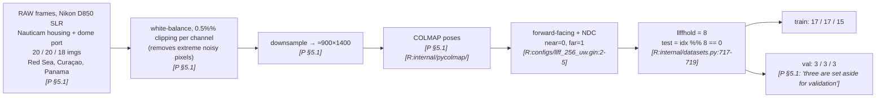
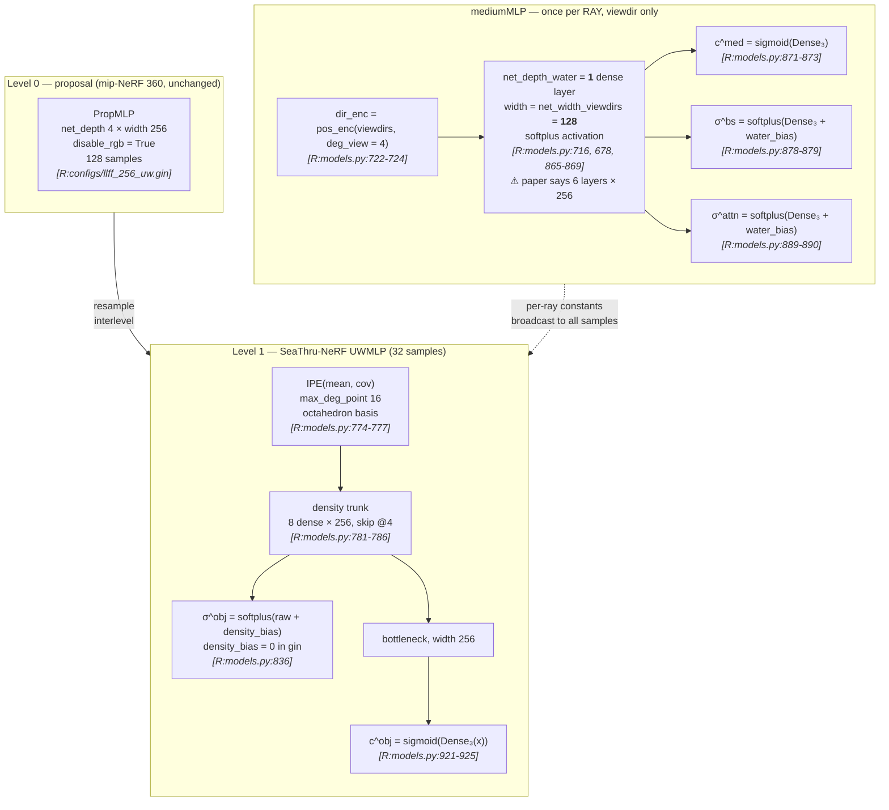
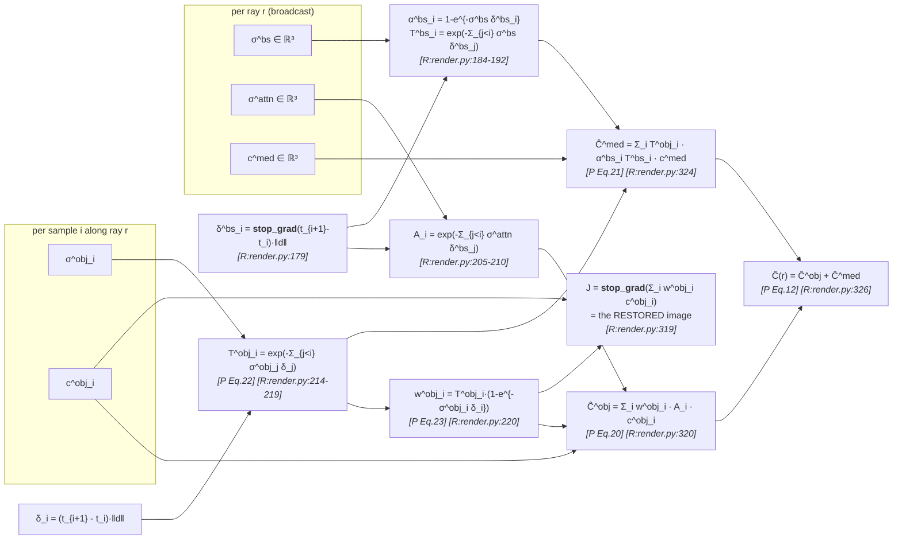
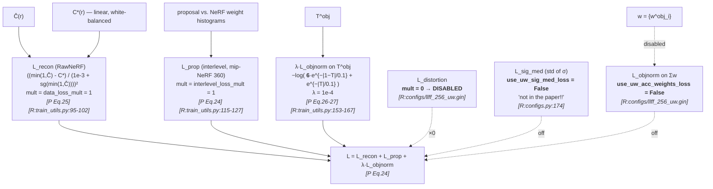
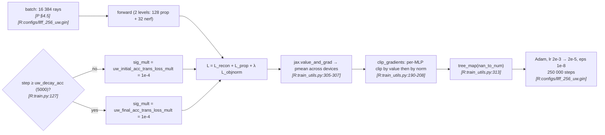
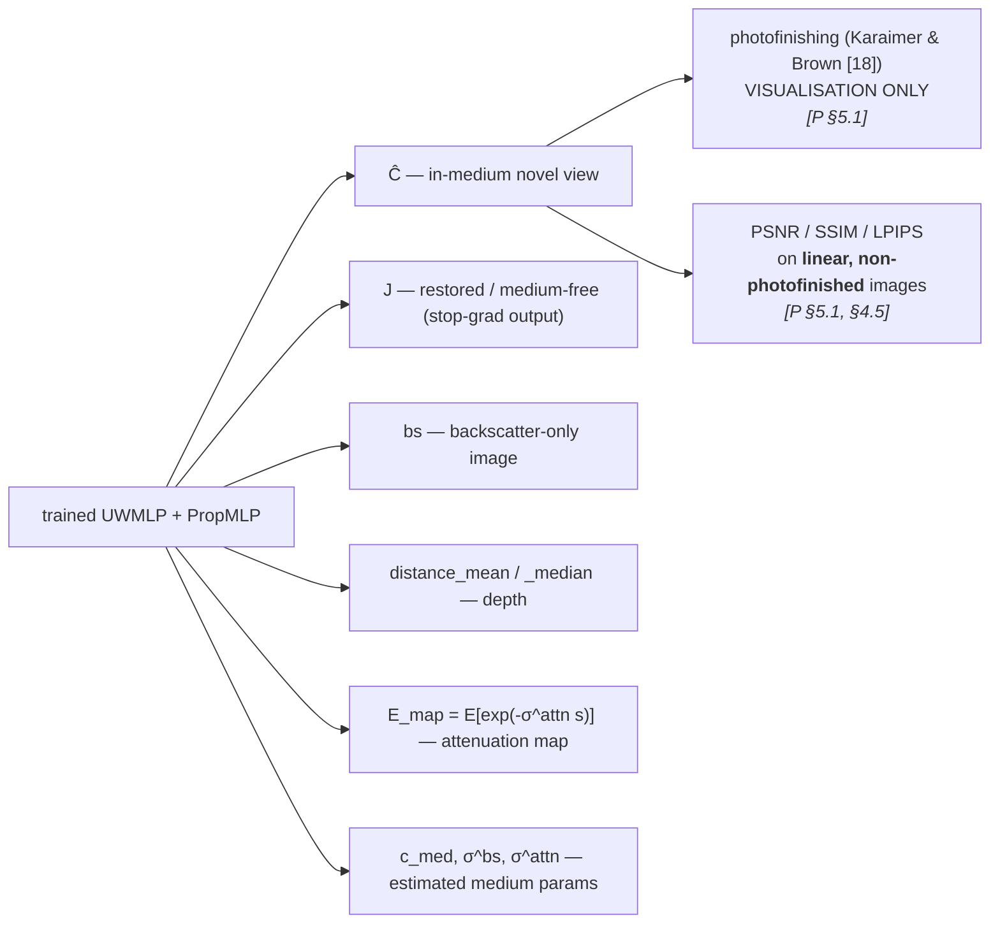

# §2 — Pipeline flowcharts

Split by stage. `[R:file:line]` abbreviates `[repo: file:line]`; `[P §x]` abbreviates `[paper §x]`.

---

## Stage A — Data → preprocessing

> **The split checks out arithmetically:** `20 // 8 → indices {0,8,16}` = 3 held-out;
> `18 // 8 → {0,8,16}` = 3. Paper and code agree exactly. `[inferred: paper §5.1 vs repo datasets.py:717-719]`
> Contrast with SeaSplat, where `--eval` defaults off and the split is undocumented.

---

## Stage B — Model initialisation / architecture

> **`uw_rgb_dir = False`** in the released gin `[R:configs/llff_256_uw.gin]`, and the code
> only appends the direction encoding to the colour branch when that flag is set
> `[R:models.py:898-900]`. So in the released configuration **`c^obj` is a function of
> position only** — view-independent — contradicting `[P §4.3]`. See D-3.

---

## Stage C — Forward pass: the split rendering equations

Two detachments are visible here and both are load-bearing:

| Detach | Line | Why it matters |
|---|---|---|
| `δ^bs = stop_gradient(t_delta)·‖d‖` | `[R:render.py:179]` | the medium's transmittances depend on **sample spacing**. Without the stop-gradient, the proposal network could reduce loss by *moving the samples*, i.e. by changing the quadrature rather than the physics. |
| `J = stop_gradient(…)` | `[R:render.py:319]` | the restored image is a **pure diagnostic output**. No gradient flows through it and it appears in no loss. |

---

## Stage D — Loss composition

> **Only three terms are live.** Unlike SeaSplat's seven-term objective, SeaThru-NeRF's
> deployed loss is exactly the three of Eq. 24, with `distortion_loss_mult = 0` explicitly
> switching off mip-NeRF 360's distortion regulariser
> `[R:configs/llff_256_uw.gin]` — a change from the mip-NeRF 360 baseline that the paper
> does not mention.
>
> **But the Laplacian mixture is asymmetric in code (`factor = 6`) and symmetric in the
> paper (Eq. 26).** See D-2.

---

## Stage E — Optimization

> The `uw_decay_acc = 5000` schedule is a **no-op in the released config**: initial and
> final multipliers are both `1e-4` `[R:configs/llff_256_uw.gin]`. The machinery exists for
> a ramp that was not used in the published runs. `[inferred]`
>
> Note `jnp.nan_to_num` on the gradient tree `[R:train_utils.py:313]` — NaN gradients are
> silently zeroed rather than raising. Worth knowing when debugging a reproduction.

---

## Stage F — Outputs

> `[P §4.5]`: "The loss function and metrics are calculated on the output before any
> post-processing." `[P §5.1]`: "PSNR is calculated on the original non-photofinished
> linear images." **PSNR on linear HDR-ish data is not numerically comparable to PSNR on
> tone-mapped sRGB data** — a critical caveat when placing this method's numbers beside
> SeaSplat's. See [`10-reproducibility.md`](10-reproducibility.md) §10.3.
