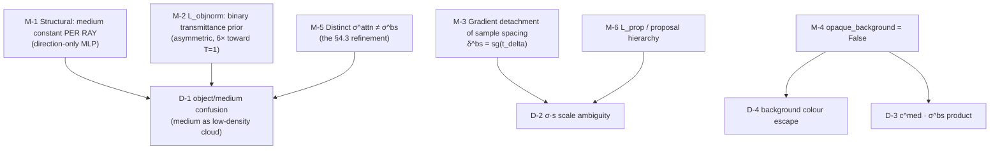

# §5 — Constraints and well-posedness

## 5.1 Why the naive objective is underdetermined

The rendering equation is a **sum of two components**:

```
Ĉ(r) = Σ_i T^obj_i·exp(−σ^attn s_i)·(1−e^{−σ^obj_i δ_i})·c^obj_i   +   Σ_i T^obj_i·(1−e^{−σ^bs δ_i})·e^{−σ^bs s_i}·c^med
       └────────────────── object ──────────────────┘                └───────────── medium ─────────────┘
```

with only `Ĉ` observed. Four degenerate solutions:

### D-1 — Object/medium confusion (the central one, named in the paper)

Any radiance can be assigned to *either* summand. In particular, the medium can be
represented as a **low-density object**: a diffuse cloud of `σ^obj` spread along the ray
with `c^obj ≈ c^med` reproduces the backscatter exactly, with `σ^bs = 0`.

This is not hypothetical — it is the observed failure mode of every unmodified NeRF on
these scenes:

> "Attempting to optimize existing NeRFs on scenes with scattering medium results in
> **cloud-like objects floating in space**" `[paper §1]`

> "[5] achieves a reasonable rendering of the scene in terms of PSNR by **wrongly modeling
> the water as a nearby blue object**, as can be seen in the depth map" `[paper §5.2]`

Note this is the *same* degeneracy SeaSplat calls "floaters in the water column"
(D-4 there) — the two papers name the identical failure in different vocabularies.

### D-2 — The `σ`/`s` scale ambiguity

`σ^attn` and `σ^bs` enter only as products `σ·s_i` with the sample distances. Rescaling
`s ← cs`, `σ ← σ/c` is exactly invariant. Since `s_i` is set by the proposal network's
sample placement, the sampler could satisfy the medium model by relocating samples rather
than by fitting physics.

### D-3 — The `c^med` / `σ^bs` product ambiguity in the near field

For small `σ^bs s`, `Ĉ^med ≈ σ^bs·s·c^med` — only the product is determined. `c^med` is
identifiable only from rays where backscatter *saturates* (i.e. `σ^bs s ≫ 1`), which
requires long, object-free rays. The paper states this limitation:

> "the medium's parameters are better learned in sets where there is enough variation in
> the scene range between the viewpoints" `[paper §6]`

### D-4 — The background-colour escape hatch

mip-NeRF 360 initialises the farthest interval with infinite density, letting a ray that
hits nothing take a learned background colour. That background is a *free* explanation for
the far-field veiling light, so the medium would never need to account for it.

---

## 5.2 The resolving mechanisms



### M-1 — The medium is constant along each ray (a *structural* constraint)

The mediumMLP takes **only the viewing direction** as input and is evaluated **once per
ray**; its outputs are broadcast to all `N` samples
`[repo: models.py:865-890; render.py:184 — sigma_bs[..., None, :] broadcast]`.

> "we constrain the medium parameters to be constant along 3D viewing rays. We drop the
> respective interval indices and remain with `σ^med` and `c^med` that depend only on the
> ray `r`. … **These constraints will be enforced by respective structural choices in the
> network.**" `[paper §4.1]`

This is the load-bearing mechanism, and it works by **capacity starvation**: the medium
literally *cannot* represent a spatially-localised blob, because it has no positional
input. A cloud sitting at 3 m along one ray is inexpressible. Only the object field can do
that — so any localised radiance must be object, and any range-monotone veiling must be
medium. The separation is enforced by architecture, not by a loss.

The paper is careful about how strong this assumption is relative to alternatives:

> "This is **far less restrictive** compared to models that assume constancy per image or
> even per scene [2]." `[paper §4.1]`

— which is precisely the assumption SeaSplat later makes. Two different points on the same
capacity/identifiability trade-off.

> **⚠ But the released capacity is far below what the paper claims.** `net_depth_water = 1`
> layer of 128 units `[repo: models.py:716, 678]` versus "6 linear layers with 256 features"
> `[paper §4.5]`. Since the whole mechanism is capacity control, a 12× reduction in the
> medium trunk is not a cosmetic difference — it makes the constraint *stronger* than
> described. See D-1 in [`06-implementation-deltas.md`](06-implementation-deltas.md).

### M-2 — The binary-transmittance prior (the only hand-designed prior)

`L_objnorm = −log P(T^obj_i)` with `P` a mixture of Laplacians at 0 and 1
`[paper Eq. 26-27]`. Its job is to forbid the semi-transparent object that would mimic the
medium.

> "To enforce binary separation between points in space that contain objects and those that
> contain solely a medium — we add a prior on the transmittance `T^obj_i` … **not allowing
> semi-transparent objects**." `[paper §4.4]`

In code the mixture is **asymmetric**, weighting the `T = 1` mode `6×`
`[repo: train_utils.py:162; configs.py:173]`. Physically that says "along a typical
underwater forward-facing ray, most samples are empty water, so `T^obj` should stay near 1
until the object is reached" — a sensible extra prior, but an undocumented one.

Note the *weight* is only `λ = 1e-4` `[paper Eq. 24]`. This prior is a nudge, not a
constraint; the heavy lifting is M-1.

### M-3 — Detached sample spacing in all medium terms

`[repo: internal/render.py:179]`

```python
delta_bs = jax.lax.stop_gradient(t_delta) * jnp.linalg.norm(dirs[..., None, :], axis=-1)
```

`δ^bs` — used for `α^bs`, `T^bs` and `A` (attenuation) — is computed from **detached**
`t_delta`, whereas the object's `δ` is not `[repo: render.py:164]`. So the medium's
transmittances cannot be reduced by the sampler moving samples around: D-2 is closed on
the medium side. The object side keeps a live path, which is what lets geometry actually
learn.

This detachment appears **nowhere in the paper**. It is the direct structural analogue of
SeaSplat's `Ẑ.detach()` — both methods sever the gradient from the medium model back into
whatever produces the range coordinate.

### M-4 — `opaque_background = False`

`[repo: configs/llff_256_uw.gin]`, and the paper is explicit about why:

> "In the rendering scheme, [5] initialized the farthest `σ_i` with infinity, enabling the
> network to predict a background color for rays that do not intersect with any object.
> **We disabled this addition as it prevents our method from explaining the medium** that
> contributes to the rendered color along the ray." `[paper §4.5]`

Closes D-4, and is what makes `c^med` identifiable (D-3): a ray that hits nothing now
*must* be explained by `Ĉ^med` saturating to `c^med`, which is exactly the physical
definition of `B^∞` (backscatter at infinity).

### M-5 — Distinct `σ^attn ≠ σ^bs`

§4.2 proves the *basic* model (Eqs. 13–14) collapses to a form with **identical**
coefficients for direct and backscatter (Eq. 21: "`σ^med = β^D = β^B` plays the role of
the attenuation coefficient (equal for direct and backscatter)"). §4.3 then breaks that tie
deliberately:

> "the effective `σ^med` that is experienced by the camera in `C^obj_i(r)` is different than
> the one experienced in `C^med_i(r)`. Therefore, in our final model we use different
> parameters … `σ^attn` and `σ^bs`." `[paper §4.3]`

This is a *de*-constraining move that improves fit (Table 1: Ours 21.83 vs II 21.43), and
it is the same modelling insight Akkaynak & Treibitz's revised model contributes over the
classical single-`β` haze model.

### M-6 — Proposal hierarchy / interlevel loss

Standard mip-NeRF 360 machinery, retained. With only **32** fine samples
`[repo: configs Model.num_nerf_samples = 32]`, the proposal network must place them well;
`L_prop` is what keeps it aligned.

---

## 5.3 What is *not* resolved

- **`J` is unsupervised and unscored.** The restored image is
  `stop_gradient(Σ w^obj_i c^obj_i)` `[repo: render.py:319]` — it contributes no gradient
  and appears in no loss or metric. Its quality is a *consequence* of the separation being
  correct, never a target. Same epistemic position as SeaSplat's `Ĵ`: no ground truth
  exists. All restoration claims in both papers are qualitative.
- **Scale.** NDC + COLMAP fixes range only up to a global factor, so `σ^attn`, `σ^bs` are
  in inverse-NDC units, **not inverse metres**. They are therefore not directly comparable
  to the simulation constants `β^D = [1.3, 1.2, 0.9]` used to *build* the Fern-underwater
  scene `[paper §5.1]`, nor to any published attenuation coefficient.
  `[inferred: paper §4.5 NDC + §5.1]` The paper claims "estimation of wideband medium
  parameters, which are informative properties of the captured environment" `[paper §1]` —
  that claim needs a scale calibration the paper does not describe. `[unverified]`
- **Model assumptions the authors concede** `[paper §6]`: no multiple scattering, no
  artificial illumination, poses must be pre-computed, and the method "struggles in scenes
  that do not adhere to the model's assumptions, e.g., underwater scenes with significant
  flickering".
- **`c^med` varies with viewing direction**, which is *more* expressive than the physical
  model (`B^∞` is a single constant in Eq. 7). Nothing forces the learned `c^med(v)` to be
  approximately constant, so it can absorb view-dependent effects that are not medium at
  all — a capacity leak in the opposite direction from D-1. The optional `L_sig_med`
  (penalising the std of `σ` across the batch) exists in the repo precisely to counter this
  and is **disabled**, tagged *"not in the paper!!"* `[repo: configs.py:168, 174]`.
